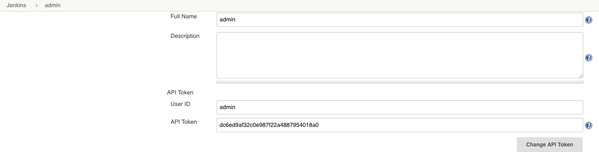
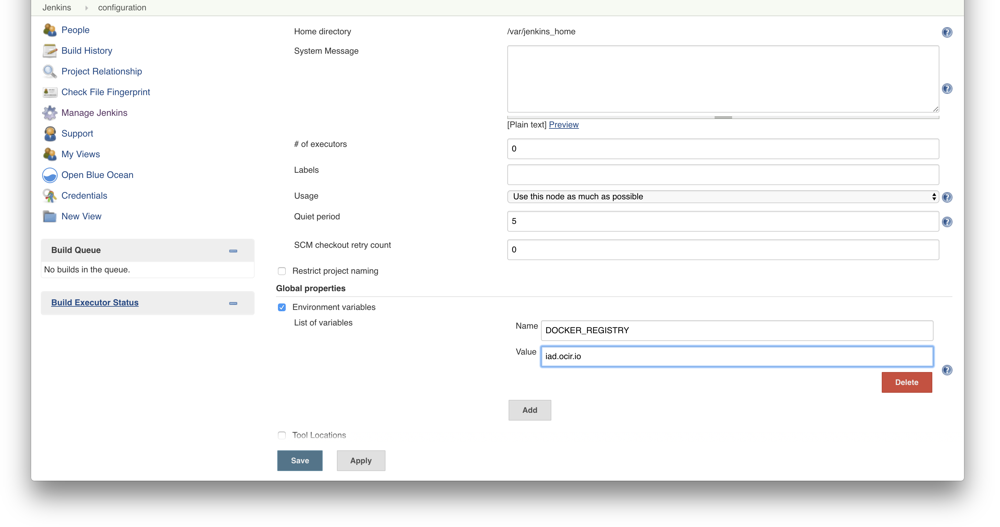
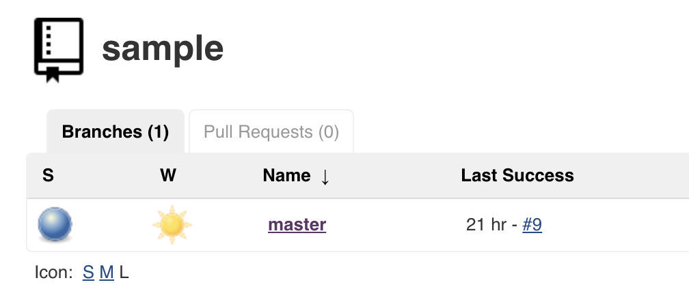
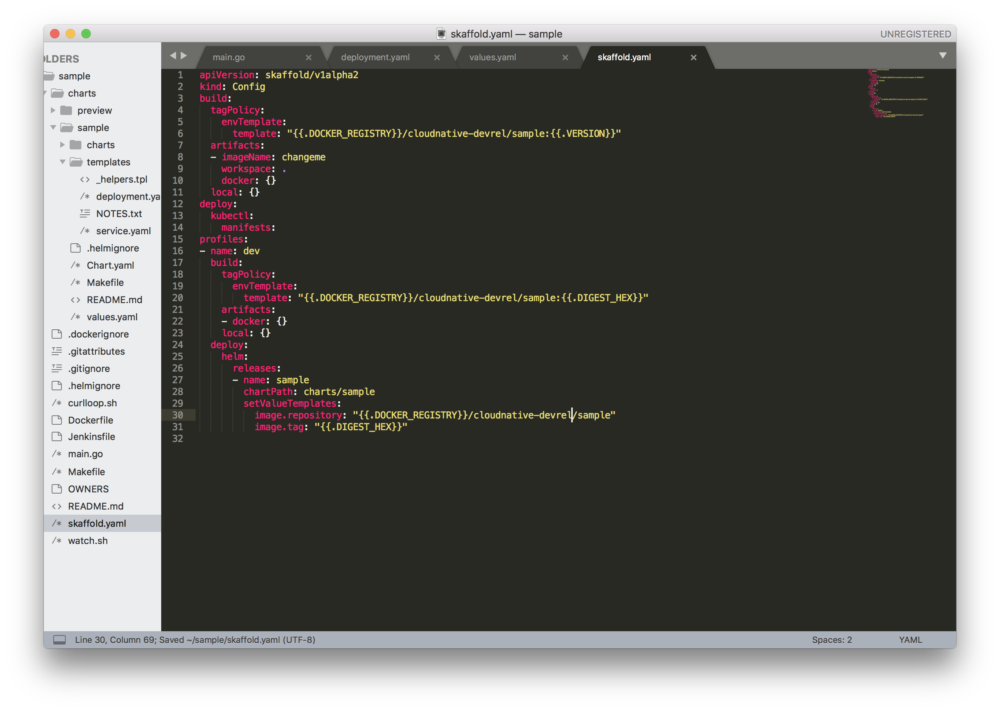
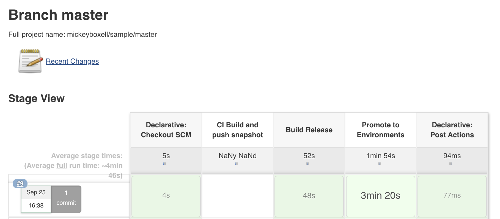

# Jenkins X: Cloud Native Continuous Integration and Deployment

In the open source and self-hosted space, Jenkins has been the dominant player for years. But, it requires some work, most of which is repetitive and invites error. You know what that is like, finding the right set of plugins, designing the CD process, writing pipeline definitions, etc... This "lego" approach is the strength, and some would argue, the weakness of Jenkins. Jenkins X has come to simplify how to work with continuous delivery and Kubernetes. 

Here are a few of the ways Jenkins X removes some complexity from your life: 

* Jenkins X presents itself as a handy, sleek command line.
* Out of the box Jenkins X makes three environments for you (dev, staging, and production), but you can make as many as you like. 
* Any changes you make to your app are automatically built, and if the build looks good, they go through to the staging environment. 
* If you are using GitHub, webhooks are set up for you.

The value of Jenkins X is that if you follow the best practices that it has baked in with simple commands, then Jenkins X assembles all the pieces for you (e.g., Jenkins, Kubernetes, Git, CI/CD, etc.) such that you can be instantly productive (which has always been the promise of CI/CD, has it not?). 

## Creating an Ingress Controller

Jenkins X requires the use of a ingress controller to access the service over the public internet. To ensure the Jenkins X installation tool can properly access the ingress controller during the installation process, create the ingress controller in the `kube-system` namespace.

Install an ingress controller with:

`helm install stable/nginx-ingress --name nginx --set rbac.create=true --namespace=kube-system`

Output should include:

```
NOTES:
The nginx-ingress controller has been installed.
It may take a few minutes for the LoadBalancer IP to be available.
You can watch the status by running 'kubectl --namespace kube-system get services -o wide -w nginx-nginx-ingress-controller'
```

Running `kubectl get svc -n kube-system` will show the ingress controller you created: 
```
NAME                                  TYPE           CLUSTER-IP      EXTERNAL-IP      PORT(S)                      AGE
nginx-nginx-ingress-controller        LoadBalancer   10.96.255.145   [External/LoadBalancer IP]   80:32151/TCP,443:30744/TCP   2h
nginx-nginx-ingress-default-backend   ClusterIP      10.96.240.5     <none>           80/TCP                       2h

```

## Preparing for Your Installation

First let's install the `jx` binary, which we will use to install and manage our Jenkins X deployment. If you are running MacOS, you can download it by running:

`brew tap jenkins-x/jx`

and then:

`brew install jx`

If you are on Linux you can install it by running:

```
curl -L https://github.com/jenkins-x/jx/releases/download/v1.3.212/jx-linux-amd64.tar.gz | tar xzv
sudo mv jx /usr/local/bin
```

Next we will see if your cluster is able to install the Jenkins X deployment.

`jx compliance run`

If you get an error like this:

```
error: failed to start the compliance tests: failed to create object: failed to create API resource sonobuoy-serviceaccount: clusterroles.rbac.authorization.k8s.io "sonobuoy-serviceaccount" is forbidden:
```

You will need to give your user the cluster role of cluster admin by running:

```
kubectl create clusterrolebinding default-admin --clusterrole=cluster-admin --user=ocid.user.oc1..aaaaa....
```

If the cluster is able to install Jenkins X it will return something like this:

```
INFO[0003] created object                                name=heptio-sonobuoy namespace= resource=namespaces
INFO[0003] created object                                name=sonobuoy-serviceaccount namespace=heptio-sonobuoy resource=serviceaccounts
INFO[0003] created object                                name=sonobuoy-serviceaccount-heptio-sonobuoy namespace= resource=clusterrolebindings
INFO[0003] created object                                name=sonobuoy-serviceaccount namespace= resource=clusterroles
INFO[0004] created object                                name=sonobuoy-config-cm namespace=heptio-sonobuoy resource=configmaps
INFO[0004] created object                                name=sonobuoy-plugins-cm namespace=heptio-sonobuoy resource=configmaps
INFO[0004] created object                                name=sonobuoy namespace=heptio-sonobuoy resource=pods
INFO[0004] created object                                name=sonobuoy-master namespace=heptio-sonobuoy resource=services
```

After confirming you can run Jenkins X on your cluster, run `jx compliance delete` to delete the resources created by your compliance tests.

## Jenkins X Installation

To install Jenkins X, skip the option to have the installation create an ingress controller for us. Instead, select the controller we created earlier in the documentation. In order to avoid using a DNS name, we will use the .nip.io wild card DNS that works with any IP address. Grab the ingress controller external IP address with `kubectl get svc -n kube-system` and modify the `[External/LoadBalancer IP]` section accordingly: 

Next, install Jenkins X with:

`jx install --provider=kubernetes --external-ip [External/LoadBalancer IP] --ingress-service=nginx-nginx-ingress-controller --ingress-deployment=nginx-nginx-ingress-controller --ingress-namespace=kube-system`


The installation may take 5-10 minutes as images are downloaded to your system in the `jx` namespace.

You will be prompted for your GitHub user name and GitHub API Token. 

After you enter your GitHub Username, it will output something like the text below. Follow the link from the output to create an API token with the correct permissions:

```
To be able to create a repository on GitHub we need an API Token
Please click this URL https://github.com/settings/tokens/new?scopes=repo,read:user,read:org,user:email,write:repo_hook,delete_repo

Then COPY the token and enter in into the form below:
```

When the installation is complete, your `kubectl get po -n jx` output should be something similar to this: 
```
NAME                                             READY     STATUS    RESTARTS   AGE
jenkins-8fdd99b8b-m7vvr                          1/1       Running   0          3m
jenkins-x-chartmuseum-5d8777b777-xtg2k           1/1       Running   0          3m
jenkins-x-controller-workflow-65c6c9644c-6dq7q   1/1       Running   0          3m
jenkins-x-docker-registry-fb7878f76-6trjj        1/1       Running   0          3m
jenkins-x-heapster-c6d44bc95-wn5fg               2/2       Running   0          3m
jenkins-x-mongodb-7dd488d47b-8nrgm               1/1       Running   1          3m
jenkins-x-monocular-api-65959f48cf-qwhvs         1/1       Running   4          3m
jenkins-x-monocular-prerender-64f989797b-xcwfn   1/1       Running   0          3m
jenkins-x-monocular-ui-dc5c9dd95-bkfq4           1/1       Running   0          3m
jenkins-x-nexus-75dd6d4446-4bmdd                 1/1       Running   0          3m
pipelinecontroller-55d65ccc6-qnksx               1/1       Running   0          3m
```

During the installation process the system will also output the URL for your Jenkins X deployment and the admin password for Jenkins X. Jenkins X will attempt to automatically log in for you and pull your Jenkins API token. If there are issues, you can simply navigate to the URL provided and use `admin` as your username and the password provided above.


This step is only required if the Jenkins X installer is unable to automatically log in: The next step is to get your Jenkins API Token. Click on the 'admin' user in the upper right corner, and then navigate to the Configure tab, copy the API token, and post it into the command line after you are prompted for your `API Token`. 



After the installation is complete, Jenkins X will create your first pipeline connected to your GitHub provider. This process results in the creation of a "Staging" and "Production" environment along with associated repositories.

```
Jenkins X installation completed successfully

Your kubernetes context is now set to the namespace: jx 
To switch back to your original namespace use: jx ns jx
For help on switching contexts see: https://jenkins-x.io/developing/kube-context/

To import existing projects into Jenkins:       jx import
To create a new Spring Boot microservice:       jx create spring -d web -d actuator
To create a new microservice from a quickstart: jx create quickstart
```
Two things to note here:  

1)  It is suggested that you update all of your deployed plugins from within the Jenkins management console. More information can be found [here.](https://jenkins.io/doc/book/managing/plugins/)

2) Jenkins X leverages a 'jenkins-x' user to perform required actions within the cluster, that user will need permission to modify the state of the cluster, so let's take care of that now. 

Ensure the pod has proper permissions with: 

```
kubectl create clusterrolebinding cluster-adm \
--clusterrole=cluster-admin \
--user=system:serviceaccount:jx:jenkins-x-gc-activities
```

## Kubernetes Authorization

Navigate to your Jenkins X URL and click "Manage Jenkins" and then "Configure System". Scroll down to the "Kubernetes" section. In the Kubernetes URL section you will need to post the server URL from your config file. Next add your Kubernetes server certificate key in the section below. To get your key, copy the contents of your certificate-authority-data from your Kubeconfig file.

If you are using MacOS you might find these helpful:

`cat ~/.kube/config`

Run this to convert to base64: 

`$ pbpaste | base64 -D`

Copy and paste the output into the appropriate section of the console. Click "Test Connection" to verify your credentials. Click "Save" at the bottom of the page. When this is complete you will have established a secured connection to your Kubernetes environment. 


NOTE: again, the command `pbpaste` is MacOS specific. 

## Container Registry Authorization 

In order to connect the Oracle Container Registry to our Jenkins X deployment we will need to change your "global properties" and generate an auth token in OCI. To change your "global properties" in Jenkins X, navigate to the 'global properties' section of the configuration panel. In the value section add `<region-code>.ocir.io` where `<region-code>` corresponds to the code for the OCIR region you are using, as follows:

    enter fra as the region code for Frankfurt
    enter iad as the region code for Ashburn
    enter lhr as the region code for London
    enter phx as the region code for Phoenix
    



Remember to hit "Save" at the bottom of the page. 

To generate an auth token, in the Oracle Cloud Infrastructure (OCI) console navigate to "Identity" and then "Users". Click your user name, and then click the "Auth Tokens" tab. Click "Generate Token" and provide a name for your token. Be sure to copy your token to a notepad because you will not be able to access this token again.


Now we need to enable Jenkins X to authenticate to OCIR, to push and pull images from the repository when build commands are run. Add your variables to the command below: 

`jx create docker auth --host <region-code.ocir.io> -u '<tenancy-name>/<oci-username>' -s "<auth-token>" -email '<email address for notifications>'`


## Build and Release

After your authorization is complete, you can create a quickstart microservice from a number of available templates. Quickstarts are pre-made applications that can be used as the basis for a project.

`jx create quickstart`

This will open up a list of templates for you to choose from. Select the one you want to deploy, for instance `golang-http` and click enter. You will be prompted for information related to project name, GitHub user name, repository name, etc. In my case the appliation is named `sample`. After doing so you will receive an output similar to this:

```
Creating repository mickeyboxell/sample
Pushed git repository to https://github.com/mickeyboxell/sample

Created Jenkins Project: http://jenkins.jx.129.213.9.239.nip.io/job/mickeyboxell/job/sample/

Watch pipeline activity via:    jx get activity -f sample -w
Browse the pipeline log via:    jx get build logs mickeyboxell/sample/master
Open the Jenkins console via    jx console
You can list the pipelines via: jx get pipelines
When the pipeline is complete:  jx get applications

For more help on available commands see: https://jenkins-x.io/developing/browsing/
```

This will create a quickstart application (in my case this was called sample) in your current directory and import the application into GitHub. If you navigate to your GitHub "Repositories" tab you will see the newly created `sample` environment. 


The same information will be available in the Jenkins X UI: 



According to the Jenkins X documentation, the following is automated for you when choosing a quickstart project:

```
* create a new application from the quickstart in a sub directory
* add your source code into a git repository
* create a remote git repository on a git service, such as GitHub
* push your code to the remote git service
* add default files: A Dockerfile to build your application as a docker image. A Jenkinsfile to implement the CI / CD pipeline. A helm chart to run your application inside Kubernetes
* register a webhook on the remote git repository to your teams Jenkins
* add the git repository to your teams Jenkins
* trigger the first pipeline
```

Create a Kubernetes docker registry secret to be able to pull the container images from OCIR. `docker-password` is simply your OCIR auth token. `docker-email` is an email address that will be used to receive notifications from Jenkins X.

`kubectl create secret -n jx-staging docker-registry ocirsecret --docker-server=<region-code.ocir.io> --docker-username='<tenancy-name>/<oci-username>' --docker-password="<auth-token>" --docker-email='youremail@domain.com'`

Here we will add an image pull secret which allows Kubernetes to authenticate with a container registry to pull a private image. To use the imagePullSecret, edit the deployments that were skaffolded by the quickstart command. "Skaffolding" simply refers to the creation of a number of sample files for the quickstart project. Go to your deployment.yaml file (/app_name/charts/deployment.yaml) and under spec add the following:

```
      imagePullSecrets: 
        - name: ocirsecret
```

Take note of the spacing in the image below.

We also recommend that you change the name of the image URL inside of the same deployments.yaml file to:

`<region-code.ocir.io>/<tenancy-name>/<quickstart-project-name>`

Here's what the change to our sample application's deployment looked like:


Next you will want to modify the skaffold.yaml file (/app_name/skaffold.yaml) to make sure the build templates and image repository are pointed to your tenancy. In the `template` section add your tenancy name between `{{.DOCKER_REGISTRY}}/` and the name of your deployment. Here is an example:



After editing the deployment.yaml file, commit it: 

`git commit -am "edit deployment"`

 and push it to Git:
 
`git push origin master` 

This will automatically trigger a build. You can view the build by running: 

`jx get pipeline`

Or by navigating to the Jenkins X UI: 



or the Blue Ocean plugin: 


When the pipeline is completed you can connect to your application by running: 

`jx get app`

and navigating to the URL. 

### Clean Up

Uninstalling Jenkins X is as simple as typing in `jx uninstall` for more information on options (check out this page)[https://jenkins-x.io/commands/jx_uninstall/#jx-uninstall]. 

### Conclusion 

You have now created your first repository, build, and deployment of an application using Jenkins X. This a great start to implementing CI/CD practices in your Kubernetes environment.

## Some Additional Thoughts on Jenkins X

The Good:

* Skaffolding projects is really easy and having a tool that is able to both create the project on GitHub and in Jenkins reduces the number of steps so we can focus on coding!
* Being able to access and trigger builds from the CLI makes for a more streamlined experience than switching back and forth from a terminal window to a web browser.
* Jenkins X configures your build runners to be able to build projects with any language. If you were to do a regular install of Jenkins you would have to do this all yourself.

The Bad:

* The `jx` tool does a lot of heavy lifting, but unfortunately this leads to some unexpected changes to your Kubernetes configuration. The tool will change your current namespace to 'jx'.
* Much of what Jenkins X can do can simply be done with Kubectl or Helm.
