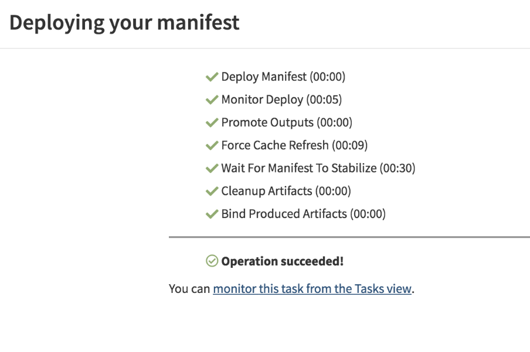

# Spinnaker: Kubernetes Provider V2 (Manifest Based) on Oracle Container Engine for Kubernetes

## Overview

Spinnaker is an open source continuous delivery platform that enables you to rapidly and reliably release software changes. It can be used to create deployment pipelines to create and destroy server groups, run systems and integration tests, and monitor rollouts. These pipelines can be triggered via numerous sources, including git events, Jenkins, etc. Another benefit of Spinnaker is that it can be used to deploy across multiple cloud vendors through the use of providers. 

This guide will walk through the process of installing and configuring Spinnaker for use with Oracle Container Engine for Kubernetes. After the installation we will perform a manifest-based deployment of a Hello World pod and service. 

### Prerequisites

The Kubernetes Provider V2 (Manifest Based) supports Kubernetes-based deployments. Its installer uses kubeconfig to allow Spinnaker to authenticate against your cluster. Spinnaker relies on `kubectl` to manage all API access. Ensure that the config file kubectl defaults to is the one you want to use. The current installer requires your `kubectl` to be version 1.10 or greater and installed on the same machine running Halyard.  

In order to push to Oracle Cluster Engine for Kubernetes (OKE) you will need access to an OKE cluster. For more information about creating an OKE cluster follow this [guide](http://www.oracle.com/webfolder/technetwork/tutorials/obe/oci/oke-full/index.html).

[Oracle Object Storage](https://docs.cloud.oracle.com/iaas/Content/Object/Concepts/objectstorageoverview.htm) as a storage provider for the persistent store and as an artifact repository and Oracle [Registry](https://docs.cloud.oracle.com/iaas/Content/Registry/Concepts/registryoverview.htm) is available as a Docker image registry.

### Installation

Download Halyard, the tool used to manage the lifecycle of your Spinnaker deployment: `curl -O https://raw.githubusercontent.com/spinnaker/halyard/master/install/macos/InstallHalyard.sh`

Install it with: `sudo bash InstallHalyard.sh`

This should install the `hal` command in `/usr/local/bin`. You can test that you have the correct version in your path by running `hal -v`. `hal` will bring up a list of helpful commands. 

Enable the Kubernetes provider with: `hal config provider kubernetes enable`

Output: 

```
$ hal config provider kubernetes enable
+ Get current deployment
  Success
WARNING: An illegal reflective access operation has occurred
WARNING: Illegal reflective access by com.fasterxml.jackson.databind.util.ClassUtil (file:/opt/halyard/lib/jackson-databind-2.8.8.jar) to constructor java.lang.Void()
WARNING: Please consider reporting this to the maintainers of com.fasterxml.jackson.databind.util.ClassUtil
WARNING: Use --illegal-access=warn to enable warnings of further illegal reflective access operations
WARNING: All illegal access operations will be denied in a future release
+ Edit the kubernetes provider
  Success
+ Successfully enabled kubernetes
``` 
You may see certain warnings pop up in output of your commands. These will not impact the successful deployment of Spinnaker and since Spinnaker is in continuous development they should no longer appear in more recent versions.

Add a Kubernetes account with:

```
$ hal config provider kubernetes account add my-k8s-v2-account \
    --provider-version v2 \
    --context $(kubectl config current-context)
```

Output: 

```
$ hal config provider kubernetes account add my-k8s-v2-account     --provider-version v2     --context $(kubectl config current-context)
+ Get current deployment
  Success
WARNING: An illegal reflective access operation has occurred
WARNING: Illegal reflective access by com.fasterxml.jackson.databind.util.ClassUtil (file:/opt/halyard/lib/jackson-databind-2.8.8.jar) to constructor java.lang.Void()
WARNING: Please consider reporting this to the maintainers of com.fasterxml.jackson.databind.util.ClassUtil
WARNING: Use --illegal-access=warn to enable warnings of further illegal reflective access operations
WARNING: All illegal access operations will be denied in a future release
+ Add the my-k8s-v2-account account
  Success
+ Successfully added account my-k8s-v2-account for provider
  kubernetes.
```

Next run: `hal config features edit --artifacts true`

Output: 

```
$ hal config features edit --artifacts true
+ Get current deployment
  Success
+ Get features
  Success
- No changes supplied.
```

Choose `distributed` as the environment on which Halyard will install Spinnaker. This installation option means that Spinnaker will be downloaded and run onto a Kubernetes cluster and that Halyard will deploy each of the Spinnaker microservices separately. A distributed installation is helpful to limit update-related downtime, making it recommended for use with production environments. To do so enter: `hal config deploy edit --type distributed --account-name my-k8s-v2-account`

Output: 

```
$ hal config deploy edit --type distributed --account-name my-k8s-v2-account
+ Get current deployment
  Success
+ Get the deployment environment
  Success
WARNING: An illegal reflective access operation has occurred
WARNING: Illegal reflective access by com.fasterxml.jackson.databind.util.ClassUtil (file:/opt/halyard/lib/jackson-databind-2.8.8.jar) to constructor java.lang.Void()
WARNING: Please consider reporting this to the maintainers of com.fasterxml.jackson.databind.util.ClassUtil
WARNING: Use --illegal-access=warn to enable warnings of further illegal reflective access operations
WARNING: All illegal access operations will be denied in a future release
+ Edit the deployment environment
  Success
Problems in default.deploymentEnvironment:
- WARNING Field DeploymentEnvironment.haServices not supported for
  Spinnaker version 1.9.3: High availability services are not available prior to
  this release.
? Use at least 1.10.0 (It may not have been released yet).

+ Successfully updated your deployment environment.
```

The next step is to provide Spinnaker with a Persistent Storage source. In this case we will be connecting to Oracle Cloud Infrastructure Object Storage. 

You will need the following information to enable Oracle Object Storage in Spinnaker:

- `--bucket-name`: A bucket to store persistent data within the Object Storage namespace. If you do not already have a bucket that you want to use, Halyard will create one for you (either with the `--bucket-name` value provided, or `_spinnaker_front50_data` by default). See [Managing Buckets](https://docs.cloud.oracle.com/iaas/Content/Object/Tasks/managingbuckets.htm). (e.g. `--bucket-name my-spinnaker-bucket`)

- `--compartment-id`: Compartment OCID (e.g. `--compartment-id ocid1.compartment.oc1..aa...`). For more information go to [Managing Compartments](https://docs.cloud.oracle.com/iaas/Content/Identity/Tasks/managingcompartments.htm). 

- `--fingerprint` Fingerprint of the public key (e.g. `--fingerprint 11:22:33:..:aa`). For more information go to [How to Get the Key’s Fingerprint](https://docs.cloud.oracle.com/iaas/Content/API/Concepts/apisigningkey.htm#How3). 

- ` --namespace`: Your Tenancy name (e.g. `--namespace my-tenancy`). 

- `--region`: The user’s home region (e.g. `--region us-ashburn-1`). For more information go to [Managing Regions](https://docs.cloud.oracle.com/iaas/Content/Identity/Tasks/managingregions.htm). 

- `--ssh-private-key-file-path`: RSA key pair in PEM format (minimum 2048 bits) (e.g. `--ssh-private-key-file-path /home/ubuntu/.oci/myPrivateKey.pem`). For more information go to [How to Generate an API Signing Key](https://docs.cloud.oracle.com/iaas/Content/API/Concepts/apisigningkey.htm#How). The PEM key has to be created without a password in order to work. Spinnaker 1.11.x. will provide support for the additional parameter --private-key-passphrase. Upload the public key from the key pair in the Console. For more information go to [How to Upload the Public Key](https://docs.cloud.oracle.com/iaas/Content/API/Concepts/apisigningkey.htm#How2). In spite of what the name implies, use the path to your private .pem key instead of your private .ssh key.

- ` --tenancy-id`: Tenancy OCID (e.g. `--tenancyId ocid1.tenancy.oc1..aa...`). For more information go to [Where to Get the Tenancy’s OCID and User’s OCID](https://docs.cloud.oracle.com/iaas/Content/API/Concepts/apisigningkey.htm#Other).

- `--user-id`: User OCID (e.g. `--user-id ocid1.user.oc1..aa...`). For more information go to [Where to Get the Tenancy’s OCID and User’s OCID](https://docs.cloud.oracle.com/iaas/Content/API/Concepts/apisigningkey.htm#Other). The user will need to have permissions for Object Storage in the OCI Identity and Access Management system. For more information go to [Adding Users](https://docs.cloud.oracle.com/iaas/Content/GSG/Tasks/addingusers.htm) and [Object Storage Policy](https://docs.cloud.oracle.com/iaas/Content/Identity/Reference/objectstoragepolicyreference.htm).


Fill out the Oracle Cloud Infrastructure Object Storage source with your OCI credentials: 

```
$ hal config storage oracle edit \
    --bucket-name $BUCKET_NAME \
    --compartment-id $COMPARTMENT_OCID \
    --fingerprint $API_KEY_FINGERPRINT \
    --namespace $TENANCY_NAME \
    --region $REGION \
    --ssh-private-key-file-path  $PRIVATE_KEY_FILE \
    --tenancy-id $TENANCY_OCID \
    --user-id $USER_OCID 
```

Output: 

```
+ Get current deployment
+ Get current deployments 
  Success
+ Get persistent store
  Success
WARNING: An illegal reflective access operation has occurred
WARNING: Illegal reflective access by com.fasterxml.jackson.databind.util.ClassUtil (file:/opt/halyard/lib/jackson-databind-2.8.8.jar) to constructor java.lang.Void()
WARNING: Please consider reporting this to the maintainers of com.fasterxml.jackson.databind.util.ClassUtil
WARNING: Use --illegal-access=warn to enable warnings of further illegal reflective access operations
WARNING: All illegal access operations will be denied in a future release
+ Edit persistent store
  Success
Problems in default.persistentStorage:
- WARNING Your deployment will most likely fail until you configure
  and enable a persistent store.

+ Successfully edited persistent store "oracle".
```

Set the storage source to Oracle Object Storage: `hal config storage edit --type oracle`

Output: 

```
+ Get current deployment
  Success
+ Get persistent storage settings
  Success
WARNING: An illegal reflective access operation has occurred
WARNING: Illegal reflective access by com.fasterxml.jackson.databind.util.ClassUtil (file:/opt/halyard/lib/jackson-databind-2.8.8.jar) to constructor java.lang.Void()
WARNING: Please consider reporting this to the maintainers of com.fasterxml.jackson.databind.util.ClassUtil
WARNING: Use --illegal-access=warn to enable warnings of further illegal reflective access operations
WARNING: All illegal access operations will be denied in a future release
+ Edit persistent storage settings
  Success
+ Successfully edited persistent storage.
```

List the versions of Spinnaker available for deployment: `hal version list`

Output:

```
+ Get current deployment
  Success
+ Get Spinnaker version
  Success
+ Get released versions
  Success
+ You are on version "1.9.3", and the following are available:
 - 1.14.209 (OSS Spinnaker v1.8.6):
   Changelog: https://docs.armory.io/release-notes/armoryspinnaker_v1.14.209/
   Published: Thu Sep 13 15:42:49 PDT 2018
   (Requires Halyard >= 1.0.0)
```

Select the version you would like to deploy: `hal config version edit --version 1.11.3`

Deploy Spinnaker: `hal deploy apply`

Output: 

```
$ hal deploy apply
+ Get current deployment
  Success
+ Prep deployment
  Success
Problems in default.security:
- WARNING Your UI or API domain does not have override base URLs
  set even though your Spinnaker deployment is a Distributed deployment on a
  remote cloud provider. As a result, you will need to open SSH tunnels against
  that deployment to access Spinnaker.
? We recommend that you instead configure an authentication
  mechanism (OAuth2, SAML2, or x509) to make it easier to access Spinnaker
  securely, and then register the intended Domain and IP addresses that your
  publicly facing services will be using.

Problems in default.provider.dockerRegistry.my-docker-registry:
- WARNING You have a supplied a username but no password.

- WARNING Your docker registry has no repositories specified, and
  the registry's catalog is empty. Spinnaker will not be able to deploy any images
  until some are pushed to this registry.
? Manually specify some repositories for this docker registry to
  index.

+ Preparation complete... deploying Spinnaker
+ Get current deployment
  Success
+ Preparation complete... deploying Spinnaker
+ Get current deployment
  Success
+ Apply deployment
  Success
+ Run `hal deploy connect` to connect to Spinnaker.
```

To see the services created during the installation process run: `kubectl get svc -n spinnaker`

Output: 

```
NAME               TYPE        CLUSTER-IP      EXTERNAL-IP   PORT(S)          AGE
spin-clouddriver   ClusterIP   10.96.192.163   <none>        7002/TCP         9m
spin-deck          ClusterIP   10.96.121.21    <none>        8080/TCP   	  8m
spin-echo          ClusterIP   10.96.50.64     <none>        8089/TCP         8m
spin-front50       ClusterIP   10.96.74.135    <none>        8080/TCP         9m
spin-gate          ClusterIP   10.96.86.132    <none>        8084/TCP         8m
spin-igor          ClusterIP   10.96.107.165   <none>        8088/TCP         8m
spin-orca          ClusterIP   10.96.131.18    <none>        8083/TCP         9m
spin-redis         ClusterIP   10.96.80.206    <none>        6379/TCP         9m
spin-rosco         ClusterIP   10.96.97.43     <none>        8087/TCP         8m
```

Run `hal deploy connect` to start portforwarding your Spinnaker deployment. 

Output: 

```
+ Get current deployment
  Success
+ Connect to Spinnaker deployment.
  Success
Forwarding from 127.0.0.1:8084 -> 8084
```

Navigate to Spinnaker Deck running on http://localhost:9000. If configured correctly, the "Applications" tab will show the pods in your Kubernetes cluster. At a minimum you will see the installation of Spinnaker along with a number of essential Kubernetes pods. In Spinnaker, an "application" is a logical collection of resources, such as Load Balancers, Security Groups, Server Groups, and Clusters, managed by a chosen cloud provider.

Let’s get familiar with Spinnaker concepts and terminology by deploying a sample application. Click "Actions" and then "Create Application". Enter a name for your application and a contact email address and then click "Create". 


On the next page click "Create Server Group" and make sure to choose "my-k8s-v2-account", the Kubernetes provider configured for Spinnaker, from the "Account" pull down menu. A "Server Group" is a collection of servers all running the same Docker image.

In the "Manifest" field, add the following helloworld yaml and then click "Create". 

```
apiVersion: apps/v1
kind: Deployment
metadata:
  name: helloworld
spec:
  selector:
    matchLabels:
      app: helloworld
  replicas: 1 
  template: 
    metadata:
      labels:
        app: helloworld
    spec:
      containers:
      - name: helloworld
        image: karthequian/helloworld:latest
        ports:
        - containerPort: 80
```

It is worth noting that if there is an error with your manifest, Spinnaker will not return an error code. The "Create" button will simply be disabled and not move you to the validation window. 

A successful installation will run through the following checks: 



Running `kubectl get pods -n spinnaker` will show the running pod: 

```
NAME                               READY     STATUS    RESTARTS   AGE
helloworld-64bc4cc75c-jf8w2        1/1       Running   0          1m 
```

The next step is to add a service to the pod. The Spinnaker "Load Balancer" is similar to a "Service" in Kubernetes. Click "Load Balancers" and then "Create Load Balancer". Make sure that the "Account" and "Application" fields match the ones for the application created in the previous step. 

Add the following information to the "Manifest" field: 

```
apiVersion: v1
kind: Service
metadata:
 name: helloworld
spec:
 type: NodePort
 selector:
   app: helloworld
 ports:
   - name: client
     protocol: TCP
     port: 80
     nodePort: 32080
```

Running `kubectl get svc -n spinnaker` will return the information for the newly created service: 

```
NAME               TYPE        CLUSTER-IP      EXTERNAL-IP   PORT(S)        AGE
helloworld         NodePort    10.96.70.62     <none>        80:32080/TCP   1m
```

### Clean Up 
To delete everything created during this walkthrough, you can select the server group in the Spinnaker UI and click “Delete” from the dropdown menu. This will delete all pods, the replicaset, and the deployment from Kubernetes. Another option is to manually delete everything by means of Kubectl.  

Run `hal deploy clean` to purge the deployment of Spinnaker created using Halyard. 

Uninstall Halyard with: `sudo ~/.hal/uninstall.sh`