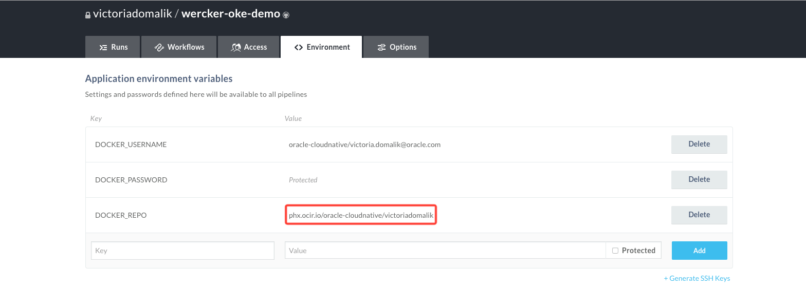
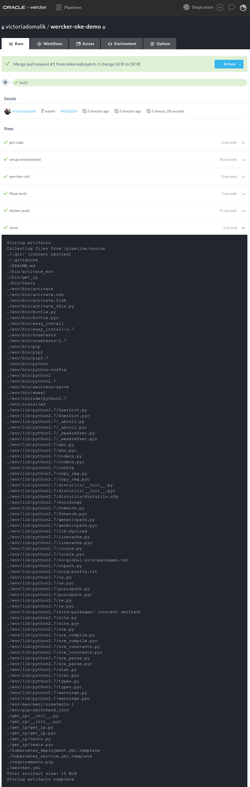
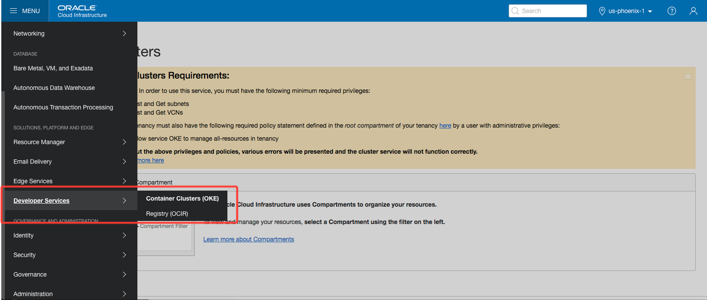
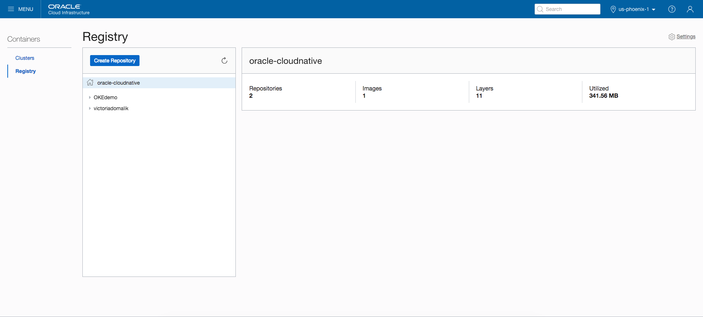
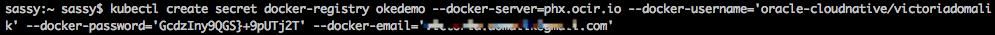
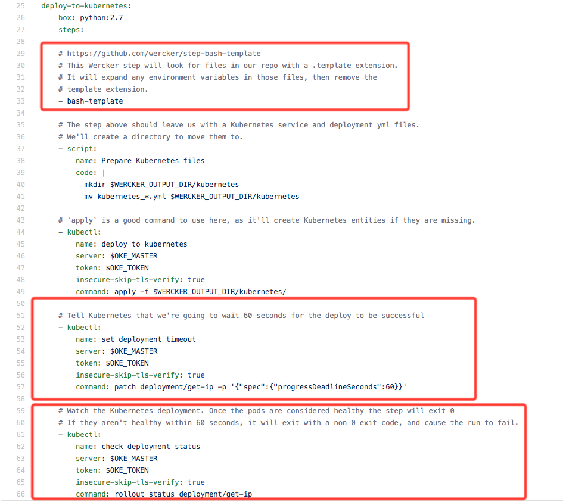
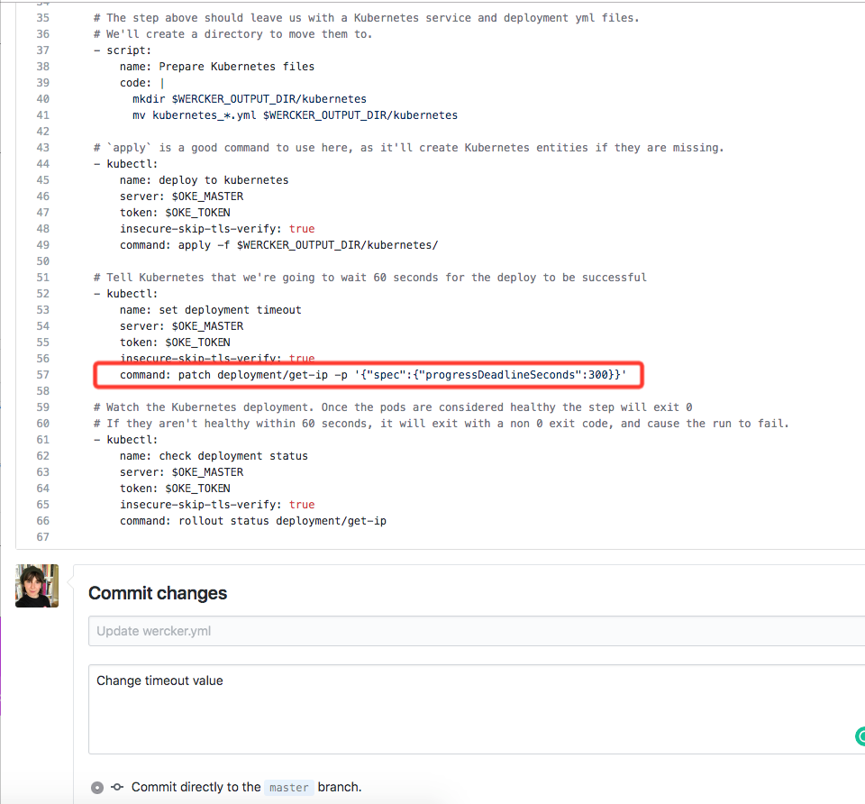
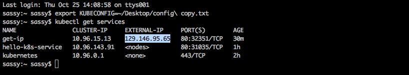

Wercker is a Continuous-Integration and Continuous-Delivery (CI/CD) tool. It enables the creation of automated workflows, or pipelines, which specify a series of 
tasks or commands that are run on your code whenever a change is pushed to the source repository. In order achieve this, Wercker "listens" to GitHub so that, for 
example, when there is a commit (new code or changes made to a branch or the master), Wercker can automatically build a container image from that change without 
manual intervention. 

In the case of a commit to master, Wercker runs a pipeline and builds the image, pushes the image to Oracle Container Repository (OCIR) and then deploys the container to an instance of OKE, replacing the running containers/pods, and thus updating the application.

In this tutorial we're going to get a sample application running on OKE with Wercker.

### Important 

Before we dive in, I am assuming that you have not completed the prerequisite tutorial "Creating a Cluster with Oracle Cloud Infrastructure Container Engine for Kubernetes and Deploying a Sample App" (as yet). I have a couple of "gotcha's" that will make your life easier. 

### Gotcha 1

In the prerequisite tutorial "Creating a Cluster with Oracle Cloud Infrastructure Container Engine for Kubernetes and Deploying a Sample App" halfway through you get prompted to download the OCI CLI. Do it now, it will make things faster. [Here is the link](https://docs.cloud.oracle.com/iaas/Content/API/SDKDocs/cliinstall.htm).

### Gotcha 2

To avoid the above CLI from presenting installation errors, **Mac OSX** users need to install Python 2.7. Use whatever package manager you like. I use Homebrew `$ brew install python@2`. If you don't have Homebrew, paste this into your terminal `/usr/bin/ruby -e "$(curl -fsSL https://raw.githubusercontent.com/Homebrew/install/master/install)` and then install Python 2.7.

### Gotcha 3

Again, at a midpoint in the tutorial, you'll be prompted to generate an API signing pair in your OCI dashboard. I think it flows better to do that now, and add the public key value of the API signing key pair to the **User Settings** for your username by [following these instructions](https://docs.cloud.oracle.com/iaas/Content/API/Concepts/apisigningkey.htm#How).

Now that we have ironed those out go forth, complete the [tutorial](https://www.oracle.com/webfolder/technetwork/tutorials/obe/oci/oke-full/index.html). Do not tear anything down at the end and come back here.


#### Step 1

In this step, create a Wercker application of a GitHub application.

* Login to your GitHub account.
* Open the application [wercker-oke-demo](https://github.com/riceo/wercker-oke-demo) and fork it.
* Select the **wercker.yaml** file and open.


Any Docker image created by the Wercker application will be tagged with the corresponding Git commit that triggered its run. This is a Wercker best practice that 
ensures a given revision of your source is included in a known single artifact image. This makes it easy to point Kubernetes at new changes to the application. 

The initial environment variables that need to be passed to Wercker are:

* DOCKER_USERNAME
* DOCKER_PASSWORD
* DOCKER_REPO

You can see them here in this handy image below. 


We're going to create your first application in a few easy steps by following the Wercker wizard prompts. 

* Log into your Wercker account and create your first application. In the wizard make sure that you select your user in the drop down as well as GitHub as your SCM. 
* Select the **wercker-oke-demo** application you previously forked and click next. Accept the default when it comes to checking out the code...
* Finally, click create!

#### Step 2 

In the previous step we created your Wercker application successfully. In this step, we define the environment variables. 

* Click on the Environment tab and create the following environment variables (remember to click "add" after each one). 
    * Docker Username must include the **<tenancy name>/<username>**
    * Docker Password is the **auth_token** for your cluster (that you set up earlier). Click the "protected" check box ensuring you don't have any $ characters. 
    * Docker repo must include **<region-code>.ocir.io/<tenancy name>/<registry name>**. Click the Run tab when you're done putting these in. 



Notice, I put a red box around the value for DOCKER_REPO. The reason I did this is that I have made the mistake of adding the value as `us-phoenix-1.ocir.io` rather than `phx`. This caused silly errors down the line (obviously) that took an inordinate amount of time to figure out. 

* Test that the application can be built and pushed to OCIR. Click the "trigger a build now" link at the bottom of the page and watch your build complete successfully in the Runs tab. 


This is what success looks like




#### Step 3 

In the previous step we defined the environment variables of your application. In this section, we're going to check that the images have been successfully pushed to
OCIR.

* Login to your OCI instance.
* Choose the menu icon in the top left corner to display your options.
* Select Developer Services > Registry (OCIR). Once the list of repositories in the OCI Registry is displayed. 



* Expand the repository to see the images you pushed.



#### Step 4 

In the previous step we checked that the images have been successfully pushed to OCIR. In this step we're going to configure the cluster to pull images from the 
OCI registry. 

In order for the images to pulled during deployment, you need to configure the cluster by creating an image secret and setting some additional parameters in your 
Wercker application.

* Create an Image Secret for accessing OCIR. Open a Terminal Window and execute the following command: 

```
export KUBECONFIG=~/kubeconfig
kubectl create secret docker-registry <SECRET NAME> --docker-server=<REGION.ocir.io> --docker-username='<TENANCY/OCI_USERNAME>' --docker-password='<AUTH_TOKEN>' --docker-email='<EMAIL>'
```



* At this point, switch to GitHub and select the **kubernetes_deployment.yml.template** file. 


Inside the Kubernetes configuration file you'll see the newly created image secret using the environment variable OKE_IMAGESECRET which you need to create as an environment variable in your Wercker application.


* Switch back to the Wercker Environment tab and enter the **OKE_IMAGESECRET** and value **<secret name>** (my secret name was 'okedemo') and click add. 

* You'll need to get the values for **OKE_MASTER** and **OKE_TOKEN** from the kubeconfig file. To do this switch over to your terminal window to enter:

```
cat kubeconfig
```

* The image below shows the execution of the cat kubeconfig command in a terminal window. The highlighted area is the server URL that you will use as your OKE_MASTER envar. **Make note of it.**


* The image below shows the execution of the cat kubeconfig command in a terminal window. The bottom of the file contents is displayed. The token parameter is highlighted. This is your OKE_TOKEN, make note of it.


Switch to Wercker to create the following parameters under the Environment tab.

* Key: OKE_MASTER: <server value from kubeconfig>
* Key OKE_TOKEN: <token value from kubeconfig>


As an aside, to review the script when a deploy to kubernetes is performed, switch to GitHub and open the wercker.yml file.

* Scroll to to the **deploy-to-kubernetes** area. 



The highlighted steps in the configuration file do the following:

* The first step is that all the .template extensions are removed. Afer this it will move all the Kubernetes configuration files to a clean directory for consumption by kubectl commands. 
* Set a timeout on the deployment of 60 seconds, giving the deployment time to successfully start the application's container before timing out.
* Watch the status of the deployment until all pods have come up. If the timeout is hit this will immediately return a non zero exit code and cause the pipeline run to fail. This means your pipeline will succeed only if your application has been successfully deployed, otherwise it fails.

#### Step 5 

In the previous step we configured the cluster to pull images from the OCI registry. In this step we will create a Deploy-to-Kubernetes workflow in your Wercker application.

To deploy the OCI container to Kubernetes, you need to create a Deploy-to-Kubernetes workflow in your Wercker application.

* Switch to your Wercker application and click the Workflows tab and add a new pipeline and enter **deploy-to-kubernetes** for both Name and YML pipeline and click create.
* Click back to the Workflows tab and in the editor click the '+', to create a new pipeline chain after the build. Select **deploy-to-kubernetes** for Execute pipeline and click Add.

In the end it should look like this


#### Step 6 

In the previous step The new change in the workflow was created successfully. In the next step, we'll deploy the OCI image to kubernetes.

Switch to your GitHub application and select the *wercker.yml* file and click edit. Scroll down to the set deployment timeout area and change the timeout to *300* seconds to make sure there is enough time to complete the deployment. Enter a description for commit and click Commit changes.



Switch to the Runs tab. You'll note that the pipeline was executed automatically. Click **deploy-to-kubernetes** and scroll to the bottom to verify that all the steps were completed successfully. 


#### Conclusion

You can verify the service by running the app in OCI Container Engine for Kubernetes.

From your terminal window, execute the following:

```
export KUBECONFIG=~/kubeconfig
kubectl proxy
```
Open a NEW terminal window and execute the following. Copy the EXTERNAL-IP for get-ip to your clipboard.

```
export KUBECONFIG=~/kubeconfig
kubectl get services
```



Paste the value for EXTERNAL-IP into your browser to run the application! 

After you've had your fun make sure to tear down the VCNs and clusters that you launched. 
