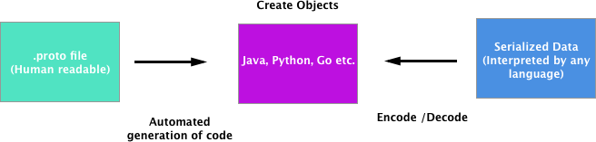

As mentioned in the introduction section, Protocol Buffers (Protobuf) is a language-neutral, platform-neutral mechanism for serializing structured data. Protobuf is smaller, faster, simpler and has been shown to perform better than other standards such as XML and JSON. In this guide, we're going to dive into some of the concepts and building blocks of Protobuf before moving on to more advanced topics. However, before we go on. I want to take you on a journey; the journey of the evolution of data and how Protobuf came to be. 

#### CSV 

Let's start with good ol' CSV. In this format, you have a header with rows and names and different columns. The good thing about CSVs is that they are easy to parse, read and make sense of. The less good things are that the data has to be inferred, parsing gets hard when the data has weird characters in it like commas, and there may be missing information like column names.

Overall it works well for some things, but not so great for data. 

#### Relational Databases 

Next up, we look at relational databases. Relational table definitions add _types_. So you create a table, and you can define what is an integer and a string, etc. The data is also fully typed and fits in the table. This is all good and a step up from CSVs, but, the less good things are that the data has to be flat and stored in a database where the definitions are likely different in each database. This means that everything needs to be customized. 

#### JSON

JSON (Javascript Object Notation). The JSON format can be shared across the network and makes sense when you look at it. Data can take any form (arrays, nested elements, etc.) and it's a widely accepted format on the web. Every language knows how to read JSON. The less good things are that your schema is not enforced, meaning that you can put anything anywhere and JSON won't complain. In addition to this, your CPU has the potential to be eaten alive and with no comments, data notation and metadata, things get weird pretty quickly. 

#### Protocol Buffers 

With Protobuf we have a syntax line and a message (and a few fields like ID, name, etc.). Protocol buffers are defined by a `.proto` text file which one can easily read and understand. Data is fully typed, compressed automatically, you _need_ a schema to use it, documentation can be embedded in the file, it's read by many languages, and you can change the protocol buffer in a safe way over time. It's super fast. Code is generated for you automagically. 

That being said, support for some languages might be lacking (but there's a plugin for that), you can't open the data with a text editor like Json which can be a pain. 

## Basics

In image below should help you get your head around how Protobufs work. On the left, we have a `.proto` file that is human readable and generates code automatically in pretty much any language. In the middle your language of choice is used to create an object that can be encoded and decoded to create serialized data that can be interpreted by any language, thus making it universally useful. 

Universality aside, and other than the points earlier stated that relate to speed, ease of use and low overhead, Protobuf is also used by big projects like etcd, lots of RPC frameworks, including gRPC, to exchange data. It's also the default format for APIs at Google - so that has to stand for something. 




Now that we have a conceptual and historical idea about Protobufs, let's take a look at what a `.proto` file looks like.  

```
syntax = "proto3";

message Mymessage {
    int32 age = 1;
    string first_name = 2;
    bool is_profile_verified = 3;
}
```


The first line says syntax "proto3"; that's because we're looking at "proto3" in this guide. If you were going to use "proto2" you'd type "proto2" instead. 

The third line is message Mymessage. Messages are the at the heart of Protobuf because they are what gets exchanged in our code. Messages are typically comprised of fields, IDs and field tags. 

### Scalar Types

#### Numbers
 
Numbers can take various forms based on what values you expect them to have: `double, float, in32, int34` etc.  In the example above we're using int32. 

#### Boolean

Boolean; true or false, you know this. Boolean is shown as `bool` in Protobufs. 

#### String

As you know, strings are comprised of an arbitrary length of text. In Protobuf string must always contain either UTF-8 encoded or 7-bit ASCII text. You cannot have other types of encoding in string types. 

#### Bytes

Bytes are for anything else you can think of; pictures for example. 

### Tags

In Protobufs field names are not the most important. What's really important for Protobufs is the `field` tag. Some notes on tags: 

* The smallest tag you can have is 1 (you'll see why later).
* Numbers 19000 and 19999 are off limits - those are reserved by Google for Googly things. 
* Good practice for frequently used fields is to be given tags numbering between 1-15. This is because they only use 1 byte of space. 
* For less frequently populated fields the tag numbers 16 - 2047 are good as they use more bytes. 

### Repeated Fields

If you want to express a list or array, you can use the concept of repeated fields. The list can take any number of elements that you want. In the example below we have a repeated field. 

```
syntax = "proto3";

message Person {
    int32 age = 1;
    string first_name = 2;
    bool is_profile_verified = 3;

    repeated string phone_numbers = 4;
}
```


### Comments

It is possible (and highly recommended) to embed comments in your `.proto` file. Comments can be used in these two forms as you can see below: 

```
// The syntax for this file is proto3
syntax = "proto3";

/* Person is used to identify users
 * throughout our system */
message Person {
    // the age as of the person's creation
    int32 age = 1;
    // the first name as documented in the signup form
    string first_name = 2;
    bool is_profile_verified = 3;

    // a list of phone numbers that is optional to provide at signup
    repeated string phone_numbers = 4;
}
```

### Default Value Fields 

Earlier I stated that the lowest value you can have for a tag is `1`. The reason behind this is that for every field in Protobuf there is a default value. You never have empty fields; if you don't specify them or are they are unknown, a default value will be automatically inserted. 

Here is a list of some of the default values:

* For bool it's "false"
* Number it's "0"
* String is "empty string"
* Bytes is empty bytes
* enmum will be the first value
* repeated will be an empty list 


### Enums

`enum` stand for enumeration. If you know the all the values of a given field in advance then you can leverage this beauty. A common "gotcha" is that the first value of an `enum` is a default value, as expressed above. If you give the first enum any other value things will break. Below is an example of what it should look like.

```
// The syntax for this file is proto3
syntax = "proto3";

/* Person is used to identify users
 * across our system */
message Person {
    // the age as of the person's creation
    int32 age = 1;
    // the first name as documented in the signup form
    string first_name = 2;
    bool is_profile_verified = 3;

    // a list of phone numbers that is optional to provide at signup
    repeated string phone_numbers = 4;

    // we currently consider only 3 hair colours
    enum HairColour {
        UNKNOWN_HAIR_COLOUR = 0;
        HAIR_RED = 1;
        HAIR_BROWN = 2;
        HAIR_BLONDE = 3;
    }

    // it's an enum as defined above
    HairColour hair_colour = 5;

}
```


 As you can see we have defined our `HairColour` field with the tag `8` which is referencing the enum. 
 

### Nesting

Now that we have the hang of the basic Protobuf message structure, let's move on to defining multiple messages in the same`.proto`file. 

```
// The syntax for this file is proto3
syntax = "proto3";

/* Person is used to identify users
 * across our system */
message Person {
    // the age as of the person's creation
    int32 age = 1;
    // the first name as documented in the signup form
    string first_name = 2;
    bool is_profile_verified = 3;

    // a list of phone numbers that is optional to provide at signup
    repeated string phone_numbers = 4;

    // we currently consider only 3 hair colours
    enum HairColour {
        UNKNOWN_HAIR_COLOUR = 0;
        HAIR_RED = 1;
        HAIR_BROWN = 2;
        HAIR_BLONDE = 3;
    }

    // it's an enum as defined above
    HairColour hair_colour = 5;

  // Person's birthday
  Date birthday = 6;
}

message Date {
  // Year of date. Must be from 1 to 9999, or 0 if specifying a date without
  // a year.
  int32 year = 1;

  // Month of year. Must be from 1 to 12.
  int32 month = 2;

  // Day of month. Must be from 1 to 31 and valid for the year and month, or 0
  // if specifying a year/month where the day is not significant.
  int32 day = 3;
}

```


As you can see in the example above, we have the addition of the user's birthday as type `Date` outside of the constrains of our `user` type, but, is referenced inside the `user` type. In the example below we have a different nesting situation. The below example with type `Address` sits within the `user` type and is also referenced there. 

```
// The syntax for this file is proto3
syntax = "proto3";

/* Person is used to identify users
 * across our system */
message Person {
    // the age as of the person's creation
    int32 age = 1;
    // the first name as documented in the signup form
    string first_name = 2;
    bool is_profile_verified = 3;

    // a list of phone numbers that is optional to provide at signup
    repeated string phone_numbers = 4;

    // we currently consider only 3 hair colours
    enum HairColour {
        UNKNOWN_HAIR_COLOUR = 0;
        HAIR_RED = 1;
        HAIR_BROWN = 2;
        HAIR_BLONDE = 3;
    }

    // it's an enum as defined above
    HairColour hair_colour = 5;

  // Person's birthday
  Date birthday = 6;
  
    // we define the type Address within Person (full name is Person.Address)
  message Address {
    string address_line_1 = 1;
    string address_line_2 = 2;
    string zip_code = 3;
    string city = 4;
    string country = 5;
  }

  // multiple addresses
  repeated Address addresses = 7;
}

message Date {
  // Year of date. Must be from 1 to 9999, or 0 if specifying a date without
  // a year.
  int32 year = 1;

  // Month of year. Must be from 1 to 12.
  int32 month = 2;

  // Day of month. Must be from 1 to 31 and valid for the year and month, or 0
  // if specifying a year/month where the day is not significant.
  int32 day = 3;
}

```


The reasons for wanting to nest types differently are many, but some top level reasons would be that you want to avoid naming conflicts, or you want to enforce some level of locality for that type. 


### Imports 

In Protobuf we have the ability to import types so that different messages can in different `.proto` files. This is useful if you want to reuse code or use other `.proto` files from your team or that you find on the web. It also makes things a bit neater. 

```
// The syntax for this file is proto3
syntax = "proto3";

import "3-basics-part-ii/3-date.proto";

/* Person is used to identify users
 * across our system */
message Person {
    // the age as of the person's creation
    int32 age = 1;
    // the first name as documented in the signup form
    string first_name = 2;
    bool is_profile_verified = 3;

    // a list of phone numbers that is optional to provide at signup
    repeated string phone_numbers = 4;

    // we currently consider only 3 hair colours
    enum HairColour {
        UNKNOWN_HAIR_COLOUR = 0;
        HAIR_RED = 1;
        HAIR_BROWN = 2;
        HAIR_BLONDE = 3;
    }

    // it's an enum as defined above
    HairColour hair_colour = 5;

  // Person's birthday
  Date birthday = 6;
  
    // we define the type Address within Person (full name is Person.Address)
  message Address {
    string address_line_1 = 1;
    string address_line_2 = 2;
    string zip_code = 3;
    string city = 4;
    string country = 5;
  }

  // multiple addresses
  repeated Address addresses = 7;
}

```


In the example above we have moved our `Date` type out of our current `.proto` file and into another `.proto` file named `date.proto` instead, and have imported this new `date.proto` file into our current file. There is a gotcha here, note that I had to type the entire path name from the root of the project, not just the file name in the import statement. 

There we have it. An introduction to the basic components of Protobufs. 


