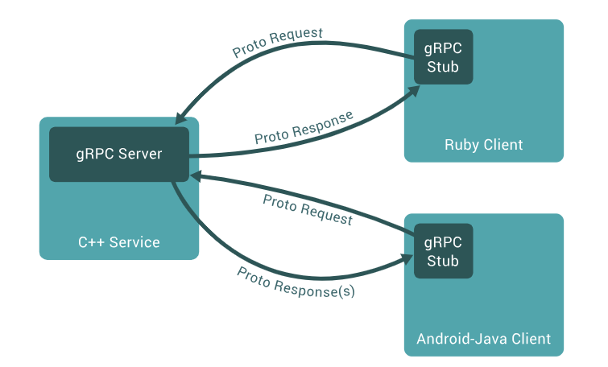

In an earlier [guide](#link to protocol buffers guide) we had a look at the basic building blocks of the `.proto` file, getting to know how to write one and receiving a heads up on a couple of "gotchas". 

In this guide, we cover the same kind of theoretical overview of gRPC, and stack it up against REST (the favorite) and GraphQL (so hot right now) before we dive into some "hands-on labs" type guides later in the series.

### What is gRPC?

gRPC has become a popular choice for microservices of late, and that is because it has been touted as a high performance, open-source remote procedure call (RPC) framework that makes it easier to build connected systems. Built on top of http/2 and Protobuf (although, other protocols can also be supported as we will see later), gRPC is supposed to be faster, more efficient, with less network overhead. gRPC allows you to build services with both synchronous and asynchronous communication models and it supports the traditional request/response model and bi-directional streams with apparent ease. Did I mention that it also makes a decent cup of tea?

As alluded to earlier gRPC and Protocol Buffers _are not_ a discreet package. As in, Protobuf and gRPC are entirely independent of each other, and you can, if you are so inclined, swap out Protobuf for any other encoding method. For example, you could use [Thrift](https://thrift.apache.org/), [Flatbuffers](https://google.github.io/flatbuffers/index.html#flatbuffers_overview), [Cap'nProto](https://capnproto.org/) and many more. If you have bought into gRPC but are not sure you even want to go down the whole "new encoding method" route, then you can still use [JSON](https://grpc.io/blog/grpc-with-json) with tiny hacks as described on the official gRPC blog, which we will not go into here. 

gRPC is built on top of http/2 which is like vanilla http but better. For example, it supports connection multiplexing. So if, say, there are multiple parallel requests from one server to another, all the responses can be sent together over a single connection. Also, the headers are compressed and transferred as binary data rather than plain text, and there is less SSL handshaking to be done because connections are reused, making things a tad faster. These things, in addition to various other benefits are what make http/2 good. Having said that, multiplexing can add overhead if there is a single request-response involved. For example, in case of proxy- or DNS-based round robin scenarios, each request may be routed to a different downstream, making multiplexing less useful, and a compressed and binary header means that inspection becomes difficult. 

Now that we have covered http/2, let's move on to Protocol Buffers, in case you did not read our exceptional guide on the basics of [Protocol Buffers](grpc-part-one-protocol-buffers-theory.md). Protobuf is a messaging protocol for over the wire communication. Protocol buffers are defined by a `.proto` text file which one can easily read and understand, data is fully typed and compressed automatically, you _need_ a schema to use it, documentation can be embedded in the file, many languages read it, it's super fast, and code is generated for you automagically. That being said, support for some languages might be lacking (but there's a plugin for that), and you can't open the data with a text editor like JSON which has its downfalls. Below is an image that illustrates what you've just read. 

_courtesy of grpc.io_

Now that we have a basic understanding of what's under the hood let's take a look at other API designs and see how gRPC stacks up. 

#### REST, GraphQL and gRPC

REST is probably the most commonly used API architecture, its claim to fame being the way the World Wide Web works. REST is stateless, operations are usually defined using `GET`, `POST`, `PUT`, and other standardized http methodologies, it has efficient caching, and is super scalable and extendable due to the fact that the client and the server are loosely coupled, meaning that you can iterate to your 'hearts content' within certain constraints. Not that anyone does that, to paraphrase the general feeling of the internet:

"let's be honest, REST is a metric of quality that developers aspire to, fail to understand, then label as REST anyway. Most implementations of REST that you've seen recently are washed out versions of RPC where request and response data is smeared over methods and query strings and are so tightly coupled as to lose the benefits of being loosely coupled".

One of the key differences between gRPC and REST is the way in which gRPC defines its contract negotiation.   RPC functions upon an "idea" of contracts whereas REST defines its interactions through terms standardized in its requests. Meaning that gRPC gives much of the responsibility to the client for execution, while offloading much of the handling and computation to the remote server hosting the resource. For this reason,  gRPC would be a "go to" in low-power situations (think the internet of things). Also, gRPC reuses connections which means that there is less SSL handshaking, making things faster. 

With GraphQL, the client determines what data it wants, how it wants it, and what format it wants it in.
This is a complete reversal from REST where the server dictates those things to the client, and different from gRPC where the client and the server negotiate the contract but where the how and what format the data is in is defined mainly by the resources themselves.
 
GraphQL typically delivers the smallest possible request. REST, on the other hand, usually sends everything it has all at once by default, and with gRPC, you can have it both ways. For this reason when you consider GraphQL, you might also consider functions because the data type is well-defined, and a low data package is preferred. 

### Conclusion 

All things considered, should you adopt gRPC? 

It's good practice to be sure any new architecture is vetted and has strong backing. gRPC is in production in environments like Netflix and Google and is in the CNCF (which we are a proud sponsor of). But you are likely not Netflix or Google so you should choose what is right for you and your team. Sure, new is better and yeah, having the latest technology is good for recruitment and morale, BUT there is something to be said for implementing the right thing (which may not be the newest thing) correctly for your company.