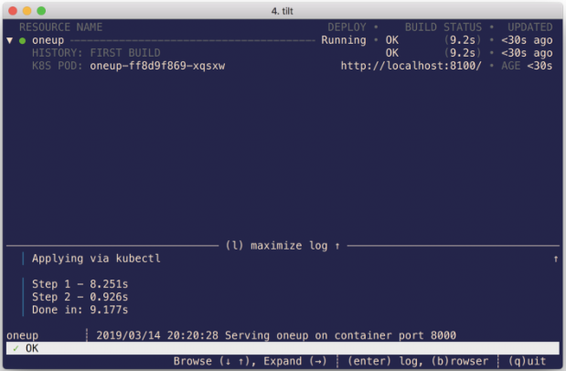

Tilt makes it easy to deploy multiple microservices simultaneously. You can reference more than one Dockerfile and more than one Kubernetes manifest in your Tiltfile. While Tilt and Skaffold are both useful for the development of multiple interconnected microservices, Tilt differentiates itself with two key features: heads up display and fast build.

The heads up display indicates whether or not a pod has been successfully deployed to your cluster with a simple green (successful) and red (unsuccessful) indicator next to the pod name. It also includes information about the name of each pod deployed in the cluster using Tilt, the deployment status, deployment history, and pod logs: both build logs and running container logs. This is especially helpful when you find yourself developing a growing number of interrelated microservices. Some might push back on the UI as superfluous — of course all of this information is available using basic kubectl commands - but it certainly makes it harder to miss pod issues when they are as clear as a green dot flipping to red. The UI is justified because it helps you focus on what matters.

Fast build addresses one of the major bottlenecks of local development: the build and update process. Fast build is used to perform incremental image builds. Rather than re-download all of the dependencies and recompile from scratch each time code changes, fast build uses a build cache to skip steps done previously and inject the build cache from the previous run. Tilt also speeds up the deployment process by means of a sidecar “Synclet” running on the same node as your existing pod. The Synclet adds updated files to an existing pod and restarts the container instead of deploying a new pod from scratch when your code changes. The Synclet further speeds up the build and deploy process by allowing you to bypass the registry to send code updates directly to the Synclet and also by allowing you to run build commands directly in your cluster. Fast build take over much of the build responsibility from your `Dockerfile`. As a result, your `Dockerfile` cannot contain any ADD or COPY lines, so you may need to make small changes to it.


### Installation

More detailed installation information can be found on the [Tilt GitHub page](https://github.com/windmilleng/tilt/).

Download and install Tilt:

```
brew tap windmilleng/tap && brew install windmilleng/tap/tilt
```

Verify your installation:

```
tilt version
```

### Local Configuration

Clone the [Tilt repository on GitHub](https://github.com/windmilleng/tilt) and change to the `/integration/oneup` directory. The directory contains:

```
$ ls
Dockerfile	Tiltfile	main.go		oneup.yaml
```

* Tilt is configured by means of a `Tiltfile`. In the repository you will see an example `Tiltfile` that will be used to deploy `oneup.yaml`.
* The `Dockerfile` contains information about how to build your `main.go` application.
* `oneup.yaml` is the Kubernetes manifest used to build the image created by the Dockerfile.


When deploying to a local cluster, if there is no registry specified in your `tiltfile`, Tilt will bypass the step to push your image to a registry. Tilt uses your current Kubernetes context to determine the cluster on which your application will be deployed. To find your context run: `kubectl config current-context`.

### Deploy the Application

Run `tilt up` to build and deploy the application. The Tilt UI will indicate a successful deployment with a green indicator and a deploy status of `running`.



### Verify Your Deployment

Tilt deployed the application in the `tilt-integration` namespace as specified in the Kubernetes manifest. Verify your application was properly deployed by switching to that namespace and running `kubectl get pods`:

```
$ kubectl get pods
NAME                     READY   STATUS    RESTARTS   AGE
oneup-7f7d69bd66-ckhct   1/1     Running   0          5s
```

### Connect to the Application

Connect to your application by typing B. This will open your browser and connect to the "OneUp" application based on the port forward indicated in the `Tiltfile`. In this example the browser will open to `http://localhost:8100`.

### Modify the Application

While `tilt up` is running, the build, push, and deploy application will reoccur every time a change is made to your code. You can make a change to your application, save it, and watch in real-time as Tilt runs through the pipeline to redeploy your updated application.

### Application Logs

There are no additional steps needed to get logs from your application. Build logs and running container logs are both visible in the heads up display.

### Remove the Application

When you are finished testing the application, you can exit the UI by typing `Q` and remove the application from your cluster with `tilt down`:

```
$ tilt down
Deleting via kubectl: Namespace/tilt-integration
Deleting via kubectl: Deployment/oneup
```

### Hosted Kubernetes and Docker Registry Configuration

Skaffold can also be used with hosted Kubernetes solutions. My example will use [Oracle Container Engine for Kubernetes (OKE)](https://docs.cloud.oracle.com/iaas/Content/ContEng/Concepts/contengoverview.htm) as the Kubernetes cluster and [Oracle Cloud Infrastructure Registry (OCIR)](https://docs.cloud.oracle.com/iaas/Content/Registry/Concepts/registryoverview.htm) as the container image registry. Similar steps can be followed to configure Tilt with other Kubernetes cluster and registry services.

### Registry Configuration

To use a cloud registry service you will either need to add the URL of the registry to your `tiltfile` or specify a registry in a personal settings file. To use OCIR as your registry you will need to provide the server URL of the registry in the following format: `<region code>.ocir.io/<tenancy name>/<repo name>/<image name>:<tag>`

* `<region-code>` is the code for the OCI region that you are using. For example, the region code for Phoenix is `phx`. For additional information see [Regions and Availability Domains](https://docs.cloud.oracle.com/iaas/Content/General/Concepts/regions.htm).
* `ocir.io` is the Oracle Cloud Infrastructure Registry name.
* `<tenancy-name>` is the name of the tenancy that owns the repository to which you want to push the image, for example `example-dev`. Note that your user must have access to the tenancy.
* `<repo-name>`, if specified, is the name of a repository to which you want to push the image. For example, `project01`. Note that specifying a repository is optional. If you choose specify a repository name, the name of the image is used as the repository name in Oracle Cloud Infrastructure Registry.
* `<image-name>` is the name you want to give the image in Oracle Cloud Infrastructure Registry, for example, `helloworld`.
* `<tag>` is an image tag you want to give the image in Oracle Cloud Infrastructure Registry, for example, `latest`.

Use the following format to update default_registry in your tiltfile with the registry URL:
```
default_registry('ocir.io/my-personal-project')
```

Even without creating the `tilt_option.json`, this setting will modify both the `docker_build` section of the `tiltfile` and the `app.yaml` with your registry settings.

If you choose to use a personal registry, instead create a `tilt_option.json` file with the registry specified in JSON:

```
{
  "default_registry": "ocir.io/my-personal-project"
}
```

You will need to update your `tiltfile` to reference this file:

```
settings = read_json('tilt_option.json', default={})
default_registry(settings.get('default_registry', 'ocir.io/shared-project-registry'))
```

You will need to log into the registry with:

```
docker login <region code>.ocir.io
```

* Username: `<tenancy-name>/<oci-username>`
* Password: `<oci-auth-token>`


You may also be required to establish trust with the registry. For example, the OCIR registry will be set to private by default. If you would like to continue with a private repository, you will have to add an image pull secret which allows Kubernetes to authenticate with a container registry to pull a private image. For more information about using image secrets, refer to [this guide](https://www.oracle.com/webfolder/technetwork/tutorials/obe/oci/oke-and-registry/index.html). A simpler option for testing purposes is to set the registry to be **public**.

### Kubernetes Cluster Configuration

Because Tilt uses your current Kubernetes context to determine the cluster on which your application will be deployed you will need remember to switch to your context to OKE. Verify your context with: `kubectl config current-context`.

Once the configuration is complete, run `tilt up` to build your application using the Dockerfile, push the application to OCIR, and deploy the application to OKE. As you did before locally, you can verify the successful deployment of the application by changing to the proper namespace and running `kubectl get pods`. Connect to your application with `B`.

### Summary

Tilt is tool that makes deploying and managing multiple microservices easy. The heads up display simplifies the process of simultaneously monitoring multiple deployments with a central dashboard that includes logs and other useful information. The [Servantes](https://github.com/windmilleng/servantes) example microservice application available on the Tilt GitHub page is a terrific way to see the benefits of Tilt first hand.

### References

* [Tilt User Docs](https://docs.tilt.dev/)
* [Tilt GitHub](https://github.com/windmilleng/tilt)

**Editors note: this article has been sindicated with the authors permission. For the original [click here](https://medium.com/@m.r.boxell/inner-loop-container-native-development-with-tilt-47c97fc31918).**

