The purpose of this solution is to go over the Docker basics which explain containers, images, how they work, where to find them, the architecture (client, daemon), the difference between Docker and VMs, and we will download Docker and an Oracle image and have a play with some commands.

### Prerequisites

This tutorial is for complete beginners that have never played with Docker before.  However, I am going to assume you are familiar with a few concepts before we continue:

* IP addresses and ports
* Virtual Machines
* Editing configuration files
* Basic familiarity with the ideas of code dependencies and building
* Machine resource usage terms, like CPU percentages, RAM use in bytes, etc.
* Finally, a Docker hub account https://hub.docker.com/  (it is free)

## Containers

To understand Docker you have to start at containers. Container technology has been around since the days of the mainframe, but it has resurged in the last couple of years due to the increase in virtualization and the rise of microservice architecture.

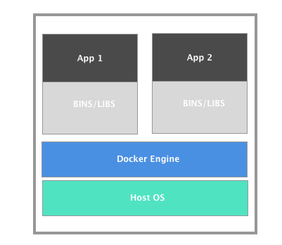

A container is created from a container image. Images are tarballs with a JSON configuration file attached.

A Docker container image includes everything needed to run an application: code, runtime, system libraries, etc.
  

When using containers, there is a single operating system installed on the physical hardware which each container makes use of. Illustrated in the diagram above we have two containers (app 1 and app 2) sitting atop the Docker engine. Note that the containers themselves are not a complete operating system, the complete system is within the host OS. 

The container only contains the application and the required binaries and libraries that support that particular application. Why? So the app runs quickly and reliably from one computing environment to another.

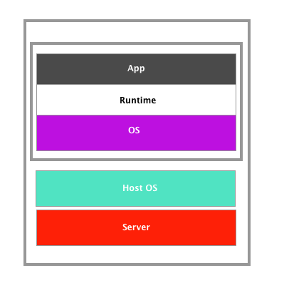

Container images become containers at runtime. The runtime is software that executes the container, which means telling the kernel to assign resource limits, create isolation layers (for processes, networking, and filesystems), and so on. Basically the runtime describes the configuration, execution environment, and lifecycle of a container.

The story of container runtimes has had many twists and turns and makes for exciting reading which we aren’t going to cover in any great detail save to say the names you may have heard to help you connect the dots.

* **Rkt** is a container runtime created by CoreOs (part of RedHat and now IBM)
* **CRI-O** another runtime was built by some RedHat folks to make an even simpler runtime to Rkt; and that would only do what Kubernetes needed
* Along the same time Docker updated its runtime **Containerd** which was donated to the CNCF last year.

And finally we have the **OCI** (Open Container Initiative) which is NOT a runtime (or our Oracle Cloud Infrastructure also known as OCI) but the organization created to manage, define and standardize runtimes. You may ask, why so many runtimes? Well, since its inception Docker has been known as a big project doing too many things, and the other players just wanted a simple, standardized runtime. 


## Images


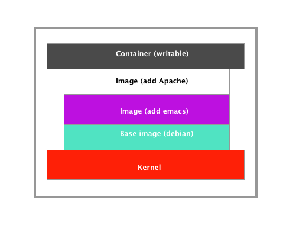

As you can see from the picture above, an image is a collection of read-only files and some metadata that include executable code (system libraries, system tools and other platforms settings a software program needs to run) so it can run an isolated process.

These images are made of layers that are conceptually stacked on one another with each layer being able to add, change or remove files. A storage driver handles the details about the way these layers interact with each other.
 
A container is a running instance of an image. You can have many running containers of the same image. To make changes to introduce more functionality, fix bugs or otherwise change the image, you create a new container from that image and make changes to the files presented from the base image of that container on the read-write layer (container layer) of your new container.

For increased automation, the set of layers can be described by the user in a Dockerfile, and these are assembled into the image. A Dockerfile is a series of commands or operations that define how to build an image. The image is built up of read-only layers, with each instruction in the Dockerfile resulting in a new read-only layer based on the previous layer. The resulting image is also read-only. 

Let's look at a Dockerfile briefly.

```
FROM ubuntu:15.04
COPY . /app
RUN make /app
CMD python /app/app.py
```
This Dockerfile contains four commands, each of which creates a layer.

* The `FROM` statement starts by creating a layer from the ubuntu:15.04 image.
* The `COPY` command adds some files from your Docker client’s current directory. 
* The `RUN` command builds your application. 
* Finally, the last layer specifies what command to run within the container.

Note: That "ubuntu" image in the Dockerfile above is a public image from Docker Hub and `15.04` is a tag which describes the version. 
The use of layers, images, and copy-on-write means there is a strong emphasis on building generic images that can be reused and shared (like the ubuntu image above) to optimize disk storage. 
Once you have a running container, avoid making additional configuration changes to it, which includes upgrades and patches. Instead, make the necessary changes in the Dockerfile and/or configuration scripts, rebuild the image, then run a new container based on the updated image.

A slightly advanced topic, but one that I will mention anyways is that when you are trying to make containers that are stateless, anything important that shouldn't be thrown away when the container is dropped and run again should be held in persistent storage, not in the container itself. 

### Get Images

Now that you know what they are, you're probably wondering where to find them. Many software vendors create publicly available images of their products.

The way they make them available is through a Container Registry such as [Docker Hub](https://hub.docker.com/) or [Docker Store](https://store.docker.com/). 

How is Docker Store different from Docker Hub? Docker Hub contains community content - these are images that have been created by entities that are not vetted or curated; anyone can push new images to the community, and there are no guarantees around the quality or compatibility of this content. For [official Oracle images go to the Docker Store](https://store.docker.com/search?q=oracle&type=image&source=verified&certification_status=certified).

## Docker Architecture 

Now that we have covered containers and images, let's have a look at Docker. 


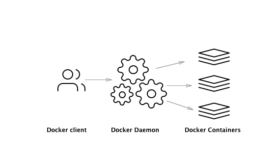


Docker as a whole is composed of many different tools, but when most people talk about installing and using Docker, it’s about the Docker daemon and Docker CLI.  

Look at the image above. The image on the left is the Docker client. The Docker client makes the calls to the Docker daemon to pull an image, create a container, delete a container, attach a network, remove storage (you get the picture) - all these actions are from the Docker client which uses the exposed Docker API to connect with the Docker daemon. The client could be installed on your laptop running Windows, MacOS or a server running Linux. 

The next picture in the middle is the Docker daemon. The Docker daemon runs on a “host” server, and this can be bare metal or a VM. The host is just the server that happens to be running the Docker daemon. The client and daemon do not need to be on the same box. The daemon is doing all the work that the client asks it to do. 

On the right, you have Docker containers (remember containers are lightweight operating systems that have the required binaries and libraries, created out of multiple images, to support our application. You can deploy every application you can think of in any language be it Java, Python, Perl (I mean, you could), and you don’t need to stop there.  Under particular conditions you could deploy a [database](https://cloudnative.oracle.com/template.html#infrastructure/database/mysql-operator/readme.md). 

Let's look at the daemon (the bit in the middle in the picture above) in closer detail.

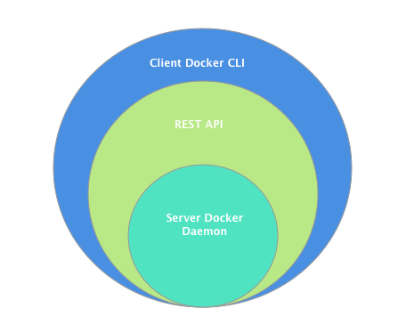

The Docker daemon (green circle of the picture above) listens for the Docker API requests and manages Docker objects such as images, containers, networks, and volumes. The daemon itself exposes a REST API where a number of different tools can talk to the daemon. 
Docker client - is the primary way that many Docker users interact with Docker. When you use commands such as `docker run`, the client sends these commands to the daemon which then carries them out. The picture below illustrates this. 

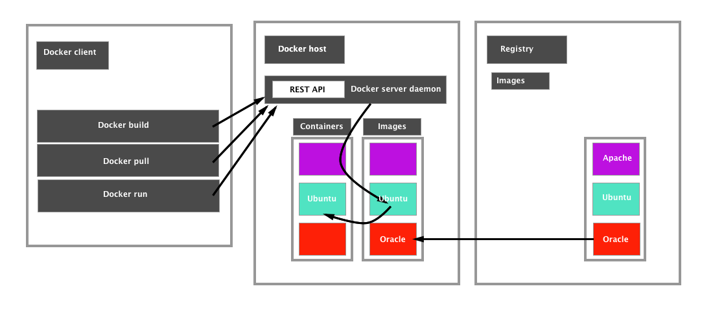

## What’s the Difference from VM’s? 

Let's have a look at this diagram below. 

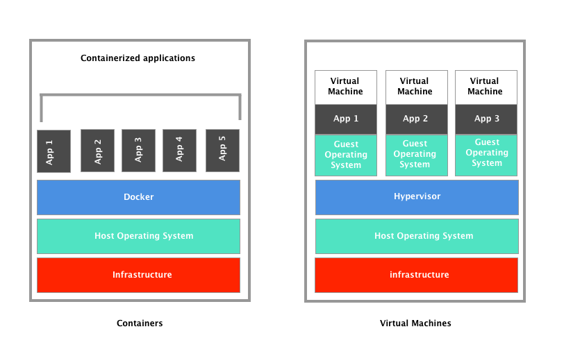

With Virtualization, You have three layers: Infrastructure, Host Operating System, and the Hypervisor with each virtual machine containing a copy of the OS and all the required binaries and libraries to run the application (this can get pretty big, pretty fast).

With containers, the Docker engine replaces the hypervisor and shares the host OS among the containerized applications who themselves only have the required binaries and libraries needed to run the applications (this greatly improves CPU utilization). 
 
So which is best? Containers are the answer in some situations while VMs are the answer in others, and, in some cases, both should be deployed at the same time. It's about understanding when and where each type of deployment is best for your organization. 

### Container Pros

* They deliver immutable infrastructure and solve the age-old “works on my machine” problem. 
* Once containerized, applications can be deployed on any infrastructure – on virtual machines, on bare metal, and various public clouds running different hypervisors
* The improved CPU utilization within a VM means an organization can reduce the overall number of virtual machines needed to operate their environment and increase the number of applications that can run on a server
 
### Container Cons

* Builds and deployments are slow and unpredictable
* Most standard Docker containers, meaning those running on a basic community or commercial Docker Engine on Linux, are not isolated from each other like VMs

### Getting Busy with RUN

Now that we have an idea of how everything fits, let's get our hands dirty with an installation and a few commands. 

If you don't have a package manager like Homebrew, you can go to the  [Docker site and download Docker from there](https://www.docker.com/get-started). If you do have Homebrew type:

```
$ brew install docker-cloud
```
Once this has installed run the command:

```
docker run hello-world
```


This checks to see that your installation was successful. 

Now log in using the docker CLI and the `docker login` command. Your Docker ID, which you use to log in to Docker Hub, is also used for logging in to Docker Cloud.

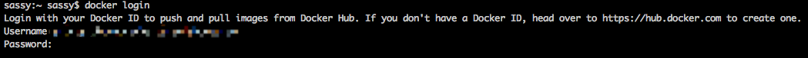

Now that we’re in, let's pull an Oracle image. In the terminal type:

```
docker pull oraclelinux
```


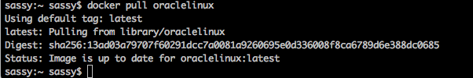
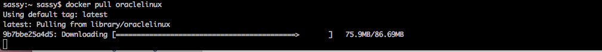

Now, you might think, how would I know that that is what the image is? You can always type:

```
docker search oracle
```

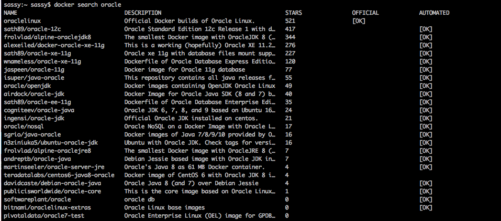

You’ll see that the image shows up right at the top and says it is official. 

So what's happening here? The `pull` command fetches the Oracle image from the Docker registry and saves it to our system. To see a list of all the images on your system type: 

```
Docker images
```

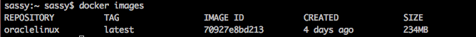

Now that we can see that we have the image on our system, let's run a container based on the image by typing:  

```
 docker run oraclelinux
```

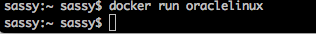

While it looks like nothing happend, actually a lot did. Let's run through what the `run` command does.  The Docker client finds the image, loads up the container and then runs a command in that container. When we ran `docker run oraclelinux` we didn't provide a command, so the container booted up, ran an empty command and then exited. Let's make it do something. Type: 

```
docker run oraclelinux echo "hello from larry"
```

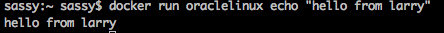

The Docker client ran the `echo` command in our oracle container and then exited it. Did you notice how fast that was? Pretty fast eh? 

That's it. You have a container on your laptop. Now let's run through some commands to get you going.  

### Lifecycle Commands.
 
- `docker create` -  creates a container but does not start it.
- `docker rename` -  allows the container to be renamed.
- `docker run` -  creates and starts a container in one operation.
- `docker rm` - deletes a container.
- `docker update` - updates a container's resource limits.
- `docker images` - shows all images.
- `docker import` - creates an image from a tarball.
- `docker build` - creates an image from Dockerfile.
- `docker commit` -  creates an image from a container, pausing it temporarily if it is running.
- `docker rmi` - removes an image.


### Starting and Stopping

- `docker start` - starts a container so it is running.
- `docker stop` - stops a running container.
- `docker restart` - stops and starts a container.
- `docker pause` - pauses a running container, "freezing" it in place.
- `docker unpause` - unpauses a running container.
- `docker wait` - blocks until a running container stops.
- `docker kill` - sends a SIGKILL to a running container.
- `docker attach` - will connect to a running container.
- `docker ps` - shows running containers.
- `docker ps -a` - lists all the containers you have run.
- `docker inspect` - looks at all the info on a container (including IP address).
- `docker events` - gets events from container.
- `docker port` - shows public facing port of container.


## Clean up

Throughout this tutorial, you'll have run `docker run` multiple times, and leaving stray containers will eat up disk space. To remove unwanted containers type `docker rm` and the container IDs from the containers you'd like to get rid of. If you have no idea what the ID's are just type `docker ps` and paste them alongside the command `docker rm`

If you have a bunch of containers to delete in one go, copy-pasting IDs can be tedious. In that case, you can simply type:

`docker system prune`

To additionally remove any stopped containers and all unused images (not just dangling images), add the `-a` flag to the command:

`docker system prune -a`

This puts up this warning. In our case press 'y'


That's it! Hope you have enjoyed dipping your feet in the water. 