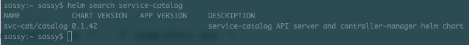
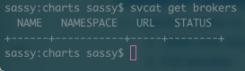
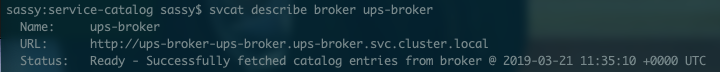
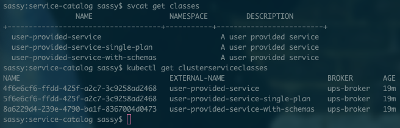
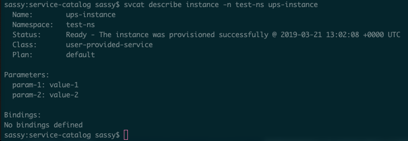
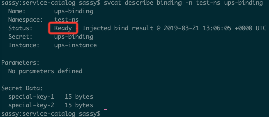

# A Walkthrough of the Kubernetes Service Broker


### Five on a Secret Trail 

Generally speaking there are The five building blocks of the service catalog.

 
_source:kubernetes.io_


1) The Open Service Broker API Server acts as an intermediary for the Kuberenetes API server to negotiate initial provisioning and retrieve credentials to use the managed server. The rules and specifications go into great detail on the [Open Service Broker Project website](https://www.openservicebrokerapi.org/), but the TL;DR is that in order to be compliant as a service broker API you need to fulfil three criteria:  

* Catalog endpoint - a JSON object list of your services offered. Each service should be composed of plans (small plan, medium plan, large plan etc.)
* Create a new `ServiceInstance` - this can happen asynchronously and we go into detail further on what a `ServiceInstance` is further on this guide.
* Credential generation - unique credentials need to be generated to access the service.


2) `ClusterServiceBroker` is an in-cluster representation of a broker server. A resource of this type encapsulates connection details for that broker server. These are created and managed by cluster operators (the people who control and configure clusters) who wish to use that broker server to make new types of managed services available within their cluster.

3) `ClusterServiceClass` is a type of managed service offered by a particular broker. Each time a new `ClusterServiceBroker` resource is added to the cluster, the service catalog controller connects to the corresponding broker server to obtain a list of service offerings (small plan, medium plan etc). A new `ClusterServiceClass` resource will automatically be created for each.

4) `ServiceInstance` is a provisioned instance of a `ClusterServiceClass`. These are created by cluster users who wish to make a new concrete instance of some type of managed service to make that available for use by one or more in-cluster applications. When a new `ServiceInstance` resource is created, the service catalog controller will connect to the appropriate broker server and instruct it to provision the service instance.

5) `ServiceBinding` expresses intent to use a `ServiceInstance`. These are created by cluster users who wish for their applications to make use of a `ServiceInstance`. Upon creation, the service catalog controller will create a Kubernetes `Secret` containing connection details and credentials for the service represented by the `ServiceInstance`. Such `Secrets` can be used like any other– mounted into a container’s file system or injected into a container as environment variables.


### Installation

Let's start locally. Here is a digested read of the [Service Catalog documentation](https://svc-cat.io/docs/), with some additional downloads and comments with particular reference to a couple of sticky points. This article assumes that you do not have any of the below installed and are working on a mac: 


* HomeBrew
* Hypervisor
* Kubectl
* Minikube (Service Catalog requires a Kubernetes cluster v1.9 or later)
* Helm with Tiller Permissions
* Service Catalog and CLI

#### Homebrew

```
brew update
```

If you don't have HomeBrew copy this into your terminal: 

```
/usr/bin/ruby -e "$(curl -fsSL https://raw.githubusercontent.com/Homebrew/install/master/install)"
```

#### Hypervisor, Kubectl And Minikube

If you are not running on a Mac you'll need to consult the [Minikube documentation](https://kubernetes.io/docs/tasks/tools/install-minikube/) to get yourself set up. For all sorts of other information regarding Minikube you can refer to these [docs](https://kubernetes.io/docs/setup/minikube/)

1) **Install a hypervisor**. We're obviously going to roll with Virtual Box and not only because we work at Oracle, but because its just a good little virtual machine. Follow this [link](https://www.virtualbox.org/wiki/Downloads) and install the OSX host. Please note, that if for some reason it fails to install, check your system preferencese and allow "Oracle Inc America" to install the Hypervisor. 

2) **Install Kubectl**. You’ll  will use kubectl as usual to interact with Service Catalog.

```
brew install kubernetes-cli
```

Test this to ensure its all working:

```
brew upgrade kubernetes-cli
```

3) Install Minikube by typing this command into your terminal:

```
brew cask install minikube
```

To start type: 

```
minikube start
```

#### Some gotcha's

Minikube might keep crashing. This could be for a number of reasons: 

1) It turns out that you had Virtual Box and skipped that step. There is a known issue with version 5.2 of Virtual Box. Upgrade to version 6 or newer. 
2) You're in the wrong context. 

To check what context you are in type:

```
kubectl config get-contexts
```
If you dont see minikube in that list, then type:
 
```
kubectl config set-context minikube
```
Your output should be:

```
Context "minikube" created.
```

 Now, switch contexts:
 
 ```
 kubectl config use-context minikube
 ```
 
 and try again with:
 
 ```
 minikube start
 ```
 
 If all else fails, type: 
 
 ```
 minikube delete
 ```
 
#### Helm and Tiller

We've written a very comprehensive Helm guide [here](https://cloudnative.oracle.com/template.html#application-development/package-management/helm/helm.md) but for our purposes we only need to install it and set up Tiller. 

To install Helm: 

```
Brew install kubernetes-helm

```

If you  think you have it, it doesnt hurt to upgrade. To check you have it: 

```
helm version
```

You'll need v2.7.0 and up for this work. To upgrade:

```
helm init --upgrade
```

Install your Tiller pod: 

```
helm init
```

Tiller will need to be configured with `cluster-admin` access to properly install Service Catalog:

```
kubectl create clusterrolebinding tiller-cluster-admin \
    --clusterrole=cluster-admin \
    --serviceaccount=kube-system:default
```

#### Service Catalog and Service Catalog CLI

Now time to set up Service Catalog on your cluster and Interact with the Service Catalog API. 

The Service Catalog is installed via a Helm Chart. Add this repo to your local machine: 

```
helm repo add svc-cat https://svc-catalog-charts.storage.googleapis.com
```

Ensure that it has been successfully added:

```
helm search service-catalog
```

Your output should look something like this: 

 

Now time to install the Service Catalog:

```
helm install svc-cat/catalog \
    --name catalog --namespace catalog
```

To install the Service Catlog CLI:

```
brew install kubernetes-service-catalog-client
```

And, we're in! We have a Service Catalog and the CLI installed on our local cluster. Before we go on, let's clone the "dummy" server application courtesy of the service catalog team the main repo can be found [here](https://github.com/kubernetes-incubator/service-catalog).

#### Installing the Broker Server

cd into the directory you just cloned in the preceding step:

```
cd service-catalog
```

Install the Helm Chart:

```
helm install ./charts/ups-broker --name ups-broker --namespace ups-broker

```

Earlier in this guide, we covered the "five building blocks of the service catalog." Now that we have the service catalog and a dummy broker installed we're going to go through each block one by one. 

By installing the chart we have added the `ClusterServiceBroker` resource to the Service Catalog. This triggers a call to the external service broker for a list of available services. The service broker returns a list of available managed services and a list of service plans, which are cached locally as `ClusterServiceClass` and `ClusterServicePlan` resources respectively. The image below illustrates what is happening. 


 
_source:kubernetes.io_

Now type:

```
svcat get brokers
```

You'll see this output: 

 


Why don't we see anything? Because we have not registered any resources in the service catalog API. Let's do this now: 

```
kubectl create -f contrib/examples/walkthrough/ups-clusterservicebroker.yaml
```
You'll see this output: 

 


When we create this `ClusterServiceBroker` resource, the service catalog controller responds by querying the broker server to see what services it offers and creates a `ClusterServiceClass` for each.

We can check the status of the broker:

```
svcat describe broker ups-broker
```
Your out put should look like this: 

 

 We can view the `ClusterServiceClass` resources available:
 

Remember that each time a new `ClusterServiceBroker` resource is added to the cluster, the service catalog controller connects to the corresponding broker server to obtain a list of service offerings (small plan, medium plan etc). A new `ClusterServiceClass` resource will automatically be created for each.

Let's look at our classes in the broker and in the Kubernetes cluster: 

```
svcat get classes
``` 
and, 

```
kubectl get clusterserviceclasses
```

 

To get more details for both: 

```
svcat describe class user-provided-service
```
and, 

```
kubectl get clusterserviceplans
```

 

Now that a `ClusterServiceClass` named `user-provided-service` exists within our cluster’s service catalog, we can create a `ServiceInstance` that points to it.

Remember, a `ServiceInstance` is a provisioned instance of a `ClusterServiceClass`. These are created by cluster users who wish to make a new concrete instance of some type of managed service to make that available for use by one or more in-cluster applications. When a new `ServiceInstance` resource is created, the service catalog controller will connect to the appropriate broker server and instruct it to provision the service instance.

Let's create a namespace and instance: 

```
kubectl create namespace test-ns
```

and, 

```
kubectl create -f contrib/examples/walkthrough/ups-instance.yaml
```

We can check the status with: 

```
svcat describe instance -n test-ns ups-instance
```

Your output should look something like this: 


 


Create a `ServiceBinding` resource remember, a`ServiceBinding` expresses intent to use a `ServiceInstance`. These are created by cluster users who wish for their applications to make use of a `ServiceInstance`. Upon creation, the service catalog controller will create a Kubernetes `Secret` containing connection details and credentials for the service represented by the `ServiceInstance`. Such `Secrets` can be used like any other– mounted into a container’s file system or injected into a container as environment variables.

To do this type: 

```
kubectl create -f contrib/examples/walkthrough/ups-binding.yaml
```

To check it worked, type: 

```
svcat describe binding -n test-ns ups-binding
```

You should see an output like this: 

 

I took the time to put "ready" in a red box because it is READY to use! That's it. If we look at the Secrets in our test-ns namespace, we should see a new one:

```
kubectl get secrets -n test-ns
```
Your output: 

 

There you have it; the steps we covered are: 

* Listing the managed services and Service Plans available from a service broker.
* Provisioning a new instance of the managed service.
* Binding to the managed service, which returns the connection credentials.

### Clean Up

In this cleanup, we're going to delete the `serviceBinding`, de-provision the `ServiceInstance`, delete the `ClusterServiceBroker` and remove the broker from Helm and service catalog. Oh, and stop running minikube. 

To unbind:

```
svcat unbind -n test-ns ups-instance
```

Deprovision the instance:

```
svcat deprovision -n test-ns ups-instance
```

Delete the cluster:

```
kubectl delete clusterservicebrokers ups-broker
```

Purge the broker from Helm:

```
helm delete --purge ups-broker
```

Delete the namespace from Kubernetes:

```
kubectl delete ns test-ns ups-broker
```

Delete the Helm deployment and namespace:

```
helm delete --purge catalog
```
and,
 
```
kubectl delete ns catalog
```

Stop minikube:

```
minikube stop
```

Please check out our other [Kubernetes](https://cloudnative.oracle.com/template.html#distributed-systems-management/container-orchestration/kubernetes/Readme.md) resources and here is the link to the [Helm guide](https://cloudnative.oracle.com/template.html#application-development/package-management/helm/readme.md) I mentioned earlier. 


 


