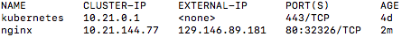

# Performing a Smoke Test on a New Kubernetes Cluster

## Overview

Welcome to our Kubernetes 101 series. In this article, we show you how to perform a simple smoke test on your Kubernetes cluster.

Creating a new Kubernetes cluster for work or just for yourself can be an exciting, fun, draining, and exhausting process. Regardless of where you are at the end of it, you'll want to make sure the cluster you just spent your time and effort making is actually up and running properly.

For this, I like to perform a very simple smoke test on new Kubernetes clusters. This test doesn't cover everything you might need from a Kubernetes cluster, but I find that it covers the basics for my most-used Kubernetes features.

This smoke test is based on the one used by the [Terraform Kubernetes Installer](https://github.com/oracle/terraform-kubernetes-installer) for Oracle Cloud Infrastructure (OCI). This test will walk you through the steps of creating a simple Nginx deployment and service on your Kubernetes cluster.  There are a few different service types you could use with your cluster. In this example, I am going to test out using the simplest (though likely not the most useful) 'NodePort' service type.

## Creating a Deployment
In Kubernetes, the yaml or JSON file which describes the way you want Kubernetes to deploy an application usually describes a Kubernetes "deployment" object. A Deployment consists of the containers that make up the application ("pods" in Kubernetes terminology), along with information about how many *replicas* of that application you want to have. Note that Kubernetes will maintain this desired number of replicas, meaning that if one of your replicas goes down for any reason, Kubernetes will spin up another in its place. There are some other cool features of Deployments which you can learn about in the Kubernetes documentation [here](https://kubernetes.io/docs/concepts/workloads/controllers/deployment/).

One of the major benefits of running with Kubernetes is its *declarative* style of resource management and creation. This means that you normally describe your Kubernetes resources in JSON rather than *imperatively* telling Kubernetes what to run via the commandline. In this case, we are going to use *imperative* commands to tell Kubernetes what to run instead of writing everything out in a file. This is for simplicity and speed, when running through this test by hand. If you wanted to automate this test or create a similar deployment for a real use case, it is best to do so using declarative yaml or JSON files, which are easier to track changes in.

For this simple smoke test, we're going to deploy an Nginx server in the fastest, simplest way - imperatively. This is not normally done for Kubernetes deployments, but it is useful just to test something out.

`kubectl run nginx --image=nginx --port=80 --replicas=3`

This command tells Kubernetes that you want to create a deployment called "nginx" using the Nginx image from Dockerhub. Run nginx on the container's port 80, and you want three Nginx containers to be running at all times. 
You should see output: `deployment "nginx" created`

You can see the nginx containers ("pods") which Kubernetes is creating by running: 
`kubectl get pods -o wide`
This will output something like: 
 

## Creating a Service
A Kubernetes service describes how you want your application to be reached. In this guide, we will discuss the two primary ways to configure your Kubernetes service to allow your application to be reached externally (for example, from your laptop).
The Terraform Kubernetes Installer deploys your cluster with the functionality of the [OCI Cloud Controller Manager](https://github.com/oracle/oci-cloud-controller-manager) already included.  
So for this piece, you may choose either type "NodePort" or type "LoadBalancer" for your service.
* NodePort: 
If you select service type NodePort, Kubernetes will expose your application on a specific port on each of the worker VMs in your Kubernetes cluster. The port Kubernetes chooses will be in the default range of: 30000-32767. If you choose NodePort, you will need to add a security list rule to allow connection to the application via the given port on the public IP of one of your Kubernetes worker VMs. You can imperatively create the Kubernetes service of type NodePort by running: 
`kubectl expose deployment nginx --type NodePort` 
* LoadBalancer: 
If you select service type LoadBalancer, Kubernetes will expose your application via an OCI Load Balancer resource. Kubernetes will create and configure this Load Balancer resource for you.  *(Note that you will be charged for the Load Balancer resource as normal. If you use kubectl to delete the service, as shown at the end of this post, Kubernetes will also destroy this Load Balancer resource for you.)*  The benefit of this service type is that Kubernetes will give you the IP of the LoadBalancer in the description of the Kubernetes service. Connecting to this IP will give you direct access to the Nginx application. This is different from a type NodePort service where you must connect to the specific port on the public IP of any of the Kubernetes workers in order to reach your application externally. Imperatively create a Kubernetes service of type LoadBalancer by running: 
`kubectl expose deployment nginx --type LoadBalancer` 

The output of either of these commands will be: `service "nginx" exposed`.

Check out the service you just created by running: 
`kubectl get svc` 

* NodePort 
If you chose type NodePort, the output of this command will look like:  
 
The "EXTERNAL-IP" section of the nginx service listed here tells you that your service is exposing the application on your Kubernetes workers/nodes. The "PORT(S)" section tells you that the service for your Nginx deployment has exposed port 80 of your Nginx containers on port 30050 of each of the VMs making up your Kubernetes workers.

* LoadBalancer 
If you chose type LoadBalancer, it will take a few minutes for the OCI Load Balancer resource to come up. While the load balancer is provisioning, the output of this command will look like:  

   
 Once the load balancer is up and running, the output will look like: 
  
 The "EXTERNAL-IP" section of the Nginx service listed here tells you that your Nginx deployment is being served on the externally-facing IP: 129.146.89.181. This is the IP of the load balancer resource Kubernetes spun up for you in OCI.

 If you chose LoadBalancer, your application will now be reachable on the "EXTERNAL-IP" listed in the `kubectl get svc` command output and you can skip to the "Connecting to NGINX" section. 

 ## NodePort Only - Create Security List Rule

If you chose NodePort, you will need to open your security list to allow connection to the Nginx application.
To do this, create an ingress rule in the "k8sWorker_security_list" which allows traffic to the port in the "EXTERNAL-IP" output of the `kubectl get svc` command you ran in the previous section. In our example, this rule would look like: 
 

## Connecting to Nginx
You should now be able to connect to your Nginx application by going to the correct location in an internet browser.
* NodePort 
If you chose NodePort, connect to the public IP of one of your Kubernetes Workers : at the port you got from the output of `kubectl get svc`.
* LoadBalancer 
If you chose LoadBalancer, you will connect directly to the external IP given by the `kubectl get svc` command output.

You should see a webpage like: 
 
*This image was taken from a LoadBalancer example; thus we were able to connect using just the public IP of the LoadBalancer. If you used NodePort, you need to include the port.*

If you want to automate this check, or if you prefer to check from the terminal, run a curl command on the same IP you use to connect via a web browser.
 
* NodePort 
For the NodePort, you will need the NodePort given to you by `kubectl get svc` and the public IP of one of your worker VMs, which you can get from the OCI console.
Once you have your worker IP and your NodePort, you can run a curl command on the Nginx server. In our example, this would be: 
`curl http://129.146.104.112:30050` 

* LoadBalancer 
Simply run a curl command on the external IP given to you by `kubectl get svc`. In our example, this would be: 
`curl http://curl http://129.146.89.181` 

The output of a curl command would looks like: 
 

## Clean Up
If you are done with your test and want to delete all the resources you created during this test, follow these steps.
1. Delete your Kubernetes Service by running: 
`kubectl delete svc nginx` 
This should output: `service "nginx" deleted` 
2. Delete your Kubernetes deployment by running: 
`kubectl delete deployment nginx` 
This should output:`deployment "nginx" deleted` 
This will destroy all of the Nginx containers (pods) you created. 

You can check that these two commands completed successfully by running: 
`kubectl get svc` 
and 
`kubectl get deployments` 
You should see no resources named "nginx" in the outputs of these commands.

## More in this Series 

* [Ingress and Routing](../ingress-and-routing/Readme.md)
* [Introduction to Service Types](../service-types/Readme.md)
