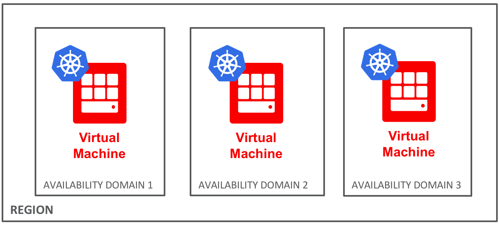
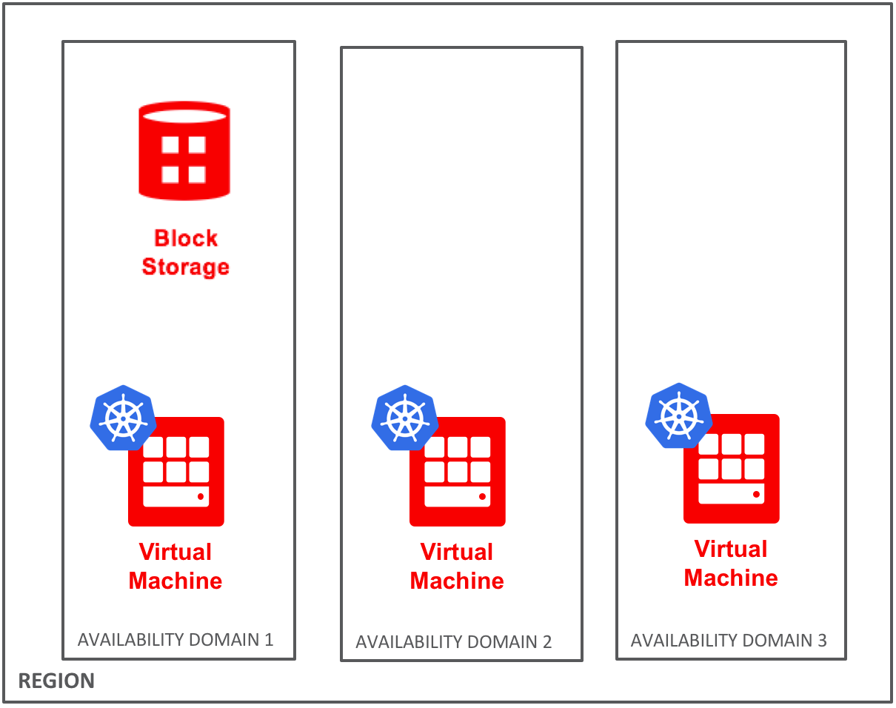

# Persistent Storage with Kubernetes
One of the biggest pain points in the container world is using persistent storage with containers. While containers have brought with them a revolution in the way we think about application deployment, those applications generally need to consume and/or produce data as well. Containers themselves aren't meant to deal with questions of persistent data, so a knowledge of the tools available for working with containers *and* persistent data is essential.

In this article, I'm going to talk about Kubernetes Persistent Volumes and Persistent Volume Claims. I'll generally explain what they do, which should give you an idea for when you would need to use them. We'll focus on Oracle Cloud Infrastructure as a concrete example.

### [OCI FlexVolume Driver](https://github.com/oracle/oci-flexvolume-driver)

You can click the header of this section to check out the github repo for this project. The FlexVolume Driver provides the ability to use OCI Block Volumes as Kubernetes Persistent Volumes. Let's walk through what that looks like.

To begin, you should have a Kubernetes cluster already deployed. The easiest way to accomplish this on Oracle Cloud Infrastructure is to use the managed Kubernetes service, OKE. If you would like to learn more about deploying a Kubernetes cluster on OKE, you can check out our article [here](https://cloudnative.oracle.com/template.html#distributed-systems-management/container-orchestration/oke/quickstart.md).

With that cluster deployed, your Oracle Cloud Infrastructure environment should look something like this:

When you deploy a cluster using OKE, you won't see the management plane, the Kubernetes controller node(s) in your tenancy. Oracle will manage those for you and all you need to worry about is the Kubernetes worker nodes.  So in this diagram, we see the worker nodes, but not the controller(s).

This is meant to represent an HA deployment across three Availability Domains within one Region.  Oracle Cloud Infrastructure (and its managed Kubernetes Service) is currently available in four regions: Phoenix, AZ, US; Ashburn, VA, US; Frankfurt, Germany; and London, England. (Keep an eye out for more region announcements in the future!)

The separation of these resources into various Availability Domains is going to be important as we consider how to run our persistent workloads in Kubernetes.

Though usually workloads are meant to be run in Kubernetes without regard for the actual physical hardware they're running on, that changes a bit when you have persistent storage needs with your workloads.  In reality, the storage your workload is utilizing is also in an availability domain. In order to make sure that block storage gets mounted to the container(s) running your workload, you need to make sure that your block storage is in the same availability domain as the physical worker node.

If you're using only the FlexVolume Plugin, you will need to create the block volume that you want using the OCI CLI, the OCI API, or the Graphical User Interface.  Once you've created your block storage, you should have an environment that looks like this:

This of course means that Kubernetes must know to schedule your workload only on a node where it has access to the Block Storage you created. In this case, that means we will need Kubernetes to only place your persistent workload on the Kubernetes Worker in Availability Domain 1.

To accomplish this, we can use a nodeSelector field in the pod definition. The below pod definition demonstrates using a nodeSelector and specifying the OCI Volume you created. Note that the flexvolume field under "volumes" has a "driver" field which is set to "oracle/oci". This tells Kubernetes which plugin to use to be able to talk to that storage volume.

Running this pod via
`kubectl apply -f pod.yml`
will tell Kubernetes to run the pod, and connect it to the block storage specified. At this point, your environment would look something like this:

The Kubernetes pod, represented by the blue circle, contains the Docker containers running your workload, represented by the Docker whale, Moby.

Also, when your pod is deleted, your environment will go back to looking like this:

Your pod will be deleted, and your block storage will be unmounted from the Kubernetes Worker. But the block volume itself will remain, thus *persisting* your data.

### [OCI Volume Provisioner](https://github.com/oracle/oci-volume-provisioner/)

In some cases, being aware of where the storage for your containerized workloads actually lives is very important. In those cases, using a FlexVolume Plugin may be sufficient to get the functionality needed.

But in some cases, having to be aware of the location of the Block Storage may be an unnecessary obstacle.  In some cases, you may prefer to be able to create persistent storage alongside the workload, wherever it may be.

For this second type of use case, Oracle Cloud Infrastructure has created the OCI Volume Provisioner. When used together with the FlexVolume Driver, the OCI Volume Provisioner allows you to dynamically create and use Oracle Cloud Infrastructure Block Volumes with your Kubernetes workloads.

To begin, you will need to have a Kubernetes environment with workers deployed across several availability domains. The OCI FlexVolume Driver *and* the OCI Volume Provisioner should be installed on the Kubernetes cluster.  If you are running a cluster created via OKE, both of these projects will already be installed by default. Otherwise, you can find instructions for installation on the projects' respective github pages.

To make use of the OCI Volume Provisioner, you will need to tell Kubernetes some information about the OCI block volume you want. You can do this by creating a Persistent Volume Claim:

You can see in this Persistent Volume Claim that the spec section contains details about the storage you want to use. In this case, that includes a storage class name of "oci", the OCI AD information, and the amount of the storage.

Once you have created a claim on the storage you would like, create a pod definition that utilizes that storage.  This one will be slightly different from the one we created when we were only using the FlexVolume Driver.

You'll see in the pod definition above, I have highlighted the sections pertaining to the storage volume.  In the "volumes" section under "spec" you can see that we simply specify the volume claim that describes the desired storage. The "volumeMounts" section is also a bit simpler; when using the OCI Volume Provisioner, there's no need to have the long volume name like we did before.  You will notice that this time the pod definition does not contain a "nodeSelector" field. This is because we do not need to specify the same AD where the block storage has been created. Kubernetes will automatically create the block storage in the same AD as the pod.

At this point, if you run `kubectl apply -f`, Kubernetes should be able to automatically go and create your block storage and hook it up to your pod for you. When the pod is deleted, the block volume will remain and could be referenced by a new pod.

# Persistent Storage with Kubernetes
At this point, you've learned the basic tools you need to be able to utilize persistent storage with Kubernetes workloads on Oracle Cloud Infrastructure.  The concepts you've learned are, however, translatable to other environments as well.  Configuring Persistent Storage with container environments is a common stumbling block along many companies' container journeys, and the area is still developing. With the basics you've learned from this article, you should be prepared to understand any changes in the future, and I hope you will feel empowered to choose the best solutions for your Persistent Storage + Container needs.
