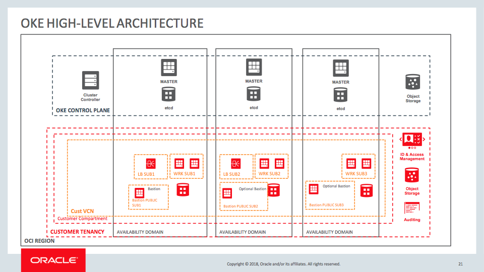
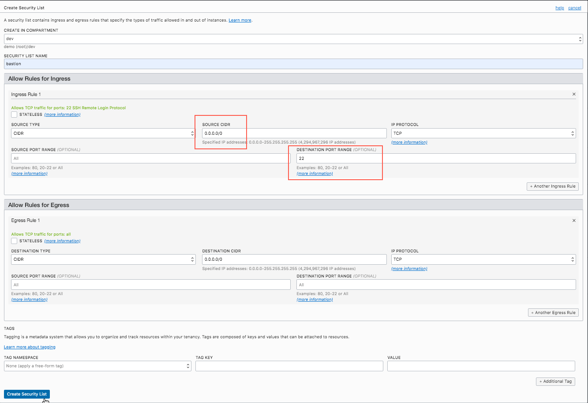
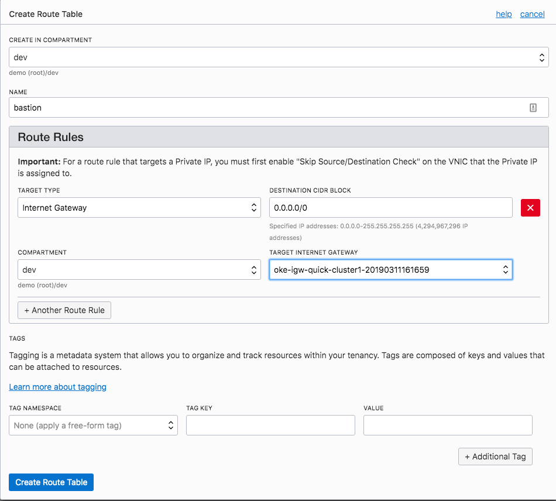
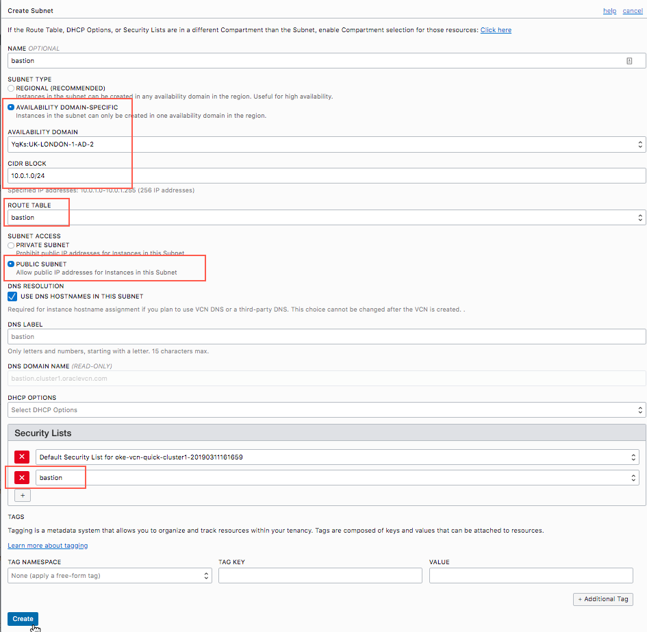

# How to Create a Bastion Host to Access Worker Nodes in a Private VCN

When you use the Oracle Container Engine for Kubernetes (OKE) [quick create](quickstart.md) option, it results in creating private nodes in a private subnet. To be able to access the nodes, you are required to either expose those nodes publically via the internet or create a bastion host to SSH to the workers. Use the example below to create a bastion host to access your workers via SSH.

Note:  Be sure to include an SSH public key when you initially set up your node pools. For further information on cluster creation [click here](quickstart.md).

## High-Level Architecture



<br />


The architecture diagram above shows three private worker subnets: WRK SUB1, WRK SUB2, and WRK SUB3. It also depicts two public load balancer subnets LB SUB1 and LB SUB2. Add the bastion instance in a public subnet called "Bastion Public SUB1" in one of the availability domains (AD) as shown in the diagram. It's not required to create bastion instances in all the ADs; however, you can create two public subnets "Bastion PUBLIC SUB2" and "Bastion PUBLIC SUB3", and add bastions to those as well.

1. Create a security list in the existing VCN created for the OKE cluster, to allow SSH access to the bastion instance from 0.0.0.0/0. This allows traffic from the internet on port 22 to access the bastion instance. You can further restrict the traffic by specifying a different source CIDR range.



<br />

2. Create a route table for the bastion, per the illustration below, using the VCN's internet gateway:



<br />

3. Create a public subnet in the OKE VCN per the screenshot below, using CIDR block 10.0.1.0/24. Associate it with AD-2, use the route table created above, and make sure that this is a public subnet so that it can be accessed from the internet. Also add the newly created security list from above to this public subnet as the second security list.

The resulting public subnet is shown in the OCI console:



<br />


4. Create a compute instance which will be your bastion instance in the public subnet of OKE's VCN. While creating the bastion instance, ensure that you add the public SSH key that will let you log in to the bastion instance.

The image below shows an instance called bastion in the public subnet, "Bastion PUBLIC SUB1" in one of the availability domains (AD-1):


<br />

5. Setup the bastion to access the workers:

Upload the private SSH key of the worker nodes to the bastion instance using scp. From your client terminal (for example, from your local machine), you will be able to access your bastion as shown below.

```
scp -i <path_to_bastion_private_key> <path to worker private key> opc@<bastion_publicIP>:/home/opc/.ssh
Next, SSH into your Bastion host
ssh -i <path_to_bastion_private_key> opc@<bastion_publicIP>
Then Login to the worker node from the bastion using the private key of the worker node:
ssh -i /home/opc/.ssh/<worker private key> opc@<worker node private ip>
```

After completing all these steps, you will be able to access your worker nodes from the bastion host. Your new bastion host will allow you to have your worker nodes private from the internet, but still be able to access them whenever needed to debug applications or the host.
