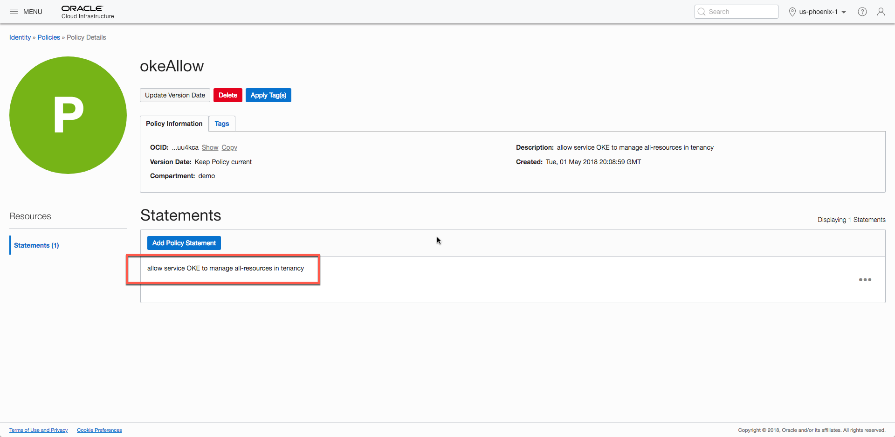
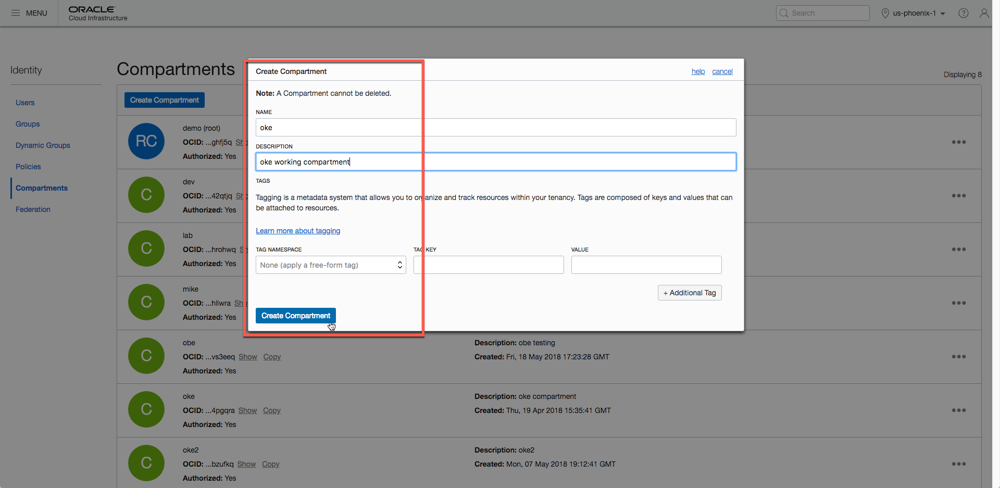
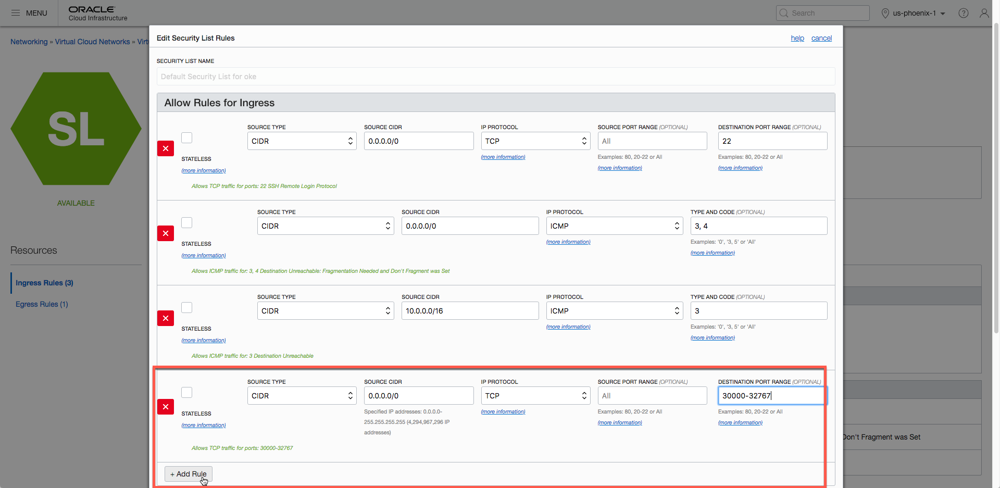
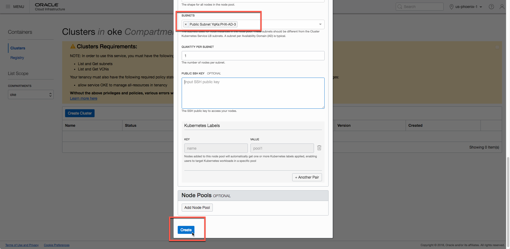

# Getting Started with Oracle Container Engine for Kubernetes

This guide is designed to help users who are new to the Oracle Container Engine for Kubernetes (OKE), learn the most efficient way to set up their Kubernetes clusters to get up and running quickly.

Typical users of OKE will deploy worker nodes in their clusters across multiple Availability Domains (AD). However, for the purposes of a demonstration of the platform, or when working in a development environment, it may be more efficient to just set up a single worker node. This tutorial helps you accomplish just that. To learn the recommended way to set up OKE for a production setting, refer to the official documentation, that illustrates how to [Create a Cluster and Deploy a Sample App](https://www.oracle.com/webfolder/technetwork/tutorials/obe/oci/oke-full/index.html).

## Prerequisites

There are a couple of things that are required to get your cluster up and running.

First, make sure that you have access to the OCI console, and have administrator permissions. OKE does not support IDCS or Federated Users today, so verify that you are logging in with your OCI credentials in the console.

Next, create a policy for OKE to manage resources. Navigate to the Identity section in the menu, and click on Policies. Select your root compartment in the dropdown, and click `Create Policy`.  You can name the policy anything you wish, and add a description. In the Policy Statements field, add the following text: `allow service OKE to manage all-resources in tenancy`, and then click the Create button. As shown in the screenshot, I named my policy "okeAllow".

## Create a Cluster

### Step 1: Create a Compartment

It's a best practice to create a cluster in a different compartment than your root compartment. Reserve your root compartment for managing your infrastructure.

To create a compartment, navigate to Compartments in the Identity section in the menu. As shown in the screenshot, I've created a compartment called "oke", with a description "oke working compartment".

### Step 2: Create Networking

Next, set up the networking and security lists required to run OKE. Networking is the heart of Kubernetes, so it's important to get this step correct.

Browse the Networking panel in the menu, and select `Virtual Cloud Networks` (VCN). Click on `Create Virtual Cloud Network`. Create your Virtual Cloud Network for your newly created compartment, "oke". Select the radio button that corresponds to `CREATE VIRTUAL CLOUD NETWORK PLUS RELATED RESOURCES`. Finally, verify that the checkbox next to "Use DNS Hostnames in this VCN" is selected. The completed window will look similar to the screenshot below.

Once the network is created, update the Security List for the VCN to add allow Kubernetes to use Node Ports (30000-32767). Navigate into the "oke" VCN, and then select Security Lists in the left hand navigation. Clicking on `Default Security List`, will bring up the screen that displays all the security rules for your oke VCN.

Click on the `Edit All Rules` button, and add `Another Ingress Rule` with the following information:
* Source Type: CIDR
* Source CIDR: 0.0.0.0/0
* IP Protocol: TCP
* Source Port Range: Default (All)
* Destination Port Range: 30000-32767

A screenshot of this is shown below:

Click `Save Security List Rules` to save this action. This completes the networking configuration for the section. This configuration is appropriate for this use case, but to learn more about other networking configurations for OKE, [refer to the documentation](https://docs.cloud.oracle.com/iaas/Content/ContEng/Concepts/contengnetworkconfig.htm?tocpath=Services%7CContainer%20Engine%7CPreparing%20for%20Container%20Engine%20for%20Kubernetes%7C_____1).

### Step 3: Create Cluster

The final step is to create a cluster. Navigate to the Clusters tab, and select the `oke` compartment. Click on the `Create Cluster` button, which will bring up a dialog similar to the one shown in the screenshot below. Create a name for the cluster, and a version of Kubernetes to install.

In the networking selection, the `Network Compartment` and `VCN` will be auto populated with `oke`. In the `Kubernetes Service LB Subnets` section, select two of the three subnets that exist in the dropdown. In the example below, I chose the public subnets for `AD1` and `AD2`.

Lastly, create the node pool by clicking the `Add Node Pool` button. Node pools require the following information:
* Name: The name for the set of nodes.
* Version: The version of Kubernetes to run on the nodes.
* Image: The OS to run on the node.
* Shape: The OCI instance shape to use.
* Subnets: Select the remaining subnet that you did not select in the `Network Compartment` section above. For example, the screenshot below has the public subnet for `AD3` selected.
* Quantity for Subnets: Use 1 for this value for a single node cluster.
* Public SSH Key: This is optional, but an SSH public key can be provided to access the node.

Once all the information is filled, click `Create`.

### Step 4: Done

Once all the steps above have been completed, the cluster will spin up in a few minutes. Typically, the cluster status will be active first, followed by the node pools.

## Interacting With the Cluster

To interact with the cluster, download the kubeconfig file from the console . And finally, you can also run a [simple helloworld application](https://www.oracle.com/webfolder/technetwork/tutorials/obe/oci/oke-full/index.html#section_7) to give the cluster a quick whirl.
