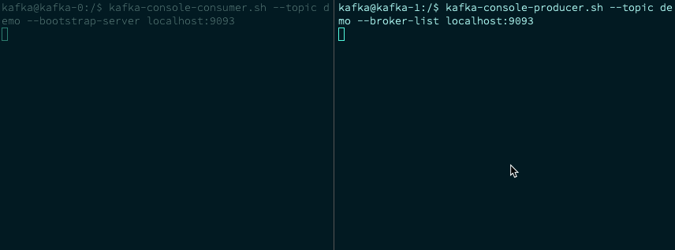

# Quickstart: Kafka on Kubernetes

In this quickstart, we'll install Kafka on Oracle Kubernetes Engine. We will do this without Helm to give us a great starting foundation for all future tutorials with Kafka. Once installed, we'll quickly test that Kafka is working correctly by pushing and pulling data from it.

## Kafka on Kubernetes?

Thanks to Kubernetes' Persistent Volumes and Kafka's distributed nature, we can safely deploy this stateful application to Kubernetes. However, there are a few things we need to consider:

### Zookeeper

Zookeeper is a separate open-source Apache project used for storing and managing centralised configuration and naming. Kafka uses it for managing both node information and the data stored within the cluster. It's something that is integral to Kafka but has to deployed separately, so we'll need to launch a Zookeeper of our own in Kubernetes.

### Kubernetes Contrib

While we don't want to use Helm to launch these clusters, there's no sense in reinventing the wheel when it comes to crafting configuration. The [Kubernetes Contrib repo](https://github.com/kubernetes/contrib) has many example configuration files, and we'll be using them for this post. 

### Prerequisites

You should already have a working Kubernetes cluster configured. It doesn't strictly need to be Oracle Kubernetes Engine for this tutorial to work, but your mileage may vary if you are using a different provider. 

You'll need at least three nodes to use the default configuration that we will illustrate in this tutorial.

You'll also need `kubectl` installed and configured on your local development environment. The commands in this post assume a Unix-like environment (in our case we're running on Mac OS).

## Installation

### Zookeeper

As mentioned, Zookeeper is a separate open-source Apache project used by Kafka for managing configuration. We'll deploy it in a highly available manner using the [Kubernetes Contrib Repo](https://github.com/kubernetes/contrib/tree/master/statefulsets/zookeeper). 

Create a yaml file on your local development environment called `zookeper.yml`, and fill it with the contents of [https://raw.githubusercontent.com/kubernetes/contrib/master/statefulsets/zookeeper/zookeeper.yaml](). 

Let's break this file down, starting with the service definition:

```
---
apiVersion: v1
kind: Service
metadata:
  name: zk-svc
  labels:
    app: zk-svc
spec:
  ports:
  - port: 2888
    name: server
  - port: 3888
    name: leader-election
  clusterIP: None
  selector:
    app: zk
```
Zookeeper exposes two different ports on each instance. One is for general accessibility (2888), and the other is for leader election (3888). This service definition will expose both of these ports and point them to resources with the label "app:zk". 

Since we have set `ClusterIP` to "none", the service will be [Headless](https://kubernetes.io/docs/concepts/services-networking/service/#headless-services), meaning no load balancing will take place in Kubernetes. Instead, DNS A records will be announced for the service that point directly to the backend Zookeeper pods. This will come in handy later on in the tutorial!

Next up, we define a [ConfigMap](https://kubernetes.io/docs/tasks/configure-pod-container/configure-pod-configmap/) that contains some tweakable parameters consumed by Zookeeper...

```
---
apiVersion: v1
kind: ConfigMap
metadata:
  name: zk-cm
data:
  jvm.heap: "1G"
  tick: "2000"
  init: "10"
  sync: "5"
  client.cnxns: "60"
  snap.retain: "3"
  purge.interval: "0"
```

... and a [PodDisruptionBudget](https://kubernetes.io/docs/concepts/workloads/pods/disruptions/) for the `zk` app, which will ensure at least two pods are available. This is critical for a distributed service that relies on a number of instances to maintain quorum:

```
---
apiVersion: policy/v1beta1
kind: PodDisruptionBudget
metadata:
  name: zk-pdb
spec:
  selector:
    matchLabels:
      app: zk
  minAvailable: 2
```

Next, we define the meat of the Zookeeper cluster - a [StatefulSet](https://kubernetes.io/docs/concepts/workloads/controllers/statefulset/)! We'll break this down into logical chunks, starting with the basics:

```
---
apiVersion: apps/v1beta1
kind: StatefulSet
metadata:
  name: zk
spec:
  serviceName: zk-svc
  replicas: 3
  template:
    metadata:
      labels:
        app: zk
```

In the above section, the most important things to note are that we set the StatefulSet's "app" label to "zk", which will be used by the `Service` and `PodDisruptionBudget` definitions to identify the  `ReplicaSet` they are interested in, and we set the number of desired replicas to three.

The name of the StatefulSet is set to "zk". By default, StatefulSets append a hyphen and a number to the end of the name for each replica, so we'll get pods called zk-0, zk-1, zk-3 in this case, and  since we've defined a Headless Service, we can access these pods via the domain names `zk-0.zk-svc.default.svc.cluster.local`. This will come in handy later when we want to connect Kafka to Zookeeper!

Next, we define a `PodAntiAffinity` to ensure that each of the three replicas will be placed on their own node. This means that if one node is lost from the Kubernetes cluster we don't run the risk of  losing more than one instance of Zookeeper:

```
    spec:
      affinity:
        podAntiAffinity:
          requiredDuringSchedulingIgnoredDuringExecution:
            - labelSelector:
                matchExpressions:
                  - key: "app"
                    operator: In
                    values: 
                    - zk
              topologyKey: "kubernetes.io/hostname"
```
The configuration file then moves on to define the Docker Image to launch into a container for Zookeeper, some resource requests, ports to expose, and some environment variables that will be exposed to the running container, along with the actual command to run to launch Zookeeper. In this case, the command to run is a wrapper script that launches Zookeeper in the foreground:

``` 
      containers:
      - name: k8szk
        imagePullPolicy: Always
        image: gcr.io/google_samples/k8szk:v3
        resources:
          requests:
            memory: "2Gi"
            cpu: "500m"
        ports:
        - containerPort: 2181
          name: client
        - containerPort: 2888
          name: server
        - containerPort: 3888
          name: leader-election 
        env:
        - name : ZK_REPLICAS
          value: "3"
        - name : ZK_HEAP_SIZE
          valueFrom:
            configMapKeyRef:
                name: zk-cm
                key: jvm.heap
        - name : ZK_TICK_TIME
          valueFrom:
            configMapKeyRef:
                name: zk-cm
                key: tick
        - name : ZK_INIT_LIMIT
          valueFrom:
            configMapKeyRef:
                name: zk-cm
                key: init
        - name : ZK_SYNC_LIMIT
          valueFrom:
            configMapKeyRef:
                name: zk-cm
                key: tick
        - name : ZK_MAX_CLIENT_CNXNS
          valueFrom:
            configMapKeyRef:
                name: zk-cm
                key: client.cnxns
        - name: ZK_SNAP_RETAIN_COUNT
          valueFrom:
            configMapKeyRef:
                name: zk-cm
                key: snap.retain
        - name: ZK_PURGE_INTERVAL
          valueFrom:
            configMapKeyRef:
                name: zk-cm
                key: purge.interval
        - name: ZK_CLIENT_PORT
          value: "2181"
        - name: ZK_SERVER_PORT
          value: "2888"
        - name: ZK_ELECTION_PORT
          value: "3888"
        command:
        - sh
        - -c
        - zkGenConfig.sh && zkServer.sh start-foreground
```         

Finally, we need to define a readiness probe in the form of a script that checks if Zookeeper is running, and a VolumeClaimTemplate that will cause a Persistent Volume to be created in our OCI account via the OCI API. 

The created volume will ensure our Zookeeper data is kept safe through pod/node changes:

```
        readinessProbe:
          exec:
            command:
            - "zkOk.sh"
          initialDelaySeconds: 10
          timeoutSeconds: 5
        livenessProbe:
          exec:
            command:
            - "zkOk.sh"
          initialDelaySeconds: 10
          timeoutSeconds: 5
        volumeMounts:
        - name: datadir
          mountPath: /var/lib/zookeeper
      securityContext:
        runAsUser: 1000
        fsGroup: 1000
  volumeClaimTemplates:
  - metadata:
      name: datadir
    spec:
      accessModes: [ "ReadWriteOnce" ]
      resources:
        requests:
          storage: 10Gi
```

_If you're not using Oracle Cloud Infrastructure, there's a chance you may need to create the volume in your provider's dashboard manually. _

### Apply the Configuration

Now that we've been through the configuration file for Zookeeper, all that's left to do is apply it to your Kubernetes cluster, which can be done with:

```
kubectl apply -f zookeeper.yaml
```

Run `kubectl get events -w` to keep an eye on the progress of the volume creation as it can take a few minutes. 

Eventually, you should see a `SuccessfulAttachVolume` message in the event log, and `kubectl get pods` should show you something similar to:

```
zk-0                                             1/1     Running   0          2d
zk-1                                             1/1     Running   0          2d
zk-2                                             1/1     Running   0          2d
```

This means that the StatefulSet has created three pods with the zk-_n_ name, and they've come up successfully!

## Kafka

Now that we have a running Zookeeper cluster, it's time to move on to Kafka! 

Again, we'll be using [Kubernetes Contrib repo](https://github.com/kubernetes/contrib/tree/master/statefulsets/kafka)'s Kafka Stateful set, found in [https://github.com/kubernetes/contrib/blob/master/statefulsets/kafka/kafka.yaml](). Create a file in your local development environment called `kafka.yml` and paste the content from Github. 

We'll run through `kafka.yml` in logical sections, the same way we did for Zookeeper, starting with the Service definition:

```
---
apiVersion: v1
kind: Service
metadata:
  name: kafka-svc
  labels:
    app: kafka
spec:
  ports:
  - port: 9093
    name: server
  clusterIP: None
  selector:
    app: kafka
```

Just like Zookeeper's service, The Kafka Service is also a headless service meaning calls to this service on the defined port (9093) will go straight through to pods identified by `app:kafka`, on port 9093.

We'll also define a PodDisruptionBudget to make sure at least two replicas are available:

```
---
apiVersion: policy/v1beta1
kind: PodDisruptionBudget
metadata:
  name: kafka-pdb
spec:
  selector:
    matchLabels:
      app: kafka
  minAvailable: 2
```

Kafka's StatefulSet has some similar features to Zookeeper's, such as defining three replicas (for Quorum), and a podAntiAffinity definition to make sure Kubernetes doesn't place more than one Kafka replica on the same Kubernetes node, both of which can be seen below:

```  
---
apiVersion: apps/v1beta1
kind: StatefulSet
metadata:
  name: kafka
spec:
  serviceName: kafka-svc
  replicas: 3
  template:
    metadata:
      labels:
        app: kafka
    spec:
      affinity:
        podAntiAffinity:
          requiredDuringSchedulingIgnoredDuringExecution:
            - labelSelector:
                matchExpressions:
                  - key: "app"
                    operator: In
                    values: 
                    - kafka
              topologyKey: "kubernetes.io/hostname"
```

However, we also define a PodAffinity definition to ensure that Kafka replicas get placed on the same node as a Zookeeper replica:

```
           podAffinity:
          preferredDuringSchedulingIgnoredDuringExecution:
             - weight: 1
               podAffinityTerm:
                 labelSelector:
                    matchExpressions:
                      - key: "app"
                        operator: In
                        values: 
                        - zk
                 topologyKey: "kubernetes.io/hostname"
      terminationGracePeriodSeconds: 300
```

Again, in a similar fashion to Zookeeper, Kafka's StatefulSet definition goes on to define a standard Kafka Docker Image to launch containers from, sets some resource requests, and also defines the Kafka container port:

```      
      containers:
      - name: k8skafka
        imagePullPolicy: Always
        image: gcr.io/google_samples/k8skafka:v1
        resources:
          requests:
            memory: "1Gi"
            cpu: 500m
        ports:
        - containerPort: 9093
          name: server
```

The penultimate part of the StatefulSet definition contains the command that the container will run, and once again a wrapper script is used to launch Kafka, with some overriding parameters and environment variables to pass to the cluster:
          
        command:
        - sh
        - -c
        - "exec kafka-server-start.sh /opt/kafka/config/server.properties --override broker.id=${HOSTNAME##*-} \
          --override listeners=PLAINTEXT://:9093 \
          --override zookeeper.connect=zk-0.zk-svc.default.svc.cluster.local:2181,zk-1.zk-svc.default.svc.cluster.local:2181,zk-2.zk-svc.default.svc.cluster.local:2181 \
          --override log.dir=/var/lib/kafka \
          --override auto.create.topics.enable=true \
          --override auto.leader.rebalance.enable=true \
          --override background.threads=10 \
          --override compression.type=producer \
          --override delete.topic.enable=false \
          --override leader.imbalance.check.interval.seconds=300 \
          --override leader.imbalance.per.broker.percentage=10 \
          --override log.flush.interval.messages=9223372036854775807 \
          --override log.flush.offset.checkpoint.interval.ms=60000 \
          --override log.flush.scheduler.interval.ms=9223372036854775807 \
          --override log.retention.bytes=-1 \
          --override log.retention.hours=168 \
          --override log.roll.hours=168 \
          --override log.roll.jitter.hours=0 \
          --override log.segment.bytes=1073741824 \
          --override log.segment.delete.delay.ms=60000 \
          --override message.max.bytes=1000012 \
          --override min.insync.replicas=1 \
          --override num.io.threads=8 \
          --override num.network.threads=3 \
          --override num.recovery.threads.per.data.dir=1 \
          --override num.replica.fetchers=1 \
          --override offset.metadata.max.bytes=4096 \
          --override offsets.commit.required.acks=-1 \
          --override offsets.commit.timeout.ms=5000 \
          --override offsets.load.buffer.size=5242880 \
          --override offsets.retention.check.interval.ms=600000 \
          --override offsets.retention.minutes=1440 \
          --override offsets.topic.compression.codec=0 \
          --override offsets.topic.num.partitions=50 \
          --override offsets.topic.replication.factor=3 \
          --override offsets.topic.segment.bytes=104857600 \
          --override queued.max.requests=500 \
          --override quota.consumer.default=9223372036854775807 \
          --override quota.producer.default=9223372036854775807 \
          --override replica.fetch.min.bytes=1 \
          --override replica.fetch.wait.max.ms=500 \
          --override replica.high.watermark.checkpoint.interval.ms=5000 \
          --override replica.lag.time.max.ms=10000 \
          --override replica.socket.receive.buffer.bytes=65536 \
          --override replica.socket.timeout.ms=30000 \
          --override request.timeout.ms=30000 \
          --override socket.receive.buffer.bytes=102400 \
          --override socket.request.max.bytes=104857600 \
          --override socket.send.buffer.bytes=102400 \
          --override unclean.leader.election.enable=true \
          --override zookeeper.session.timeout.ms=6000 \
          --override zookeeper.set.acl=false \
          --override broker.id.generation.enable=true \
          --override connections.max.idle.ms=600000 \
          --override controlled.shutdown.enable=true \
          --override controlled.shutdown.max.retries=3 \
          --override controlled.shutdown.retry.backoff.ms=5000 \
          --override controller.socket.timeout.ms=30000 \
          --override default.replication.factor=1 \
          --override fetch.purgatory.purge.interval.requests=1000 \
          --override group.max.session.timeout.ms=300000 \
          --override group.min.session.timeout.ms=6000 \
          --override inter.broker.protocol.version=0.10.2-IV0 \
          --override log.cleaner.backoff.ms=15000 \
          --override log.cleaner.dedupe.buffer.size=134217728 \
          --override log.cleaner.delete.retention.ms=86400000 \
          --override log.cleaner.enable=true \
          --override log.cleaner.io.buffer.load.factor=0.9 \
          --override log.cleaner.io.buffer.size=524288 \
          --override log.cleaner.io.max.bytes.per.second=1.7976931348623157E308 \
          --override log.cleaner.min.cleanable.ratio=0.5 \
          --override log.cleaner.min.compaction.lag.ms=0 \
          --override log.cleaner.threads=1 \
          --override log.cleanup.policy=delete \
          --override log.index.interval.bytes=4096 \
          --override log.index.size.max.bytes=10485760 \
          --override log.message.timestamp.difference.max.ms=9223372036854775807 \
          --override log.message.timestamp.type=CreateTime \
          --override log.preallocate=false \
          --override log.retention.check.interval.ms=300000 \
          --override max.connections.per.ip=2147483647 \
          --override num.partitions=1 \
          --override producer.purgatory.purge.interval.requests=1000 \
          --override replica.fetch.backoff.ms=1000 \
          --override replica.fetch.max.bytes=1048576 \
          --override replica.fetch.response.max.bytes=10485760 \
          --override reserved.broker.max.id=1000 "
        env:
        - name: KAFKA_HEAP_OPTS
          value : "-Xmx512M -Xms512M"
        - name: KAFKA_OPTS
          value: "-Dlogging.level=INFO"
          ```

The most important override parameter being defined ties Zookeeper and Kafka together:

```
--override zookeeper.connect=zk-0.zk-svc.default.svc.cluster.local:2181,zk-1.zk-svc.default.svc.cluster.local:2181,zk-2.zk-svc.default.svc.cluster.local:2181
```

Kafka likes to handle load balancing and connection management to Zookeeper, so we need to define each Zookeeper instance individually. Fortunately, Kubernetes allows this through the Headless Service we configured up in the Zookeeper section of this tutorial, meaning we can connect to each Zookeeper pod directly, as above! 

Finally, we use the same PersistentVolume created by Zookeeper, and set a readiness probe to another health-checking script found within the Kafka container:

```
        volumeMounts:
        - name: datadir
          mountPath: /var/lib/kafka
        readinessProbe:
          exec:
           command: 
            - sh 
            - -c 
            - "/opt/kafka/bin/kafka-broker-api-versions.sh --bootstrap-server=localhost:9093"
      securityContext:
        runAsUser: 1000
        fsGroup: 1000
  volumeClaimTemplates:
  - metadata:
      name: datadir
    spec:
      accessModes: [ "ReadWriteOnce" ]
      resources:
        requests:
          storage: 10Gi
```

### Apply the Config

Launch Kafka on to your Kubernetes cluster by running:

```
kubectl apply -f kafka.yml
```

This may take a few minutes to launch, but you should eventually get three Kafka pods in the "Running" state, which can be checked via:

```
>  kubectl get pods
NAME                                             READY   STATUS    RESTARTS   AGE
kafka-0                                          1/1     Running   0          3d
kafka-1                                          1/1     Running   0          3d
kafka-2                                          1/1     Running   0          3d
```

Check that everything is working correctly by looking for Java exceptions in Kafka's logs with a `kubectl logs kafka-0`. If you are exception free, it's time to test some data!

## Test Data

In theory, we have a Kafka cluster running in Kubernetes, but how do we know that it works without testing it? A quick and easy way to prove that your cluster is running is:

1. Create a topic in Kafka
2. Create a consumer for that topic
3. In a separate session, push some data to that topic
4. Check that the data gets passed from your second session to your first using magic. 

We can do this using some scripts that ship with Kafka. Since we have a running instance of this image in the form of three Kafka replicas on Kubernetes, let's jump inside one of those containers:

```
> kubectl exec -it kafka-0 -- bash
```

Once inside of the kafka-0 container with a Bash shell, you can create a topic with:

```
kafka-topics.sh --create \
--topic demo \
--zookeeper zk-0.zk-svc.default.svc.cluster.local:2181,zk-1.zk-svc.default.svc.cluster.local:2181,zk-2.zk-svc.default.svc.cluster.local:2181 \
--partitions 3 \
--replication-factor 2
```

This should respond with `Created topic "demo".`You can then create a consumer of this new topic via:

```
> kafka-console-consumer.sh --topic demo --bootstrap-server localhost:9093
```

Your terminal should now be sitting waiting for data to be pushed to your demo topic. When data is received, it will be outputted here! 

To give it some data to receive, open up a new terminal session (whilst still keeping the first open), and drop into a different Kafka node:

```
> kubectl exec -it kafka-1 -- bash
```

Once inside of the new Kafka node, start up a Kafka producer with:

```
kafka-console-producer.sh --topic demo --broker-list localhost:9093
```

At this point, anything you type and hit return on should show up in your consumer window a few seconds later!




## Conclusion

There you have it! A working Kafka and Zookeeper cluster on Kubernetes, configured for high availability, without using Helm! 

### Cleanup

You can remove everything we've added to your Kubernetes cluster in this tutorial by running the following:

```
kubectl delete  \
    service/kafka-svc \
    service/zk-svc \
    pod/kafka-0 \
    pod/kafka-1  \
    pod/kafka-2  \
    pod/zk-0 \
    pod/zk-1 \
    pod/zk-2 \
    statefulset.apps/kafka \
    statefulset.apps/zk \
    configmap/zk-cm \
    PodDisruptionBudget/kafka-pdb \
    PodDisruptionBudget/zk-pdb
```