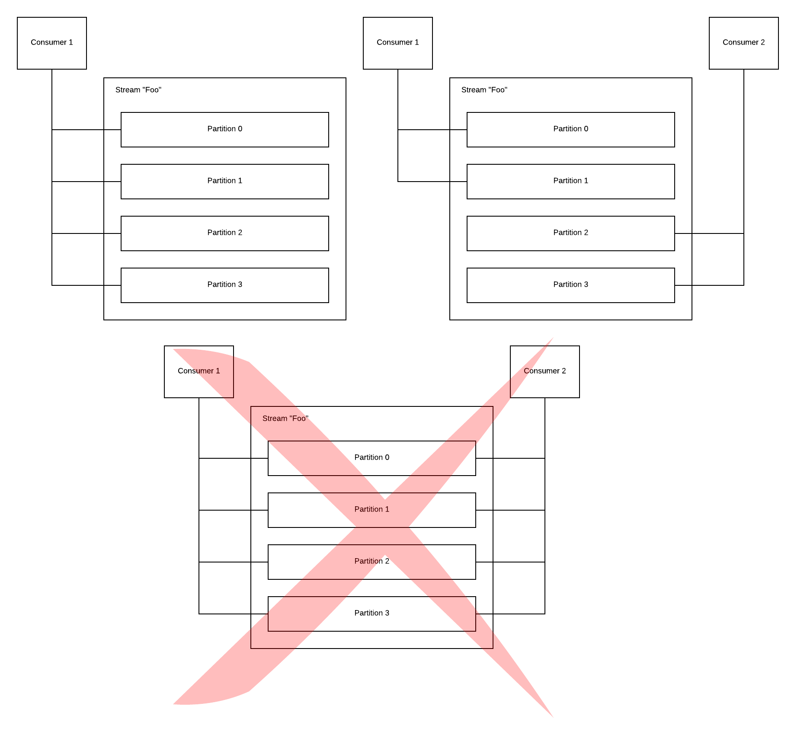
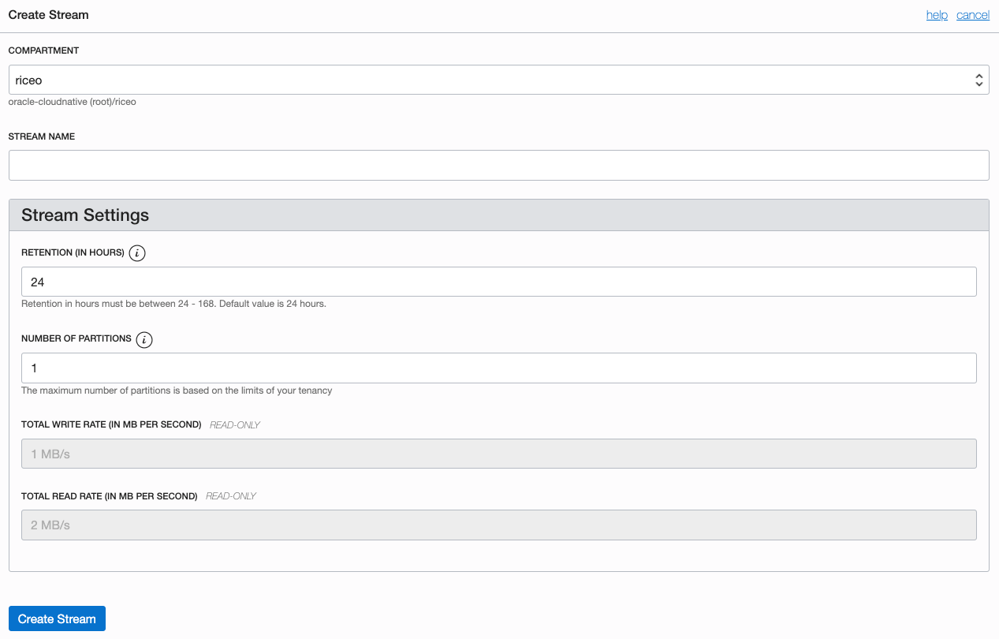
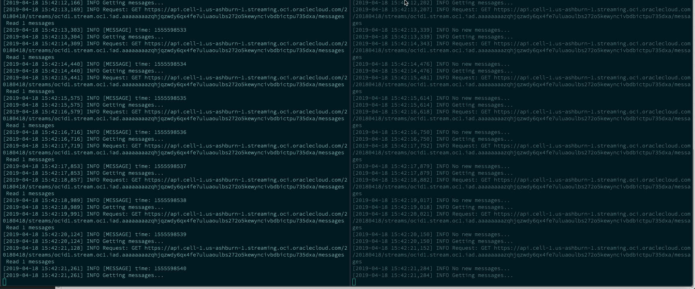

# Quickstart: Oracle Streaming Service

## Introduction

In a previous tutorial, we explained [how to install Kafka on to a Kubernetes cluster](//cloudnative.oracle.com/template.html#distributed-systems-management/queuing-streaming/Kafka/quickstart.md) of your choice, which is an excellent solution for rolling your own streaming service, but comes with the overhead of managing and maintaining Kafka. What if you don't want to deal with this overhead?

Enter OCI Streaming Service!

This fully managed service inside of Oracle Cloud Infrastructure allows you to ingest streams of data for real-time processing.

Commonly used for streaming application logs, telemetry, and web analytics, Oracle Streaming Service exposes a RESTful API for producing and consuming messages via a publish-subscribe model.

Currently, [SDKs for interacting with Oracle Streaming Service are available for Java, Python, Ruby, and Go](https://docs.cloud.oracle.com/iaas/Content/API/Concepts/sdks.htm).

## What Are We Doing here?

In this tutorial, we'll be setting up an Oracle Streaming Service stream in the Oracle Cloud Infrastructure dashboard. We will then launch a producer and two consumers pointing at this stream with a simple Python3 [demo application](https://github.com/riceo/oci-streaming-service).

## Prerequisites

You'll be able to follow along with this tutorial with just an OCI account that has access to the OCI Streaming Service and API keys. However, if you'd like to run the demo application that comes along with this tutorial, you will also need to meet the [requirements set in the Demo application's git repository](https://github.com/riceo/oci-streaming-service#requirements)

I also strongly recommend that you [review the Oracle Streaming Service overview](https://docs.cloud.oracle.com/iaas/Content/Streaming/Concepts/streamingoverview.htm) before continuing.

## Key Concepts

Before we create our first stream, there are a few concepts we need to grasp to get along with OSS. Namely:

### Everything Happens Over RESTful APIs

Both producers and consumers interact with Oracle Streaming Service through a RESTful API. The official [Oracle SDK](https://docs.cloud.oracle.com/iaas/Content/API/Concepts/sdks.htm) for your favourite language exposes some abstractions on top of this API to make it easy to carry out operations.

### Partitions

A partition is a division of messages within a given stream, decided by the key of each message (or a subset of the message value if no key is defined).

The ability for a stream to become partitioned is defined during stream creation and is dependent on your OCI tenancy limits for stream partitions.

Streams with more than one partition are useful for environments where you may wish to scale up the number of consumers reading messages from the stream in parallel. However, it's important to note that the number of partitions a stream can be divided into is defined at creation time only, so it can be beneficial to provision more partitions than needed if you think you may need to scale in the future.

### Cursors

At their most basic level, cursors are pointers to a location (i.e. an offset) within a stream, used by consumers to read messages. Once a successful read has taken place, the cursor will be passed back to the calling function with an updated offset for subsequent calls.

A single cursor can be created and used to read messages from a stream by providing the partition number and stream ID you wish to consume.

Oracle Streaming Service also exposes a powerful type of cursor known as a `Group Cursor`, which allows multiple consumers to form a group and consume from all partitions within a stream in a distributed manner. Each partition will automatically be assigned to one of the available consumers in the group, meaning you can scale the number of consumers reading from a single stream without having to worry about manually balancing the assignments of partitions to consumers. A shared offset per partition is also maintained to avoid consuming duplicate messages.

Note that a `Group Cursor` will only ever assign a single consumer to a given partition, but one consumer can be assigned to many different partitions.

Because of this, it's important to consider naming your message keys such that they would be spread out amongst available partitions, allowing new consumers to be of immediate value.



### Retention

Retention refers to the number of hours a message added to the stream will be retained before being automatically deleted.

The maximum number of hours a message can be retained is currently 168, or seven days.

It's important to note that as an append-only stream, messages can't be manually deleted from the streaming service, so it's worth setting the retention to a period where you aren't necessarily retaining messages that may have already been consumed. We'll use the default of 24 hours in this tutorial.

## Creating a Stream

Now that we have an idea of how Oracle Streaming Service works, it's time to log in to the OCI dashboard and head to the [Streaming Service section](https://console.us-ashburn-1.oraclecloud.com/storage/streaming), which lives under the _Analytics_ heading on the main menu dropdown.

 Select "Create Stream" to be prompted with creation modal:



Select the compartment you want to use and give your stream a super helpful, descriptive name, like "tutorial". The other settings can be left at defaults for this tutorial, but refer to the above section when creating a production stream.

## Demo Application

At this point, you should have a stream configured and ready to go in your OCI dashboard. All it needs now is our demo application to generate and consume some messages!

The demo application is a simple Python application that can either produce or consume messages on an existing stream. It is designed to be run in either a producer or consumer mode, and takes advantage of [`Consumer Groups` and `Group Cursors`](https://docs.cloud.oracle.com/iaas/Content/Streaming/Tasks/consuming.htm) to allow multiple consumers to consume from a given stream simultaneously.

### Dependencies

To run through this part of the tutorial, you will need to meet the [requirements for the demo application, as defined in the readme](https://github.com/riceo/oci-streaming-service#requirements):

* A Python 3 installation
* A Pipenv installation
* The OCI SDK installed and configured with a configuration file somewhere accessible to the application. By default, it looks for `~/.oci/config`. Please see the [application readme for details on how to change this](https://github.com/riceo/oci-streaming-service/blob/master/README.md#optional-environment-variables), if need be.

### Running Your First Consumer

Once the git repository is checked out to an environment that meets the above requirements, it's time to start your first consumer. You'll need the following parameters:

1. The OCID of the stream you just created, which can be copied from the Streaming Service dashboard
2. The endpoint URL for the Streaming Service in your availability domain, which can be [found in the OCI documentation]( https://docs.cloud.oracle.com/iaas/Content/API/Concepts/apiref.htm.). For me, it's `https://api.cell-1.us-ashburn-1.streaming.oci.oraclecloud.com`

Start the application with the following command:

```
>  pipenv run python main.py producer <STREAM OCID> <OSS ENDPOINT>
```

This should run through a pipenv dependency installation, then begin an endless production loop with output similar to:

```
[2019-04-18 15:25:14,109] INFO Starting a producer...
[2019-04-18 15:25:14,110] INFO Producing message for 1555597514
[2019-04-18 15:25:14,110] INFO Request: POST https://api.cell-1.us-ashburn-1.streaming.oci.oraclecloud.com/zzzz/streams/ocid1.stream.oc1.zzzzzzz/messages
[2019-04-18 15:25:14,122] DEBUG Starting new HTTPS connection (1): api.cell-1.us-ashburn-1.streaming.oci.oraclecloud.com:443
[2019-04-18 15:25:14,645] DEBUG https://api.cell-1.us-ashburn-1.streaming.oci.oraclecloud.com:443 "POST /zzzzz/streams/ocid1.stream.oc1.zzzz/messages HTTP/1.1" 200 134
[2019-04-18 15:25:14,645] DEBUG Response status: 200
[2019-04-18 15:25:14,647] DEBUG python SDK time elapsed for deserializing: 0.001542877000000109
[2019-04-18 15:25:14,647] DEBUG time elapsed for request: 0.5368775069999999
[2019-04-18 15:25:14,647] INFO Published message to partition 0 , offset 1609
[2019-04-18 15:25:15,649] INFO Producing message for 1555597515
```

If you see this, the application has successfully submitted messages to your stream! You can leave this application spinning away (producing test messages with the current epoch time every second) while we set up some consumers.

In a new terminal, run the following within the directory you checked out the application repository to start a consumer:

```
>  pipenv run python main.py consumer <STREAM OCID> <OSS ENDPOINT>
```

After a few seconds, this should show something similar to:

```
[2019-04-18 15:29:00,754] INFO Starting a consumer with instance ID: AYFOTSAZ

[...]*

[2019-04-18 15:29:01,323] DEBUG Response status: 200
[2019-04-18 15:29:01,323] DEBUG python SDK time elapsed for deserializing: 7.787200000008987e-05
[2019-04-18 15:29:01,323] DEBUG time elapsed for request: 0.5676843930000001
[2019-04-18 15:29:01,323] INFO Getting messages...

[...]*

 Read 16 messages
[2019-04-18 15:29:02,480] INFO [MESSAGE] time: 1555597727
[2019-04-18 15:29:02,480] INFO [MESSAGE] time: 1555597728
[2019-04-18 15:29:02,480] INFO [MESSAGE] time: 1555597729
[2019-04-18 15:29:02,480] INFO [MESSAGE] time: 1555597731
[2019-04-18 15:29:02,480] INFO [MESSAGE] time: 1555597732
[2019-04-18 15:29:02,480] INFO [MESSAGE] time: 1555597733
[2019-04-18 15:29:02,480] INFO [MESSAGE] time: 1555597734
[2019-04-18 15:29:02,480] INFO [MESSAGE] time: 1555597734
[2019-04-18 15:29:02,480] INFO [MESSAGE] time: 1555597735
[2019-04-18 15:29:02,480] INFO [MESSAGE] time: 1555597735
[2019-04-18 15:29:02,480] INFO [MESSAGE] time: 1555597736
[2019-04-18 15:29:02,481] INFO [MESSAGE] time: 1555597736
[2019-04-18 15:29:02,481] INFO [MESSAGE] time: 1555597737
[2019-04-18 15:29:02,481] INFO [MESSAGE] time: 1555597738
[2019-04-18 15:29:02,481] INFO [MESSAGE] time: 1555597740
[2019-04-18 15:29:02,481] INFO [MESSAGE] time: 1555597741
```

*_Truncated log output above for brevity_

If this _is_ similar to what you see, then congratulations, you are now successfully producing and consuming to your first Oracle Streaming Service stream!

### Taking Advantage of Group Cursors

Now that you have a producer pushing messages to your stream and a single consumer consuming from it, you can try adding a second consumer to see what happens.

In yet another terminal, run the consumer command above once again (you should now have three terminal instances open at the same time) to start a second consumer.

Once running, this consumer will produce output similar to:

```
[2019-04-18 15:33:53,143] INFO No new messages...
```

Why isn't this consumer receiving messages? Well - as mentioned in the `cursors` overview section in this tutorial - a group cursor will only ever assign one consumer to a partition. Since we are only using one partition in this tutorial, the new consumer is spinning its wheels, assigned to no partition. This is good for high availability as the new consumer is ready to take over if the first consumer goes down.

We can test this by:

1. Switching to the terminal that is running the original consumer. You should still see messages coming through.
2. Killing the application with `ctrl+c `

The new consumer terminal should immediately begin processing messages!



Success!

## Conclusion

This tutorial should have provided a good general overview of how to interact with Oracle Streaming Service. For taking things further, I recommend looking at:

* The [demo application source code](https://github.com/riceo/oci-streaming-service). It's well documented and should be easy to follow along with and adapt for a real-world implementation
* The [OCI Streaming Service python SDK](https://github.com/oracle/oci-python-sdk/tree/master/src/oci/streaming)  source code, which is also very well documented and easy to read
* The [OCI Streaming Service documentation](https://docs.cloud.oracle.com/iaas/Content/Streaming/Concepts/streamingoverview.htm)
* The [OCI API documentation](https://docs.cloud.oracle.com/iaas/api/#/en/streaming/20180418/)
