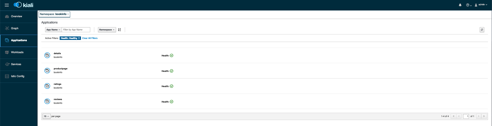
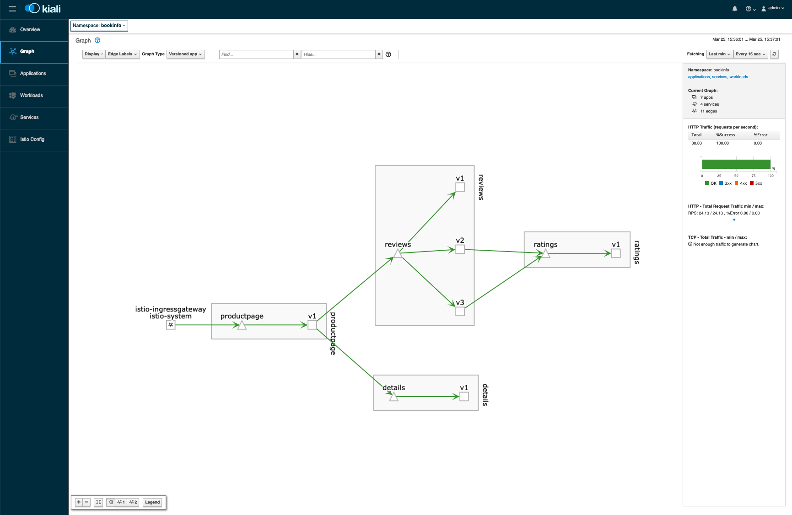

# Getting Started with Istio

As discussed in our [Overview](Readme.md), in this tutorial we will deploy Istio and learn about some of its features. Istio has many features, too many to cover in an introductory tutorial. Our aim here is to get things up and running and position ourselves for future exploration.

In our deployment, we will enable useful features such as Grafana and Prometheus. We will also install Kiali, a very nice mesh visualization tool. Once we have our deployment up and running, we will get a sample application deployed and configured. Finally, we will borrow a few examples of using Istio from the upstream [Istio documentation](https://istio.io/docs) to demonstrate some features.

You can find the prerequisites for this tutorial in the Overview as mentioned above.

## Understanding Istio

Before we get into installing and learning about Istio's features, let's take a few minutes to discuss the problem space and how Istio works to provide solutions. 

Microservice architecture is ubiquitous in cloud native development, and this typically goes hand-in-hand with large numbers of containers at scale. This typically means Kubernetes is the platform, which provides great abstractions for deploying groups of containers as services which work together consistently and reliably.

However, this is all software. Software is by its very nature dynamic and imperfect. With the shift to cloud, we've broken down our monoliths, and abstracted the resources where our processes run. In cloud native software, a distributed system architecture underlies even the most simple application. This provides powerful scalability and resource efficiency, but may result in a lack of observability and diagnosability.

Istio works to address these issues by creating and monitoring a service mesh. For each pod in a Kubernetes cluster that we wish to bring into the mesh, we inject a container running a proxy. This pattern is called a sidecar, as the proxy container runs alongside your containers. Istio uses Envoy as the proxy, which controls and mediates all of the network traffic between services within the mesh. These proxies work with Istio's other components to provide advanced traffic management capabilities, enhanced and simplified security and policy management configuration and vastly improved observability and awareness of what is running in the cloud estate.

To learn more about Istio's architecture, please refer to the project's [documentation](https://istio.io/docs/concepts/what-is-istio/#architecture).

## Installing Istio

### Preparing Our Cluster

To get started, we'll need a cluster running on OKE. If you're new to OKE, you can follow this [tutorial](https://www.oracle.com/webfolder/technetwork/tutorials/obe/oci/oke-full/index.html) to get rolling. Make sure to enable Helm on your cluster.

For a new cluster, grab the kubeconfig via the <samp>oci ce cluster create-kubeconfig</samp> command. We'll use this later when working with Istio, but Helm will also make use of it for the installation.

Helm is one of the many ways to install Istio on your cluster and a good way of getting up and running quickly. The Istio Helm Chart also makes it very convenient to deploy other services along with Istio. To get things started, you'll need a Helm client. If you don't already have a client installed, check out the [Helm Install](https://docs.helm.sh/install/) documentation. Then, utter a quick <samp>helm init --upgrade</samp> to make client and server are the same version.

Finally, to create the RBAC rules that Istio uses, we'll need to grant cluster admin permissions to the user account being used for this tutorial. To do this, you can bind the <samp>cluster-admin</samp> role using the user OCID via the following command:

```
$ kubectl create clusterrolebinding ca-binding –-clusterrole=cluster-admin –-user=<user-OCID>
```

Now we're ready to move on to installing Istio.

### Installing Istio

To get started with installation, get a copy of the latest version of Istio.

```
$ curl -L https://git.io/getLatestIstio | sh -
$ cd  istio-${version}
```

Once you have a local copy of Istio, the easiest method of installation for the purposes of this tutorial is to use Helm as mentioned above. This provides a customizable, simple method of deploying Istio to your cluster, and it comes with some optional charts that can be used to install additional services to our cluster.

Istio is deployed in two parts. The <samp>istio-init</samp> chart will initialize your cluster and install the custome resource definitions (CRDs) provided by Istio, and the <samp>istio</samp> chart will install the Istio project services. There are a few options for the second chart; use the 'Istio Demo' chart, which will also deploy Kiali, Grafana, Zipkin and other useful services.

Follow the current [installation instructions](https://istio.io/docs/setup/kubernetes/install/helm/) in the online Istio documentation to get your install rolling.

```
$ helm install install/kubernetes/helm/istio-init --name istio-init --namespace istio-system
$ helm install install/kubernetes/helm/istio --name istio --namespace istio-system \
    --values install/kubernetes/helm/istio/values-istio-demo.yaml
```

This will take a bit of time, depending. The deployment of the ingress gateway load balancer will be the long pole, you can monitor this by watching the service for an external IP assignment.

```
$ kubectl get svc -w -n istio-system istio-ingressgateway
```

As soon as you see an external IP assigned, we can move on to verifying our installation.

### Verifying the Install 

Istio is deployed as a set of services within your cluster, in the 'istio-system' namespace. We can see these are all up and running in the <samp>istio-system</samp> namespace. Note these services include those which aren't strictly Istio components, for example Prometheus and Grafana.

```
$ kubectl get svc -n istio-system
NAME                     TYPE           CLUSTER-IP      EXTERNAL-IP       PORT(S)                                        AGE
grafana                  ClusterIP      10.96.97.207    <none>            3000/TCP                                       15m
istio-citadel            ClusterIP      10.96.137.124   <none>            8060/TCP,9093/TCP                              15m
istio-egressgateway      ClusterIP      10.96.187.38    <none>            80/TCP,443/TCP                                 15m
istio-galley             ClusterIP      10.96.216.106   <none>            443/TCP,9093/TCP                               15m
istio-ingressgateway     LoadBalancer   10.96.215.235   129.213.170.247   80:31380/TCP,443:31390/TCP,31400:31400/TCP...  15m
istio-pilot              ClusterIP      10.96.96.103    <none>            15010/TCP,15011/TCP,8080/TCP,9093/TCP          15m
istio-policy             ClusterIP      10.96.208.127   <none>            9091/TCP,15004/TCP,9093/TCP                    15m
istio-sidecar-injector   ClusterIP      10.96.170.94    <none>            443/TCP                                        15m
istio-telemetry          ClusterIP      10.96.32.128    <none>            9091/TCP,15004/TCP,9093/TCP,42422/TCP          15m
jaeger-agent             ClusterIP      None            <none>            5775/UDP,6831/UDP,6832/UDP                     15m
jaeger-collector         ClusterIP      10.96.200.235   <none>            14267/TCP,14268/TCP                            15m
jaeger-query             ClusterIP      10.96.135.43    <none>            16686/TCP                                      15m
kiali                    ClusterIP      10.96.243.52    <none>            20001/TCP                                      15m
prometheus               ClusterIP      10.96.11.31     <none>            9090/TCP                                       15m
tracing                  ClusterIP      10.96.97.10     <none>            80/TCP                                         15m
zipkin                   ClusterIP      10.96.122.184   <none>            9411/TCP                                       15m
```

Once all of the pods are ready and running, Istio is ready to use. Note the pod names have some randomization, so yours will be slightly different.

```
$ kubectl get pods -n istio-system
NAME                                      READY   STATUS      RESTARTS   AGE
grafana-7b46bf6b7c-7mvrk                  1/1     Running     0          15m
istio-citadel-75fdb679db-bskwb            1/1     Running     0          15m
istio-egressgateway-75d546b87f-fkxmd      1/1     Running     0          15m
istio-galley-c864b5c86-vnwq9              1/1     Running     0          15m
istio-ingressgateway-668676fbdb-nnl6d     1/1     Running     0          15m
istio-init-crd-10-kdnnn                   0/1     Completed   0          15m
istio-init-crd-11-k54jb                   0/1     Completed   0          15m
istio-pilot-768db5615m5-q72wf             2/2     Running     0          15m
istio-policy-6996948c6c-fghfm             2/2     Running     1          15m
istio-sidecar-injector-7b47cb4689-kr797   1/1     Running     0          15m
istio-telemetry-56d57d87f7-67vc5          2/2     Running     1          15m
istio-tracing-75dd89b8b4-prpph            1/1     Running     0          15m
kiali-5d68f4c676-ks7m4                    1/1     Running     0          15m
prometheus-89bc5668c-5tsw4                1/1     Running     0          15m
```

Now, let's continue on by deploying a sample application.

### Deploy a Sample Application

To explore Istio's features, we'll need an application. The installation bundle we pulled down earlier has a sample application ready to deploy, which is quite handy. It's called <samp>"bookinfo"</samp>, and it works with the example tasks found in the [Istio documentation](https://istio.io/docs/examples/). We'll reproduce a couple of these examples below, but we encourage you to continue your investigation with the project documentation.

Before we deploy our application, let's create a new namespace for it and set up sidecar auto-injection on it. As discussed above, each pod that you want to add to the service mesh will need a sidecar container running within it. This can be deployed manually, or automatically. For the purposes of our tutorial, let's use the automatic sidecar injector. You can see that it was deployed in our list of services above.

This service will automatically deploy a sidecar when deploying new pods and is enabled on a per-namespace basis. So create a new <samp>bookinfo</samp> namespace and label it with <samp>istio-injection</samp>.

```
$ kubectl create ns bookinfo
namespace/bookinfo created
$ kubectl label namespace bookinfo istio-injection=enabled
namespace/bookinfo labeled
```

Now deploy the application.

```
$ kubectl apply -n bookinfo -f samples/bookinfo/platform/kube/bookinfo.yaml
```

As we have set up automatic sidecar injection for the default namespace, this will deploy the application as well as the Istio proxy sidecar containers in each of the pods. Let's take a look and make sure our application services are all up and running.

```
$ kubectl get pods -n bookinfo
NAME                              READY   STATUS    RESTARTS   AGE
details-v1-68868454f5-wl7gq       2/2     Running   0          19s
productpage-v1-5cb458d74f-7dt7d   2/2     Running   0          16s
ratings-v1-76f4c9765f-phplk       2/2     Running   0          18s
reviews-v1-56f6855586-s5ngd       2/2     Running   0          17s
reviews-v2-65c9df47f8-7n6bn       2/2     Running   0          17s
reviews-v3-6cf47594fd-wpwl9       2/2     Running   0          17s
```

Note that the sample application deploys three different versions of the <samp>reviews</samp> service. This is for demonstrative purposes; you would typically not do this in production.

If we take a quick peek into our <samp>productpage</samp> pod, as an example, we can see that the Istio proxy sidecar containers have been automatically spun up.

```
$ kubectl get pods -n bookinfo productpage-v1-54b8b9f55-htg47 -o jsonpath='{.spec.containers[*].name}'
productpage istio-proxy
```

Now that the application is up and running, we need to create an Istio Gateway to make it accessible outside the cluster. We can create a gateway by continuing to use the sample content, and we can confirm that it's been created by calling <samp>get</samp> on the <samp>gateway</samp> resource type.

```
$ kubectl apply -n bookinfo -f samples/bookinfo/networking/bookinfo-gateway.yaml
$ kubectl get gateway -n bookinfo
NAME               AGE
bookinfo-gateway   32s
```

Now, let's set a useful environment variable which holds the application gateway URL. This will be built from the ingress host and port, as shown below.

```
$ kubectl get svc -n bookinfo istio-ingressgateway -n istio-system
NAME                   TYPE           CLUSTER-IP     EXTERNAL-IP       PORT(S)                                                                                                                   AGE
istio-ingressgateway   LoadBalancer   10.96.58.222   129.213.142.163   80:31380/TCP,443:31390/TCP,31400:31400/TCP,15011:32240/TCP,8060:32082/TCP,853:32703/TCP,15030:32350/TCP,15031:30768/TCP   2m

$ export INGRESS_HOST=$(kubectl -n istio-system get service istio-ingressgateway -o jsonpath='{.status.loadBalancer.ingress[0].ip}')
$ export INGRESS_PORT=$(kubectl -n istio-system get service istio-ingressgateway -o jsonpath='{.spec.ports[?(@.name=="http2")].port}')
$ export GATEWAY_URL=$INGRESS_HOST:$INGRESS_PORT
```

Finally, let's verify our application is up and available by using the gateway URL.

```
$ curl -o /dev/null -s -w "%{http_code}" http://${GATEWAY_URL}/productpage
200
```

Now we have a sample application running in our Istio-enabled cluster. One final step is to define the available versions, called subsets, in our destination rules.  Once again, we can use the sample content.

```
$ kubectl apply -n bookinfo -f samples/bookinfo/networking/destination-rule-all.yaml
```

It will take a few seconds for the rules to propagate, and now you're ready to explore Istio's features.

## Using Istio

Let's start our investigation of Istio's features with a few simple examples from the Istio documentation. As mentioned above, we encourage you to carry on with your learning by exploring the rest of the [examples](https://istio.io/docs/examples/).

### Traffic Shifting

In this example, we'll incrementally migrate application traffic from one version of a service to another by applying weight-based routing rules. We'll start with all traffic going to one version, move half of our traffic to a second version, and finally route all traffic to the second version.

To accomplish this common use case in Istio, we configure rules that route a percentage of traffic, as a weight, to one service or another. We can explore this feature with our <samp>bookinfo</samp> applications by first sending 50% of traffic to the <samp>reviews:v1</samp> service and the other 50% to <samp>reviews:v3</samp>. 

To get started, run this command to route all traffic to the <samp>v1</samp> version of each microservice.

```
$ kubectl apply -n bookinfo -f samples/bookinfo/networking/virtual-service-all-v1.yaml
```

Now open the Bookinfo site in your browser. The URL is http://$GATEWAY_URL/productpage, where $GATEWAY_URL is the External IP address of the ingress that we set above.

Notice that the reviews part of the page displays with no rating stars, no matter how many times you refresh. This is because all traffic for the reviews service is routed to the version <samp>reviews:v1</samp> which does not access the star ratings service.

Now let's transfer 50% of the traffic from <samp>reviews:v1</samp> to <samp>reviews:v3</samp> with the following command:

```
$ kubectl apply -n bookinfo -f samples/bookinfo/networking/virtual-service-reviews-50-v3.yaml
```

Wait a few seconds for the new rules to propagate. You can confirm the rule was replaced with:

```
$ kubectl get virtualservice -n bookinfo reviews -o yaml
apiVersion: networking.istio.io/v1alpha3
kind: VirtualService
metadata:
  name: reviews
  ...
spec:
  hosts:
  - reviews
  http:
  - route:
    - destination:
        host: reviews
        subset: v1
      weight: 50
    - destination:
        host: reviews
        subset: v3
      weight: 50
```

Now refresh the /productpage in your browser and you will see red colored star ratings approximately 50% of the time. This is because the v3 version of reviews accesses the star ratings service, but the v1 version does not.

Finally, with <samp>reviews:v3</samp> looking stable, let's route 100% of the traffic to it by applying this virtual service:

```
$ kubectl apply -n bookinfo -f samples/bookinfo/networking/virtual-service-reviews-v3.yaml
```

Now when you refresh the /productpage in your browser, you will always see book reviews with red colored star ratings for each review.

When you've refreshed enough to observe the impact of the routing rules, you may clean up this example with:

```
$ kubectl delete -n bookinfo -f samples/bookinfo/networking/virtual-service-all-v1.yaml
```

This is just one quick example of the powerful traffic management features of Istio.

### Observability and Kiali

As an example of powerful observability features, let's take a look at Kiali. It provides an attractive and easy-to-use web interface for various observability and debugging features. Let's use it to look at the topology of our application.

First, ensure it's running with:

```
$ kubectl -n istio-system get svc kiali
NAME    TYPE        CLUSTER-IP     EXTERNAL-IP   PORT(S)     AGE
kiali   ClusterIP   10.96.243.52   <none>        20001/TCP   18m
```

You can access Kiali by first setting up port-forwarding on the service

```
$ kubectl -n istio-system port-forward $(kubectl -n istio-system get pod -l app=kiali -o jsonpath='{.items[0].metadata.name}') 20001:20001
Forwarding from 127.0.0.1:20001 -> 20001
Forwarding from [::1]:20001 -> 20001
```

Then, visit the Kiali console in a browser by opening http://localhost:20001/kiali/console. Log in with the default <samp>admin / admin</samp>.

You can look around the BUI to get an idea of what's available. On the overview page, you see a quick survey of your cluster's namespaces and the applications running within them. Clicking into one brings you into the application view, where you and drill down into the specific services and monitor the overall health of your deployed applications.




Now click on the 'Graph' section on the left navigation pane, and select the <samp>bookinfo</samp> namespace in the dropdown in the top left. This provides a nice visualization of the various services deployed, and how the traffic is flowing between them. Note, you may need to send some traffic with curl, or hit refresh a few times in your browser to generate some traffic. Notice the HTTP traffic metrics on the right side.




There is a lot more to Kiali, and it is under active development. This was just a quick example of its ability to visualize the relationships and traffic flow between your deployed services.

When you're done, you can clean up any kubectl port-forward processes that may still be running: 

```
$ killall kubectl
```

## Conclusion 

Istio can help to increase observability and transparency in your deployed service assets, assist when triaging issues with distributed tracing and help deploy complex traffic, security and policy management solutions. We have deployed, configured and explored a few quick features using Istio on a Kubernetes cluster running in OKE on Oracle Cloud Infrastructure. We encourage you to explore more features in the upstream documentation [examples](https://istio.io/docs/examples/) and [tasks](https://istio.io/docs/tasks/).
