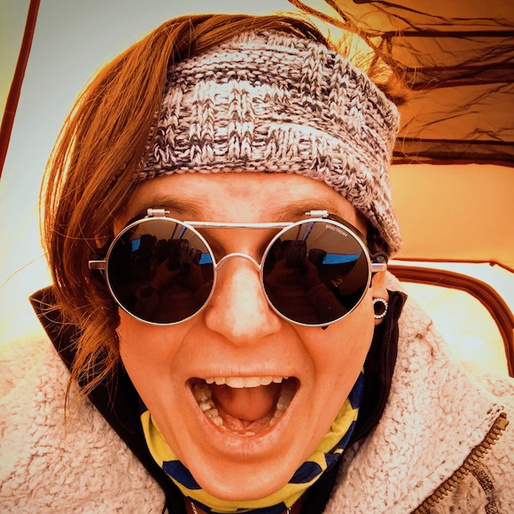
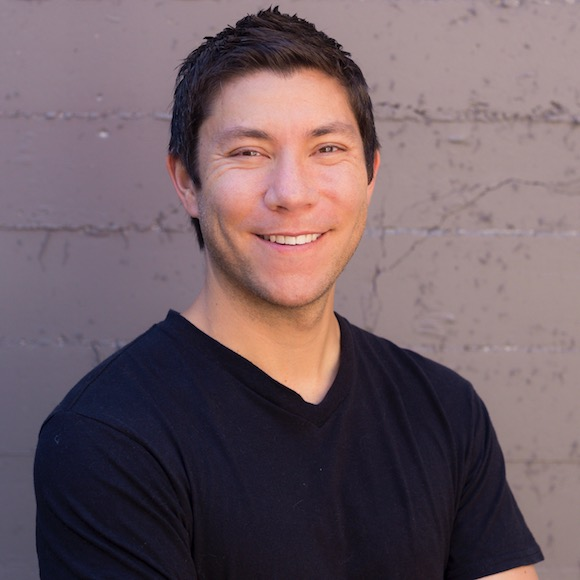
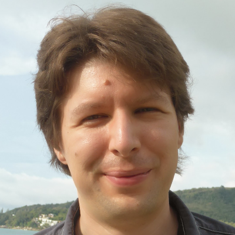
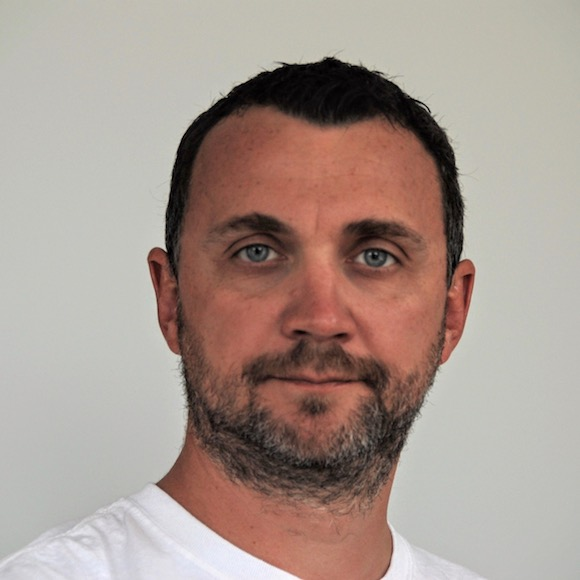
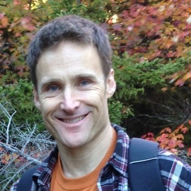
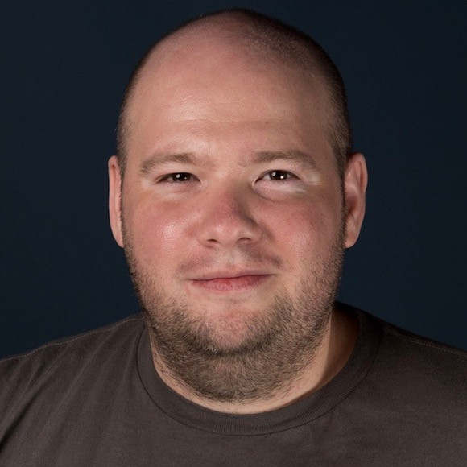
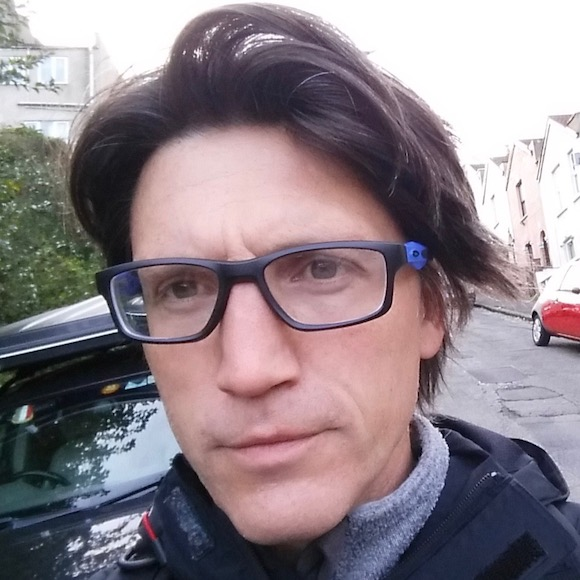

# Featured Speakers

## Kaslin Fields

### Twitter

[@kaslinfields](https://twitter.com/@kaslinfields)

### Role

Solutions Architect, Oracle

### Sessions

#### Monday, December 10 | Oracle Summit at KubeCon + CloudNativeCon

Panel moderator : Cloud Native Past, Present, Future

### Bio

Kaslin Fields is a Solutions Architect focusing on containers (particularly
Kubernetes) at Oracle Cloud Infrastructure. As a Solutions Architect, she
spends most of her time creating blog posts, demos, and other materials to help
guide Oracle's customers into the world of containerization. Kaslin has spoken
about the cloud and containers at the Kubernetes, Docker, CloudTalk, and
Cloud-Native and Kubernetes meetup groups in the Seattle area.

## Kris Nova

### Twitter

[@krisnova](https://twitter.com/@krisnova)

### Role
Senior Developer Advocate, Heptio 

### Sessions

#### Monday, December 10 | Oracle Summit at KubeCon + CloudNativeCon

Panel: Cloud Native Past, Present, Future

#### Tuesday, December 11, 3:40pm

[Use the Cluster API to Deploy Clusters On-Prem and in Public
Clouds](https://kccna18.sched.com/event/GrWT/use-the-cluster-api-to-deploy-clusters-on-prem-and-in-public-clouds-loc-nguyen-vmware-kris-nova-heptio)

#### Thursday, December 13, 1:45pm

[You Can't Have a Cluster [BLEEP] Without a
Cluster](https://kccna18.sched.com/event/GrYV/you-cant-have-a-cluster-bleep-without-a-cluster-kris-nova-heptio)

### Bio

Kris Nova is a senior developer advocate at Heptio focusing on containers,
infrastructure, and Kubernetes. Kris is also an ambassador for the Cloud Native
Computing Foundation. Previously, she was a developer advocate and an engineer
on Kubernetes in Azure at Microsoft. Kris has a deep technical background in
the Go programming language and has authored many successful tools in Go. She
is a Kubernetes maintainer and the creator of kubicorn, a successful Kubernetes
infrastructure management tool. Kris organizes a special interest group in
Kubernetes and is a leader in the community. She understands the grievances
with running cloud-native infrastructure via a distributed cloud-native
application and recently authored an O'Reilly book on the topic, Cloud Native
Infrastructure. Kris lives in Seattle and spends her free time mountaineering
and rock climbing.

## Ashley McNamara

### Twitter

[@ashleymcnamara](https://twitter/@ashleymcnamara)

### Role

Developer Advocate, Microsoft

### Sessions

#### Monday, December 10 | Oracle Summit at KubeCon + CloudNativeCon

Panel: Cloud Native Past, Present, Future

### Bio

Ashley McNamara is a Developer Advocate at Microsoft specializing in Linux,
Containers, Go, and Web Technologies.

Ashley acts as a bridge between outside developers and Microsoft, driving
platform adoption through developer communities and driving change into
products based on real-world customer/developer feedback.

Ashley was a 2014 Hackbright engineering fellow and in her spare time, she's a
mentor at WeWork, General Assembly, AngelHack, and CapitalFactory.

Ashley is passionate about helping more underrepresented individuals join and
feel comfortable in tech and is often a resource for new developers trying to
find their way.

## Chad Arimura

### Twitter

[@chadarimura](https://twitter.com/@chadarimura)

### Role

VP Serverless Advocacy, Oracle

### Sessions

#### Monday, December 10 | Oracle Summit at KubeCon + CloudNativeCon

### Bio

I am a 3x entrepreneur, most recently as co-founder and CEO of
[Iron.io](https://www.crunchbase.com/organization/iron-io) where we grew a
multi-million dollar ARR business helping pioneer serverless computing
including some of the earliest usages of the term "serverless" in 2010. Sorry
for that. We sold the company in 2017 and joined Oracle.  I am now VP
Serverless Advocacy at Oracle, currently leading The [Fn
Project](http://fnproject.io/), open source serverless FaaS platform and
orchestration.  I try my best to lead with passion, integrity, and
transparency, and am always striving to be better in these areas.

## Christopher Woods

### Twitter

[@chryswoods](https://twitter.com/@chryswoods)

### Role

Research Software Engineer, University of Bristol

### Sessions

#### Monday, December 10 | Oracle Summit at KubeCon + CloudNativeCon

#### Thursday, Dec 13, 11:40am

[Running Serverless HPC Workloads on Top of Kubernetes and Jupyter Notebooks](https://sched.co/GraL)

### Bio

Christopher Woods manages the Research Software Engineering (RSE) Group at the
University of Bristol. He is an EPSRC RSE Fellow and Joint-Chair of the UK RSE
Association. He obtained his undergraduate and postgraduate degrees in
Chemistry from the University of Southampton, working with Prof Jonathan Essex,
before moving to the University of Bristol as a chemist developing novel
software and algorithms for modelling biological molecules. In 2016 he started
the University of Bristol's RSE Group within the Advanced Computing Research
Centre. He is a lead researcher on the BioSimSpace project working with
Microsoft and Oracle to adapt biomolecular simulation software so that it can
be used commercially in the cloud.

# Speakers

## Kire Filipovski

### Twitter

[@kfilipovski](https://twitter.com/@kfilipovski)

### Role

Cloud Architect, Oracle 

### Sessions

#### Monday, December 10 | Oracle Summit at KubeCon + CloudNativeCon

Autonomous workload management: Declarative Application Development

### Bio

Kire Filipovski works as a Cloud Architect at Oracle leading design and
implementation of a distributed application management system. Previously Kire
worked as a Distinguished Cloud Architect at Walmart where he designed
computing platforms that transformed the world's largest company into a digital
business. He joined Walmart in 2013 as part of the OneOps acquisition, a
company which he co-founded in 2011.

## TJ Fontaine

### Twitter

[@tjfontaine](https://twitter.com)

### Role

Software Engineer, Oracle

### Sessions

#### Monday, December 10 | Oracle Summit at KubeCon + CloudNativeCon

Kubernetes service delivery at scale without magic: a FaaS case study

### Bio

TJ Fontaine is a software engineer at Oracle responsible for architecting and
delivering highly available cloud-native containerized services and is the
technical lead for Kubernetes contributions. He is also a veteran open source
contributor to Node.js, Linux, and Mono. While Node.js Project Lead, he guided
community expansion and enterprise adoption.

## Karthik Gaekwad 

### Twitter

[@iteration1](https://twitter.com/@iteration1)

### Role

Cloud Native Developer Advocate, Oracle 

### Sessions

#### Wednesday, December 12, 4:30pm

[Noobernetes 101: Top 10 Questions We Get From New K8s Users](https://sched.co/GrTZ)

### Bio

Karthik Gaekwad is a developer, engineer, author, and evangelist who focuses on
cloud and container products for Oracle. He graduated from the University of
Arizona with a BS and MS in computer engineering and has worked in the cloud
industry since 2007 and enjoys working on the development side of the DevOps
paradigm. He also is an organizer for DevOpsDays Austin and Cloud Austin.

## Patrick Galbraith 

### Linkedin

[galbraithpatrick](https://linkedin.com/in/galbraithpatrick)

### Role

Principal Platform Engineer, Oracle

### Sessions

#### Thursday, December 13, 3:40pm

[Running MySQL on Kubernetes](https://sched.co/Grb4)

### Bio

Patrick Galbraith has been involved in MySQL, Linux, and other Open Source
(OSS) projects back to the early days of Slackware. He has worked broad
spectrum of companies throughout his career, including Slashdot, MySQL, Blue
Gecko, Hewlett-Packard, and now Oracle, and contributed to a number of Oper
Source projects such as MySQL, Drizzle, DBD::mysql, Kubernetes, Helm charts for
MySQL and Galera. During his tenure in Hewlett-Packard's Advanced Technology
Group (ATG) for Cloud and Open Source, Patrick had a focus on containerization
with emphasis on Kubernetes; this focus, like all ATG endeavors, included
participation in the associated OSS communities that continues to this day.
Patrick has a keen, and long-standing interest in the effective marriage
databases and Kubernetes with a bent toward MySQL. To this end, Patrick's
"MySQL on Kubernetes" demonstration is a deep-rooted passion of his. 

Patrick has spoken at a number of conferences including last year at Kubecon in
Austin, TX. The talk can be seen at
https://www.youtube.com/watch?v=J7h0F34iBx0.

He is an author of two books. one in both English and Mandarin, "Developing Web
Applications with Apache, MySQL, memcached, and Perl" and "Expert PHP and
MySQL" (both Wiley)

His other conferences can be seen here: http://patg.net/speaking.html

## John Harris

### Twitter

[@johnharris85](https://twitter.com/@johnharris85)

### Role

Technical Account Manager, Docker

### Sessions

#### Monday, December 10 | Oracle Summit at KubeCon + CloudNativeCon

Panel: Cloud Native Past, Present, Future

### Bio

John Harris is a Technical Account Manager at Docker. He works with customers
to help implement and adopt container platforms with a focus on Kubernetes.
Previously he ran Continuous Delivery and DevOps services for a London-based
consultancy. Outside of work he is active in the Seattle tech community where
he co-leads several Meetup groups and is a volunteer mentor for Ada Developers
Academy.

## Kristen Jacobs

### Role

Pincipal Software Engineer, Oracle

### Sessions

#### Thursday, December 13, 1:45pm 

[Container Networking From Scratch](https://sched.co/GrWx)

### Bio

Kristen Jacobs is a principal software engineer in Oracle's cloud
infrastructure group. He spent the first 15 years of his career working in
microprocessor development, but for the past 3 (ish) years has switched from
the very small to the very large and is now working on CI/CD tools and cloud
infrastructure. More specifically, he is focused on Kubernetes integration with
the Oracle cloud.

## Bob Quillin 

### Twitter

[@bobquillin](https://twitter.com/@bobquillin)

### Role

Vice President of Developer Relations, Oracle 

### Sessions

#### Monday, December 10 | Oracle Summit at KubeCon + CloudNativeCon

### Bio

Bob Quillin is Vice President of Developer Relations for Oracle's Application
Development portfolio. He was previously CEO and co-founder of StackEngine, an
Austin-based Docker and container management platform startup acquired by
Oracle.

## Micha "mies" Hernandez van Leuffen

### Twitter

[@mies](https://twitter.com/@mies)

### Role 

Vice President of Solution Development, Oracle

### Sessions

#### Monday, December 10 | The Cloud Native Culture & Industry Summit at KubeCon + CloudNativeCon

Cloud Native Java: Not your grandfather's Cup of Joe

### Bio

Micha "mies" Hernandez van Leuffen was the founder and CEO of Wercker, a
container-native CI/CD platform, which was acquired by Oracle in May of 2017.
He's now a VP of Software Development inside the container native group at
Oracle where he's bringing the next generation of developer automation for the
modern cloud to market through OSS.

## Laird Nelson

### Role

Consulting Member of Technical Staff, Oracle

### Sessions

#### Monday, December 10 | The Cloud Native Culture & Industry Summit at KubeCon + CloudNativeCon

Cloud Native Java: Not your grandfather's Cup of Joe

### Bio

Laird has worked with Java SE since it was in beta and Java EE since its
inception.  He has contributed to Glassfish, fabric8, Weld, JBoss, Narayana,
Kubernetes Helm and other open source software projects for 17 years and
counting.  He currently works for Oracle on Project Helidon at the intersection
of Java, Kubernetes and the enterprise.  When the work day ends, he plays a
mean Hammond B3 in and around Bainbridge Island, WA, USA.
