# Featured Speakers

## Priya Shah

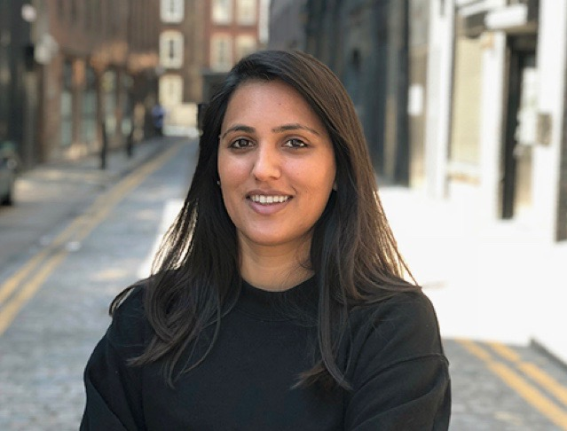

### Twitter

[@PriyaShah110](https://twitter.com/@PriyaShah110)

### Role

Co-Founder, Sauce

### Sessions

#### Wednesday May 22 | 14:00 - 14:35| Hall 8.0 D1

Democratizing HPC & AI: Startups Scale Up with Cloud Native

### Bio

Priya is the Co-founder and CMO of Sauce, the video creation platform that
enables businesses to collaborate and co-create with their global communities
of employees, customers and fans. Priya and her Co-founders developed Sauce
when they discovered the huge barriers that brands were facing when producing
video - the cost, time and admin required was not fit for today's video content
needs. So they launched their intelligent cloud platform that makes video
creation fast, easy and affordable - all powered bythe smartphone camera. Priya
leads the Sales & Marketing team - who's clients include Accenture and Oracle.

## Dr. Zara Nanu

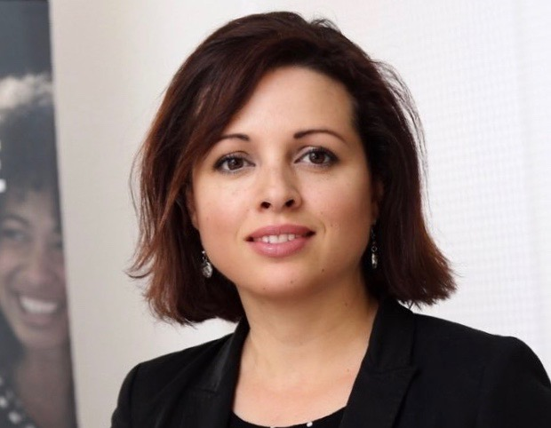

### Twitter

[@ZaraNanu](https://twitter.com/@ZaraNanu)

### Role

CEO and Co-Founder, Gapsquare

### Sessions

#### Wednesday May 22 | 14:00 - 14:35| Hall 8.0 D1

[Democratizing HPC & AI: Startups Scale Up with Cloud Native](https://sched.co/MPed)

### Bio

Zara Nanu is CEO and co-founder of Gapsquare, a leading provider of pay
transparency; gender and ethnicity pay gap analysis. Zara is an expert on how
diversity and inclusion can shape more dynamic and productive teams and a more
engaging and empowering workplace. She is an entrepreneur who believes business
can generate social impact as well as revenues and profits. She is not a talker
-- she is a doer. Zara is a Business Insider 42 under 42, Top 100 most
influential women in the West, and SPARKies Founder of theYear. Zara holds a
PhD in Politics from the University of the West of England.

## Emily Tanaka-Delgado

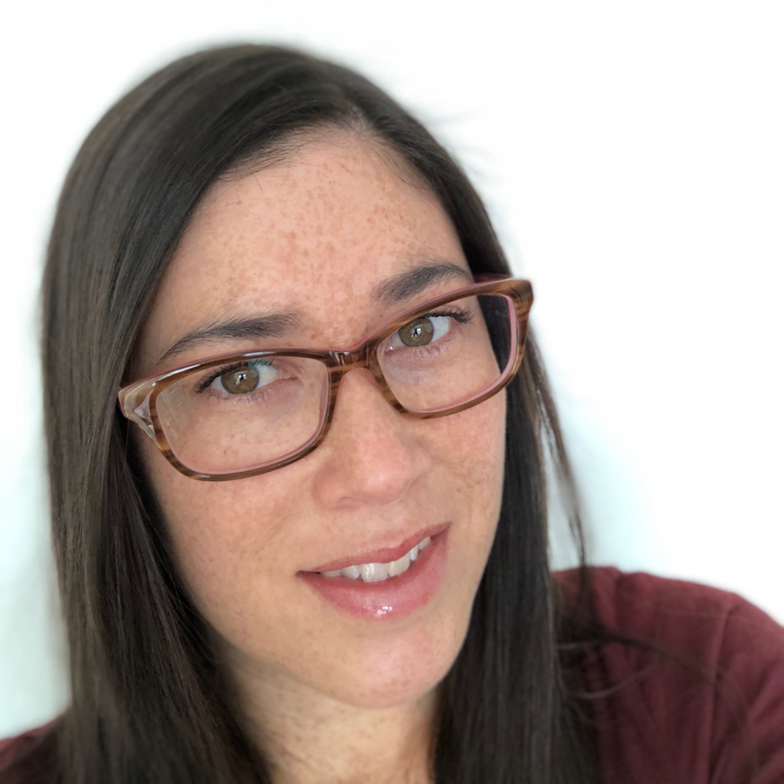

### Twitter

[@mle_tanaka](https://twitter.com/@mle_tanaka)

### Role

Director of DevRel, Oracle

### Sessions

#### Wednesday May 22 | 14:00 - 14:35| Hall 8.0 D1

Democratizing HPC & AI: Startups Scale Up with Cloud Native

### Bio

Emily Tanaka-Delgado leads cloud native DevRel Engagement at Oracle, where she
has trail blazed content and programs designed to enable, enrich, and
accelerate end users. She has a long tenure in the tech industry with a heavy
concentration in cloud and open source technologies. Before joining Oracle,
Emily ran marketing and DevRel at Joyent, with a special focus on the Node.js
stewardship, from acquisition to foundation. There, she worked with core
contributors and community leaders to grow theuser base, enable the ecosystem,
and improve developer engagement.

# Speakers

## Charlie Davies

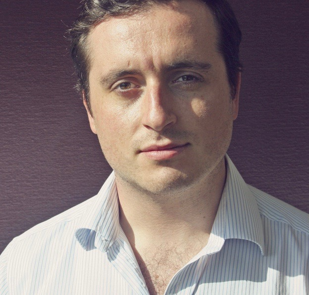

### Twitter

[@igeolise](https://twitter.com/@igeolise)

### Role

CTO and Co-Founder, iGeolise

### Sessions

#### Wednesday May 22 | 14:00 - 14:35| Hall 8.0 D1

Democratizing HPC & AI: Startups Scale Up with Cloud Native

### Bio

Charlie Davies is the co-founder and CTO of iGeolise, a location-based software
company based in London. Charlie began iGeolise when he noticed that all map
data was searched by distance (miles radius), but everyone around him discussed
travel using time (minutes). iGeolise developed an API that makes maps
searchable by time. iGeolise builds applications that add real value to local
data in order to enable successful local searches. The first application is
called Travel Time and it converts distance into journey time -- miles into
minutes.

## Alfonso Santiago

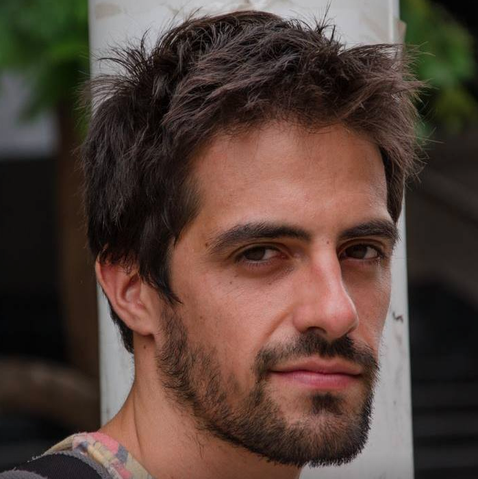

### Twitter

[@alfstg](https://twitter.com/@alfstg)

### Role

R&D Engineer, ELEM Biotech

### Sessions

#### Wednesday May 22 | 14:00 - 14:35| Hall 8.0 D1

Democratizing HPC & AI: Startups Scale Up with Cloud Native

### Bio

Alfonso Santiago is an R&D Engineer at Elem biotech and a postdoctoral
researcher at the Barcelona Supercomputing Center (BSC). During his PhD at the
BSC, he developed the fluid-electro-mechanical model of the human heart that
worked as a primer for Elem biotech. Today, Elem biotech is building a
cloud-based computer simulation technology to aid pacemaker design.He holds a
Bioengineering degree and a PhD in Biomedical Engineering and has been recently
appointed as a member ASME Codes and Standards committee V&V40. Nowadays, his
main focus is to transfer the technology developed at the BSC to business
through Elem Biotech.

## Kaslin Fields

### Twitter

[@kaslinfields](https://twitter.com/@kaslinfields)

### Role

SOLUTIONS ARCHITECT, ORACLE

### Sessions

#### Monday, May 20 / 18:30 - 18:35 / Hall 8.0 A1

Lightning Talk: Hot, Fresh Containers - How Containers Are Like Cookies!

### Bio

Kaslin Fields is a Solutions Architect focusing on containers (particularly
Kubernetes) at Oracle Cloud Infrastructure. As a Solutions Architect, she
spends most of her time creating blog posts, demos, and other materials to help
guide Oracle's customers into the world of containerization. Kaslin has spoken
about the cloud and containers at the Kubernetes, Docker, CloudTalk, and
Cloud-Native and Kubernetes meetup groups in the Seattle area.

## Bob Quillin

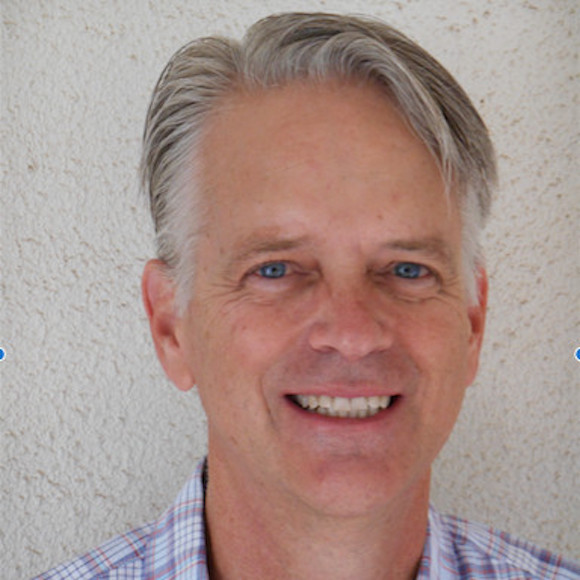

### Twitter

[@bobquillin](https://twitter.com/@bobquillin)

### Role

VP Developer Relations, Oracle

### Sessions

#### Wednesday, May 22 | 09:27 - 09:32 | Hall 6

Keynote: Building a Bigger Cloud Native Tent: Addressing Cultural Change and Complexity Challenges

### Bio

As Vice President of Developer Relations for Oracle Cloud Infrastructure (OCI),
Bob Quillin leads the Cloud Native Labs team who are responsible for OCI cloud
native developer relations, advocacy, engagement, solutions, and lighthouse
adoption. Bob joined Oracle as part of the StackEngine acquisition by Oracle in
December 2015, where he was co-founder and CEO.  Based in Austin, TX,
StackEngine was an early container-native pioneer building services and
platforms designed to help developers and devops teams build, orchestrate, and
scale enterprise-grade container apps.

Prior to his role as co-founder and CEO of StackEngine, Bob was CEO of
Austin-based CopperEgg, a cloud monitoring SaaS startup acquired by Idera in
2013.  With previous executive and startup leadership roles at CopperEgg,
nLayers, EMC, and VMware, Bob has focused his career on applying automation to
simplify complex cloud, IT and developer challenges.

## Ewan Slater

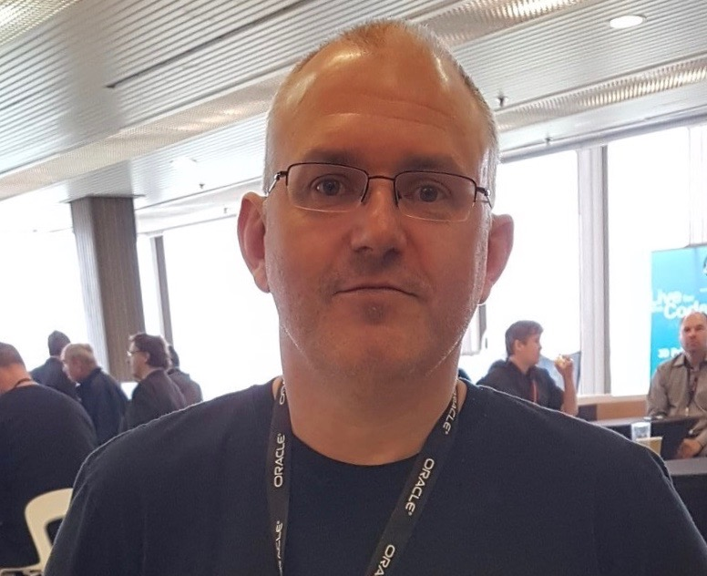

### Twitter

[@ewanslater](https://twitter.com/@ewanslater)

### Role

Cloud Architect, Oracle

### Sessions

#### Thursday, May 23 | 11:05 - 11:40 | Hall 8.1 G2

Ouch! What I Learned From Being Hit by a Serverless, Ruby Boomerang!

### Bio

I started out as a research scientist and then drifted into IT. These days I'm
an architect in Oracle's EMEA Technology Cloud Team, have over twenty years
experience in the technology industry and a lot less hair. I joined Oracle when
they acquired Thor Technology in 2005. I intended to stay for six months and
I'm still here. I'm currently focused on helping Oracle's customers and
partners adopt a cloud native approach to development. I contribute to the Fn
project and I'm one of the organisers of the DevEast conference in the UK.

## Mickey Boxell

### Role

Product Management, Oracle

### Twitter

[@mickeyboxell](https://twitter.com/@mickeyboxell)

### Bio

Mickey Boxell is a Developer Advocate on the Cloud Native Labs team at Oracle.
He is focused on building customer-deployable cloud native/container native
solutions to bridge the gap between open source communities and the core Oracle
Cloud Infrastructure services. This includes solution tutorials, sample code,
technical blog posts all related to the Kubernetes platform

### Sessions

#### Wed, May 22 / 13:35pm / Fira Hall 8, Oracle Booth D5

Modern Site Reliability Engineering Toolkit 

## Jaap Romers

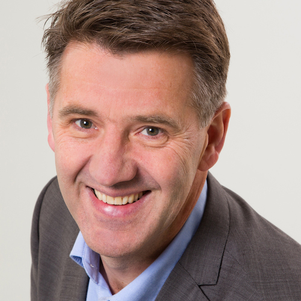

### Role

Principal Solution Engineer, Oracle

### Twitter

[@jaapromers](https://twitter.com/@jaapromers)

### Bio

Jaap Romers is a Principal Solution Engineer within the Oracle EMEA Open Cloud
Infrastructure team. He supports customers with the design and implementation
of open-source and cloud-native initiatives and has extensive knowledge of
Linux and  containerized applications.  Over the years Jaap has used open
source and cloud-native technologies to help various organisations with their
DevOps and architecture discussions.

### Sessions

#### Wed, May 22 / 15:45pm / Fira Hall 8, Oracle Booth D5

Accelerating your cloud-native DevOps

#### Thu, May 23 / 13:35pm / Fira Hall 8, Oracle Booth D5

Accelerating your cloud-native DevOps

## Jon Reeve

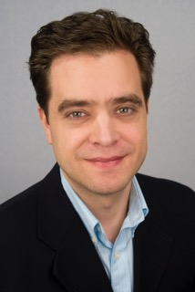

### Role

Product Management, Oracle

### Bio

Jon Reeve, Senior Director of Product Management, Oracle, owns product
management for Oracle's container management solutions.  He has served in
numerous product and leadership roles at companies such as StackEngine, Hyper9,
SolarWinds, SMARTS, EMC and VMTurbo.  Having previously served as VP of Product
for StackEngine, he was responsible for the company's flagship container
management product, Container Application Center. His experience spans more
than 20 years across computer networking, systems management, virtualization,
cloud and container technologies, helping numerous start-ups and established
companies generate market traction.  He has a degree in Electrical Engineering
and a PhD in Computer Networking from the University of Durham (UK).

### Twitter

[@j_m_reeve](https://twitter.com/@j_m_reeve)

### Sessions

#### Tue, May 21 / 15:25pm / Fira Hall 8, Oracle Booth D5

Considerations when adopting Cloud based Enterprise Container Platforms

## Jonathan Schreiber

### Role

Product Management, Oracle

### Sessions

#### Wed, May 22 / 13:15pm / Fira Hall 8, Oracle Booth D5

Autonomous Database the Native way!

## Rishi Johari

### Role

Product Management, Oracle

### Sessions

#### Thu, May 23 / 10:45am / Fira Hall 8, Oracle Booth D5

Deploying OKE Clusters as Infrastructure as Code

## Maddie Patrichi

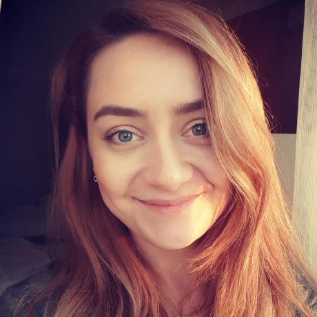

### Role

Senior Software Engineer, Oracle

### Twitter

[@maddie_patrichi](https://twitter.com/@maddie_patrichi)

### Bio

Maddie Patrichi is a Senior Software Developer for Oracle Cloud Infrastructure,
currently working for the API Gateway team and was part of various teams
working on integrating Oracle services with Kubernetes while here. She has
graduated in 2010 from the University of Bristol with an MEng in Computer
Science. Prior to working at Oracle she worked for Hewlett Packard Enterprise
and focused on developing an Object Storage solution and integrating Storage
appliances with Cloud services.

### Sessions

#### Tue, May 21 / 15:45pm / Fira Hall 8, Oracle Booth D5

Building a global API Gateway Service

#### Wed, May 22 / 15:25pm / Fira Hall 8, Oracle Booth D5

Building a global API Gateway Service

#### Thu, May 23 / 13:15pm / Fira Hall 8, Oracle Booth D5

Building a global API Gateway Service

## Karthik Gaekwad 

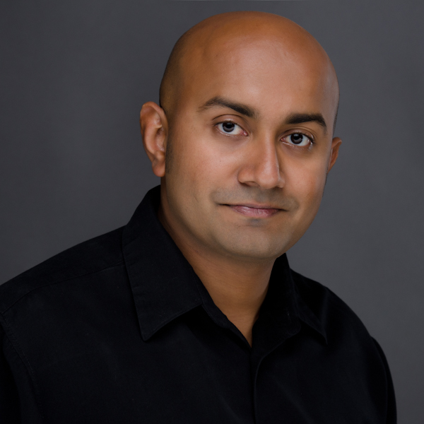

### Twitter

[@iteration1](https://twitter.com/@iteration1)

### Role

Cloud Native Developer Advocate, Oracle 

### Sessions

#### Thu, May 23 / 12:35pm / Fira Hall 8, Oracle Booth D5

5 tools later: Cloudnative devops tooling

### Bio

Karthik Gaekwad is a Principal Engineer for Oracle Cloud.  He's been in many
engineering roles inside Oracle and was on the product teams that released
various container based products including Oracle Kubernetes Engine. Before
Oracle, he has worked in both startups and large enterprises including
StackEngine, Signal Sciences, Mentor Graphics, and National Instruments. He is
an innovator in the devops, agile and container technologies. He is an author
on LinkedIn Learning, a frequent presenter at conferences, and organizes many
technical events including Devopsdays Austin. He frequently writes at
cloudnative.oracle.com. In his free time, Karthik enjoys spending time with
family, keeping up with the latest trends in software, dabbling in new product
ideas, and blogging on theagileadmin.com

## Sachin Pikle

### Role

Product Strategy Director, Oracle

### Bio

Sachin Pikle is a Product Strategy Director at Oracle working on Serverless and
Functions as a Service. Previously, he was a product manager for Oracle
Microservices, Oracle Cloud Machine, and Oracle Exalogic. He has over 20 years
of experience spanning product management, technology consulting and
application delivery. Prior to joining Oracle, he worked on large application
development projects for clients like Walmart, Westpac, American Express, JP
Morgan and more. He also founded and managed an online eCommerce startup. He is
a technical reviewer of the book Microservices for Modern Commerce published by
O'Reilly Media in October 2016

### Sessions

#### Thu, May 23 / 10:25am / Fira Hall 8, Oracle Booth D5

Serverless with Oracle Functions!

## Jesse Butler

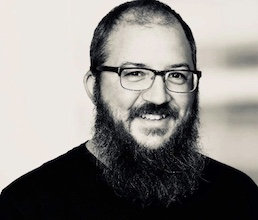

### Role

Principal Cloud Advocate, Oracle

### Twitter

[@jlb13](https://twitter.com/@jlb13)

### Bio

Jesse is a cloud advocate with Oracle Cloud. He comes from a systems and OS
development background and has been working with containers for several years,
first in Solaris and later in Linux. He now works in the OCI organization as a
Cloud Advocate focused on Kubernetes, containers, serverless and other cloud
native technologies.

### Sessions

#### Thu, May 23 / 15:25pm / Fira Hall 8, Oracle Booth D5

Service Mesh: Real World Use Cases

## Jonathan Girven

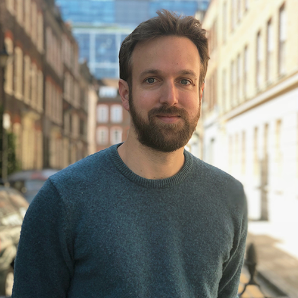

### Role

Co-founder & CTO, Sauce

### Bio

Jon completed a PhD in Astronomy & Astrophysics at the University of Warwick in
2012 with a thesis about the future of the sun and the earth after the sun dies
and becomes a white dwarf star. He developed algorithms in Python to search
billions of entries across multiple databases of stars. After a summer in a
Bedouin village in Egypt teaching windsurfing, he decided shift his career to
something closer to home and co-founded Sauce.

### Sessions

#### Tue, May 21 / 13:35pm / Fira Hall 8, Oracle Booth D5

The secret Sauce for creating video with GPUs & Kubernetes Jobs

#### Wed, May 22 / 10:25am / Fira Hall 8, Oracle Booth D5

The secret Sauce for creating video with GPUs & Kubernetes Jobs

## Ant Kennedy

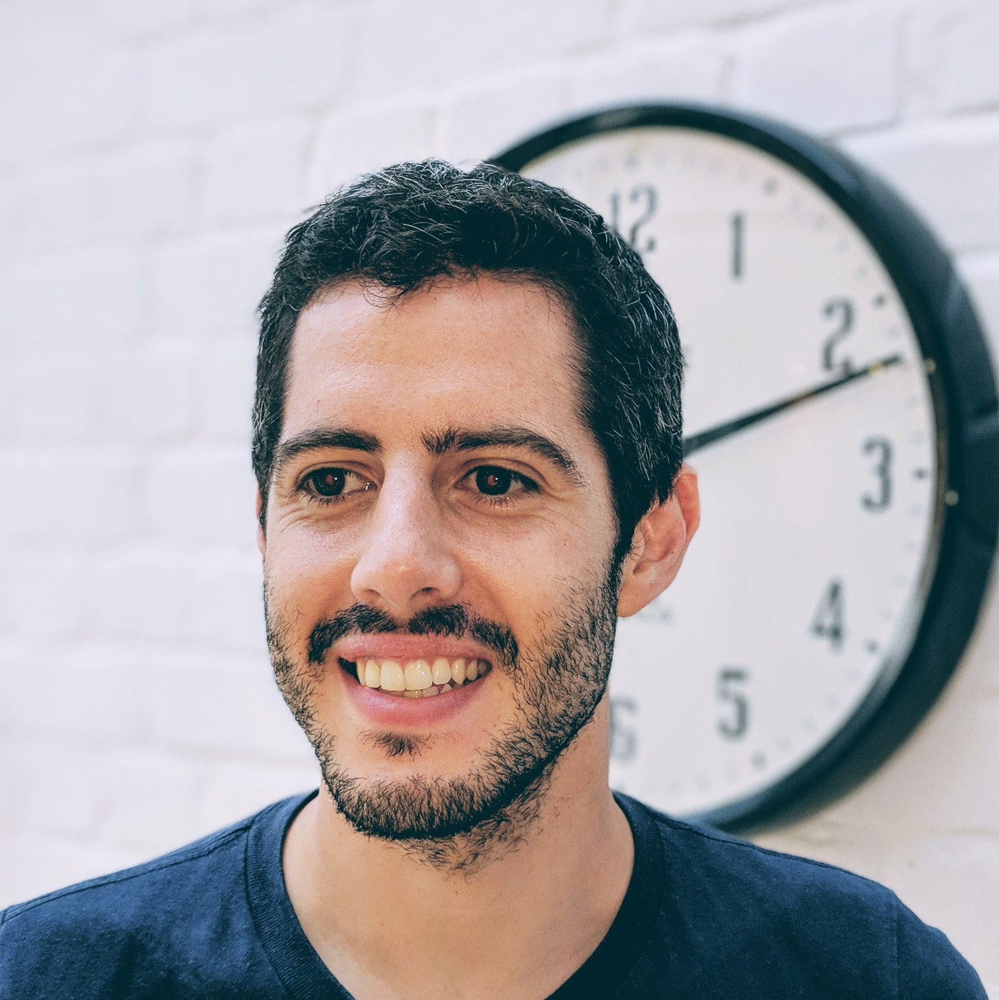

### Bio

Ant Kennedy is currently CTO at Gapsquare where he is currently focusing on
growing the engineering team, establishing best practice in the processes being
used, the future architecture and growing Gapsquare's AI/ML capabilities.
Previously he has worked at JustEat, Adarga and Boeing focusing (or rather not
focusing) on Full Stack Engineering.

### Twitter

[@antjkennedy](https://twitter.com/@antjkennedy)

### Sessions

#### Tue, May 21 / 12:55pm / Fira Hall 8, Oracle Booth D5

You've deployed your app in k8s, now what?

## Shaun Smith

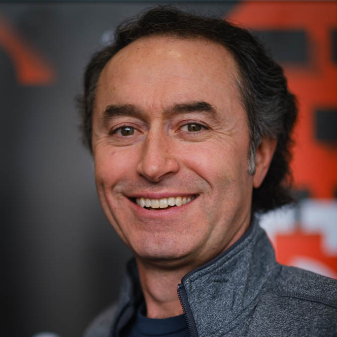

### Twitter

[@shaunMsmith](https://twitter.com/@shaunMsmith)

### Role

Director of Product Management, Oracle

### Bio

Shaun Smith is a Director of Product Management at Oracle responsible for
Serverless technologies including Functions as a Service. He's an experienced
technical product manager, enterprise framework architect, and software
developer active in open source and cloud development. Shaun is a past
committer on a number of Eclipse Foundation projects and is an experienced
speaker who has presented frequently at JavaOne, Devoxx, EclipseCon, JAX, and
many other developer conferences and user groups around the world.

### Sessions

#### Tue, May 21 / 10:25am / Fira Hall 8, Oracle Booth D5

Java Functions??

## Manuel Zach

### Role

Principal Engineer, Oracle

### Bio

Manuel Zach is a Principal DevOps Engineer at Oracle Labs working for the GraalVM project.

### Sessions

#### Thu, May 23 / 12:55pm / Fira Hall 8, Oracle Booth D5

Java sidecars, ultra-lightweight with the help of GraalVM.

## Gregg Altschul

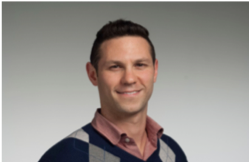

### Role

Co-founder & CTO, autom(8)

### Bio

Gregg is a serial entrepreneur, system architect, fullstack software engineer,
and tech team leader with two decades of experience building and overseeing the
development of software solutions ranging from consumer web products to
mission-critical enterprise systems. As CTO of autom(8), Gregg leads the
development of the world's first decentralized and open Function as a Service
platform. Prior autom(8), Gregg was the Chief Information Officer at Keen Home
where he architected and built a world-class IoT platform. Before joining Keen
Home, Gregg held lead software engineering roles at firms including BlackRock,
FactSet and Amano Cincinnati as well as Co-Founder roles at several startups.

### Twitter

[@greggaltschul](https://twitter.com/@greggaltschul)

### Sessions 

#### Tue, May 21 / 12:35pm / Fira Hall 8, Oracle Booth D5

Open Serverless and the Future of Social Coding

#### Wed, May 22 / 12:55pm / Fira Hall 8, Oracle Booth D5

Open Serverless and the Future of Social Coding

## Will McLeod

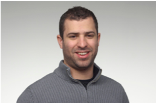

### Role

Co-founder & CPO, autom(8)

### Bio

Will is a serial entrepreneur, Mechanical Engineer/Product Designer and Forbes
"30 Under 30" award recipient with over a decade of experience building and
scaling tech startups.  As CPO of autom(8), Will heads up all product
development, UI/UX, and IP strategy.  At his first startup, SmarterShade, Will
invented and commercialized an affordable technology to make windows tint on
command. As Keen Home's Co-Founder and Chief Product Officer, Will led the
company's hardware and software product development efforts from concept to
deployment at scale in addition to the company's IP and grant strategy.  Will
is a Techstars mentor and has been successful in winning more than a dozen
business plan competitions, federal and local grants, and other fundraising
efforts that have totaled more than $6 million in funding.  Will has studied
computer science, entrepreneurship, and optics to supplement his M.S., B.S. and
B.A. engineering degrees from the University of Notre Dame, where he is
currently an adjunct professor.

### Sessions

#### Wed, May 22 / 13:15pm / Fira Hall 8, Oracle Booth D5

How the Blockchain Democratizes Serverless
