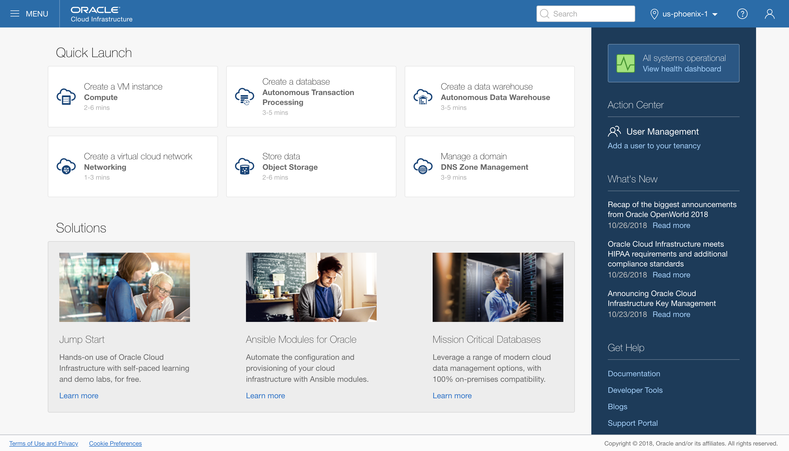
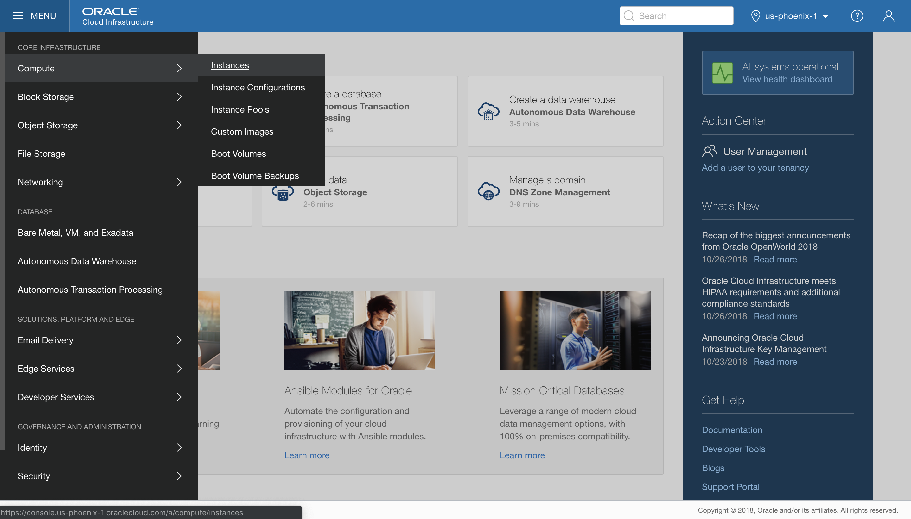
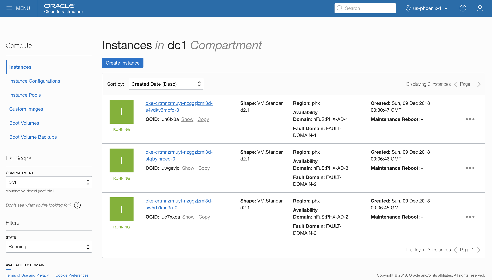
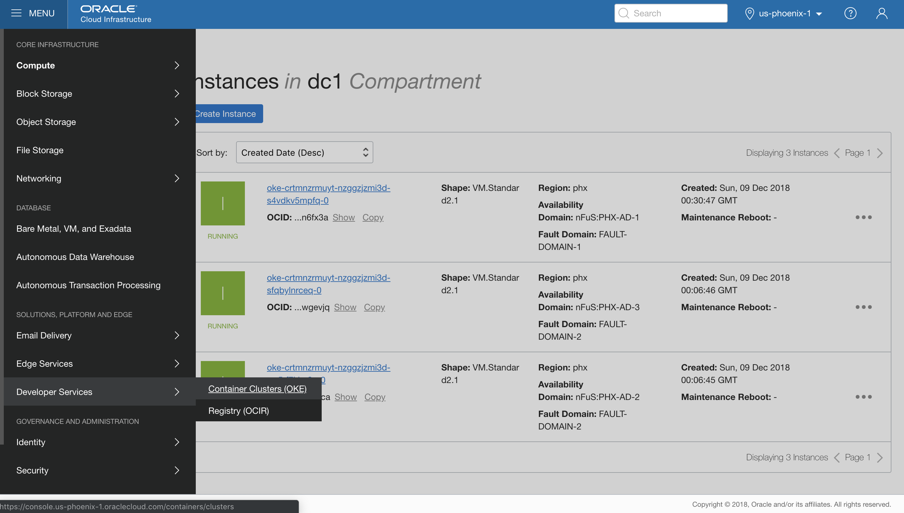
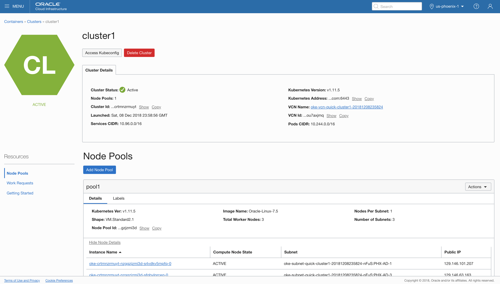
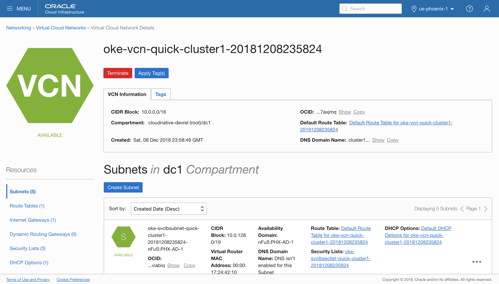

# A Tour of the Oracle Cloud Infrastructure Console #

## Before You Begin ##

This short lab walks you through the steps of logging into Oracle Cloud Infrastructure and navigating the OCI Console.

### Background ###

Welcome to the Oracle University Zip Labs Challenge. Each lab is designed to build your familiarity with the Oracle Cloud Platform using step-by-step instructions. For most of these labs, you'll use real resources within an Oracle Cloud Platform account. You can get your own trial account any time by visiting [cloud.oracle.com/trial](https://cloud.oracle.com/trial), or for this event you can borrow ours.

With access to the Oracle Cloud Platform, you can build production-ready workloads by using a variety of cloud services including Database, Compute, Blockchain, IoT, Big Data, API Management, Integration, Chatbots, and much more!

## Explore Oracle Cloud ##

### Sign in to Oracle Cloud Console ###

Open a new browser tab or window and navigate to the [OCI console login](https://console.us-phoenix-1.oraclecloud.com/). Log into the tenant with the user credentials provided at the event.

Once logged in, you'll land on the OCI Console main page.

From here, there are several tasks, solutions and other relevant items to explore. OCI offers compute, networking and storage features as well as container solutions, database features, and edge services.

You can navigate OCI features by using the menu, located in the top left of the screen. If you open the menu, you'll see the main areas of cloud functionality available in the OCI platform. Mousing into one of these will show more options.

As an example, let's navigate to **Compute Instances**.

Clicking on **Instances** will bring us to the Compute administration menu. From here you can access existing instances and at a glance see their status and relevant information.

Here we see three existing instances, each running in a different Availability Domain within the PHX OCI region.

Availability Domains in OCI are data centers independent from each other, but connected to other ADs within the same region for high availability as well as disaster recovery.

These instances are actually all nodes within the same cluster running in Container Engine for Kubernetes,  or OKE. OKE is a full-featured managed Kubernetes service offered by OCI.

Let's go take a look at the OKE administration menu. You'll find it under **Developer Services** in the menu.

Here we see a list of clusters, as well as an option to create a new cluster. Let's click on the name of the cluster, which will bring us to an information page with cluster status, Kubernetes version and other cluster information.

Note: the cluster you see has been pre-allocated for use with theses labs. Please don't delete it, as it will take a few minutes to reallocate it later. Rest assured, that red delete button works :)

Note the list of compute instances is shown in the list under **Node Pools**, and that the instance names are links. These links will lead back to the **Compute Instances** screen. Many objects in OCI are linked this way for convenience.

Using this feature of the console, let's navigate directly to details about our cluster's Virtual Cloud Network by clicking on the **VCN Name** in the **Cluster Details** section.

This brings us right to the **Virtual Cloud Network Details** page for the cluster's VCN. Here we see information about the VCN as well as the list of Subnets contained within it.

As you can see in the navigation menu, there are many more features to explore. Please feel free to click around and familiarize yourself before heading off to the next lab!
