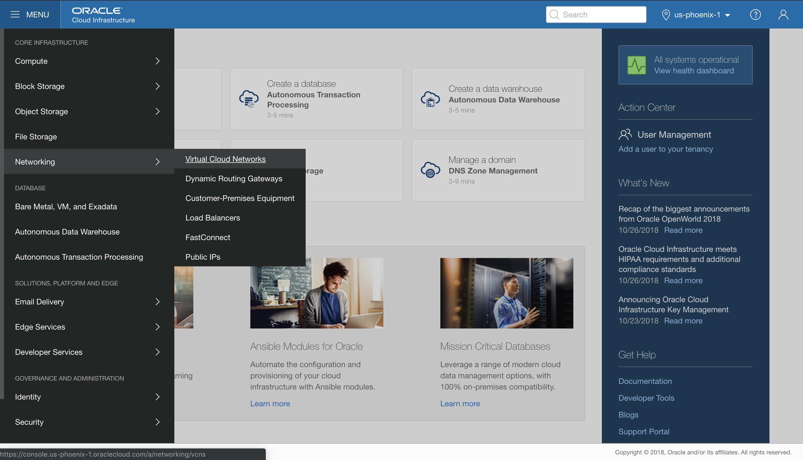
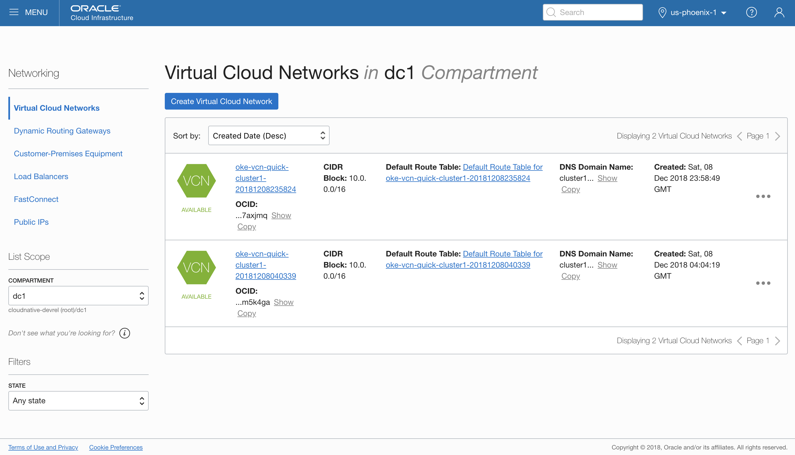
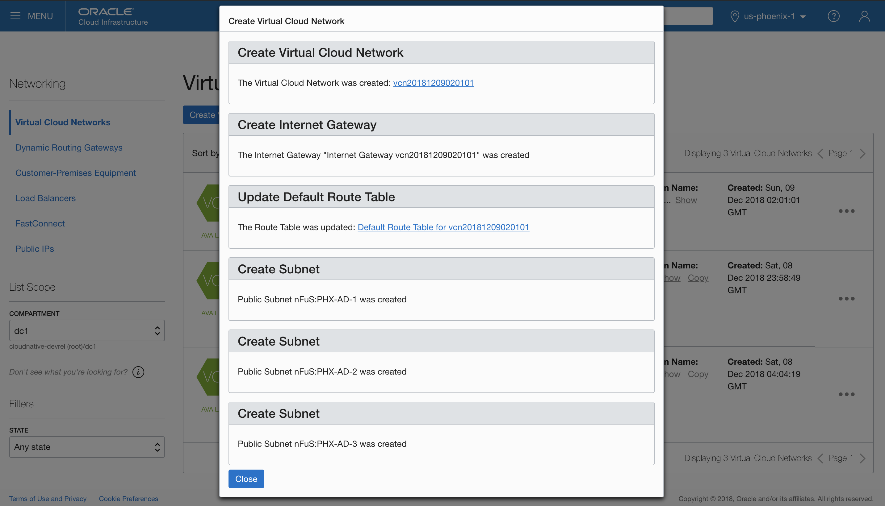
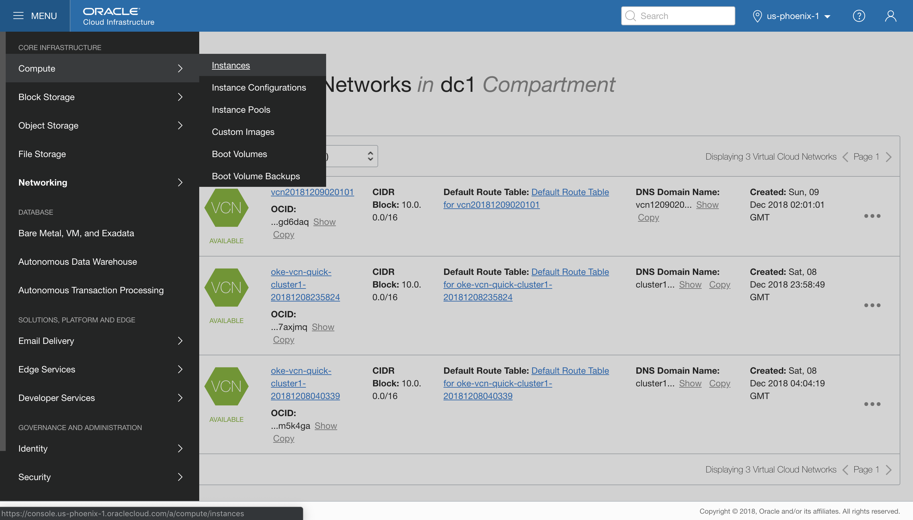
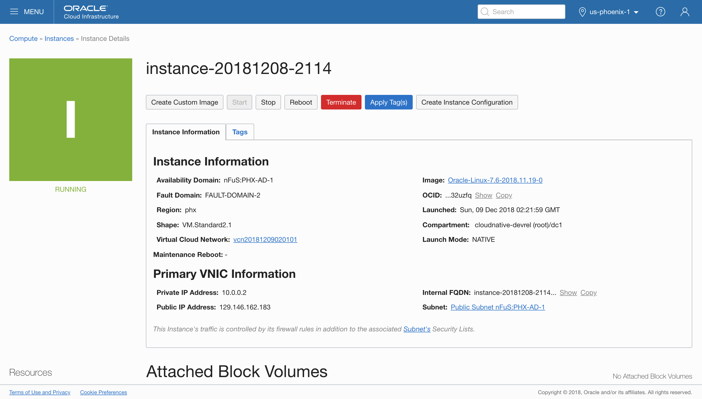

# Launch a Compute Instance Using OCI Compute Service #

## Before You Begin ##

This short lab shows you how to create a Compute Instance using Oracle Cloud Infrastructure (OCI) Compute Service.

### Background ###

Oracle Cloud Infrastructure Compute Service lets you create Virtual Machine instances on which you can run your mission-critical applications with high availability.

Compute Instances are attached to specific Virtual Cloud Networks. As you may have seen in other labs, we already have a VCN deployed in the lab environment. For the purposes of this tutorial, let's create another one.

In the VCN, you launch an instance into a subnet. A subnet is a subdivision of your VCN that you define in a single Availability Domain. The subnet directs traffic according to a route table. In this tutorial, you'll access the instance over the internet using its public IP address, so your route table will direct traffic to an Internet Gateway. The subnet also uses a security list to control traffic in and out of the instance.

## Create a Virtual Cloud Network ##

Open a new browser tab or window and navigate to the [OCI console login](https://console.us-phoenix-1.oraclecloud.com/). Log into the tenant with the user credentials provided at the event.

Once logged in, you'll land on the OCI Console main page. Navigate to the **Virtual Cloud Networks** administration page under **Networking**.

Select the demo compartment from the Compartment dropdown menu. It will be the only compartment visible in the lab environment other than root.

Click the button **Create Virtual Cloud Network**.

In the Create Virtual Cloud Network dialog box, enter the following information:

* **Create in Compartment**: Select the demo compartment
* **Name**: Leave this blank and allow the platform to set a random name for you
* Select **Create Virtual Cloud Network Plus Related Resources**
* Check the **Use DNS Host Names in this VCN** box
* Scroll down and ensure the box to **View detail page after this resource is created** should be checked.

Click the **Create Virtual Cloud Network** button. Once the VCN is created, a confirmation page with details is displayed.

Click **Close** and you'll see the new VCN on the list. It will have an autogenerated name, likely <samp>vcn</samp> plus a timestamp.

## Launch a Compute Instance ##

Now let's navigate over to the **Compute Instances** page.
    

We will be ssh'ing into our new instance once it's deployed. Before we create it, let's copy our lab environment user's ssh key. We'll use it in a moment to paste into the instance creation form.

You can copy the key by cat'ing it out in a terminal and copying it. Open a terminal and copy the output of <samp>cat ~/.ssh/id_rsa.pub</samp>. If you're not familiar with this, don't worry. Just copy the long string and carry on.

Ensure the demo compartment is selected in the Compartment dropdown menu and click the **Create Instance** button.

In the Create Instance dialog box, enter the following information:

* **Name your instance**: Keep the autogenerated name
* **Availability Domain**: Keep the default
* **Choose an Operating System**: You can use the default Oracle Linux image, or **Change Image Source**
* **Choose Instance Type**: Use **Virtual Machine** for this demonstration
* **Instance Shape**: The lab environment will only have one shape, so leave that selected
* **Boot Volume**: Keep the default values, leaving boxes unchecked
* **SSH Key**: Select `Paste SSH Keys` and paste the lab user's SSH key from above
* **VCN Compartment**: Ensure the demo compartment is selected
* **VCN**: Use the VCN you created above
* **Subnet Compartment**: Ensure the demo compartment is selected
* **Subnet**: Keep the default

Click the **Create** button to Launch the instance.

Note while the instance is being created, its state is displayed as `PROVISIONING`. The status changes to `RUNNING` when the instance is fully operational.

## SSH to the Newly Launched Instance ##

Once the instance is running, you can ssh to it if you like.  On the instance details page, the **Public IP Address** can be found under the **Primary VNIC Information** section.

Open a terminal and ssh to the Public IP address of the new instance.

Once you're done investigating, feel free to tear down the instance by clicking the red **Terminate** button.

## Want to Learn More? ##
* [Oracle Cloud Infrastructure Training](https://education.oracle.com/learn/iaas/pPillar_640) from Oracle University 
* [Oracle Cloud Infrastructure 2018 Architect Associate Certification](https://education.oracle.com/es/oracle-cloud-infrastructure-2018-architect-associate/pexam_1Z0-932) from Oracle University