# Demo Lab Setup #

## Before You Begin ##

### Background ###

For the event today, we have pre-provisioned resources to save time and effort, so we can get right to talking about features. There are just a few things remaining which are unique to your demo lab environment. This short lab walks you through getting your environment finalized.

### First Things First ###

Get a demo lab environment assigned to you. If you need help, please see any of our team members at the event!

## Configure Demo Lab Environment ##

### Provision your Demo Lab Instance ###

Your lab environment may or may not have a demo lab instance already allocated. If you need to create your instance, we'll do that here.

First, log in to the [OCI Console](https://console.us-phoenix-1.oraclecloud.com) with the demo user credentials. The demo user name is `demoN` where 'N' is the number you have. The password is `Password123!`.

Log in to OCI console, and head to compute instances.

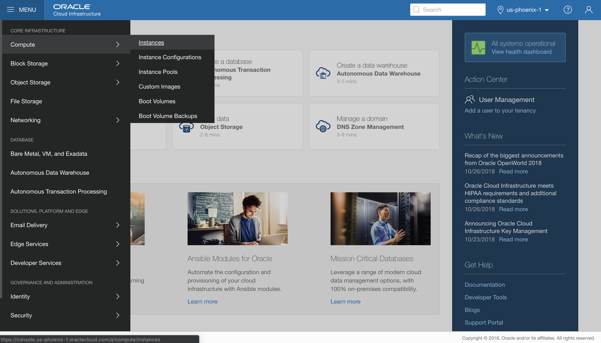

Click on `Create Instance`, choose a name for your instance (e.g. `demo-N`) and click the `Change Image Source` button.

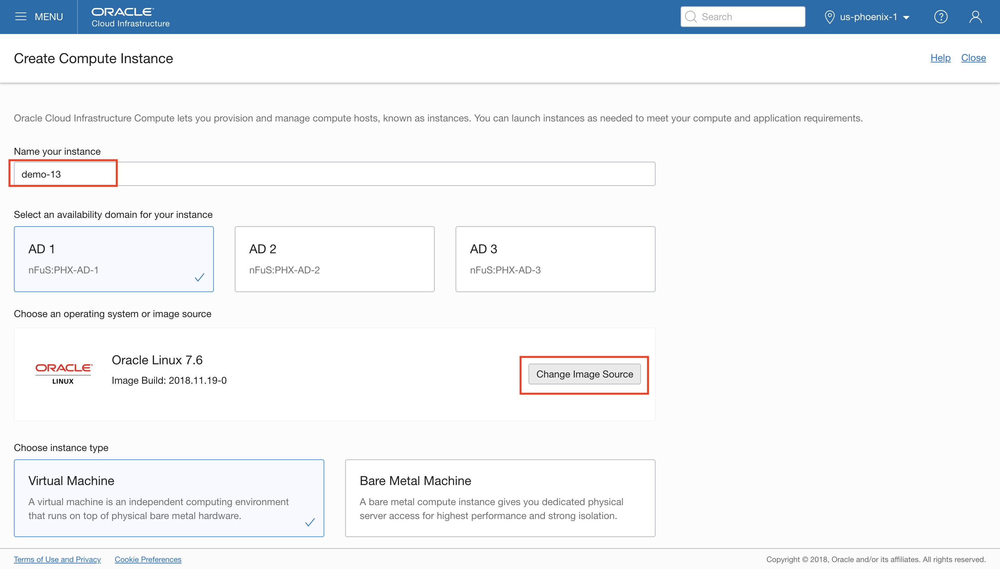

Select the root compartment, and check the box next to the custom image and click the `Select Image` button.

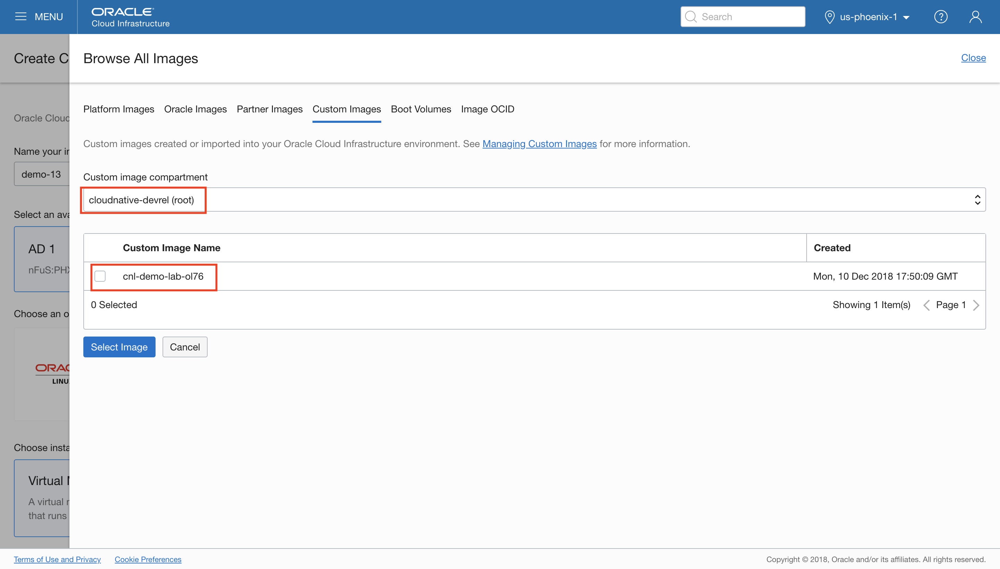

Scroll to the bottom of the main launch page, and click the `Create` button.

This will bring you to the instance details page, and the status of the instance will update. Also, the public IP address will appear here once ready.

### Connect to your Demo Lab Instance ###

To get started configuring our environment, let's log into the demo lab instance.

Once your demo lab instance is provisioned and you see the public IP address in the details page, we're ready to go.

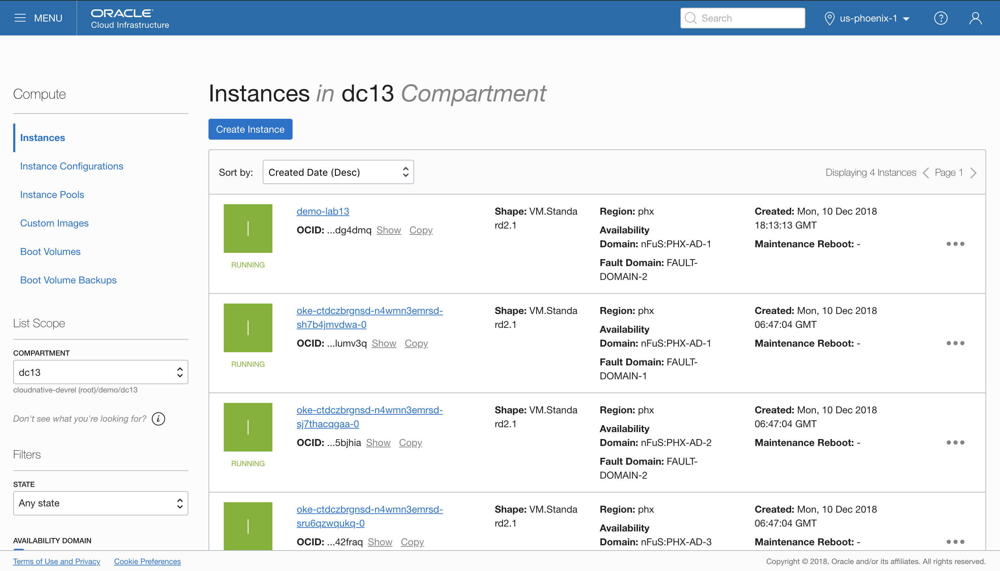

You will need to grab the demo user public key to get started. You can grab it [here](https://objectstorage.us-ashburn-1.oraclecloud.com/n/cloudnative-devrel/b/demo/o/demo_key), save it somewhere specific.

Now, log into tenancy via:  ssh -i <`path-to-demo_key`> opc@<`public IP address>

### OCI CLI Setup ###

In the console, open up the **User Details** page and copy your demo user's OCID.

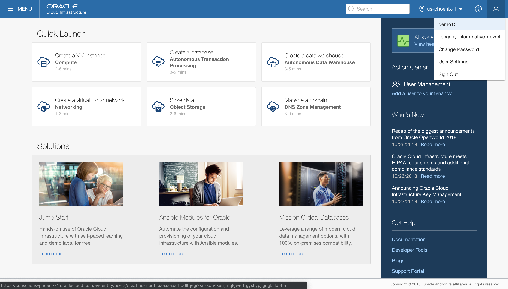
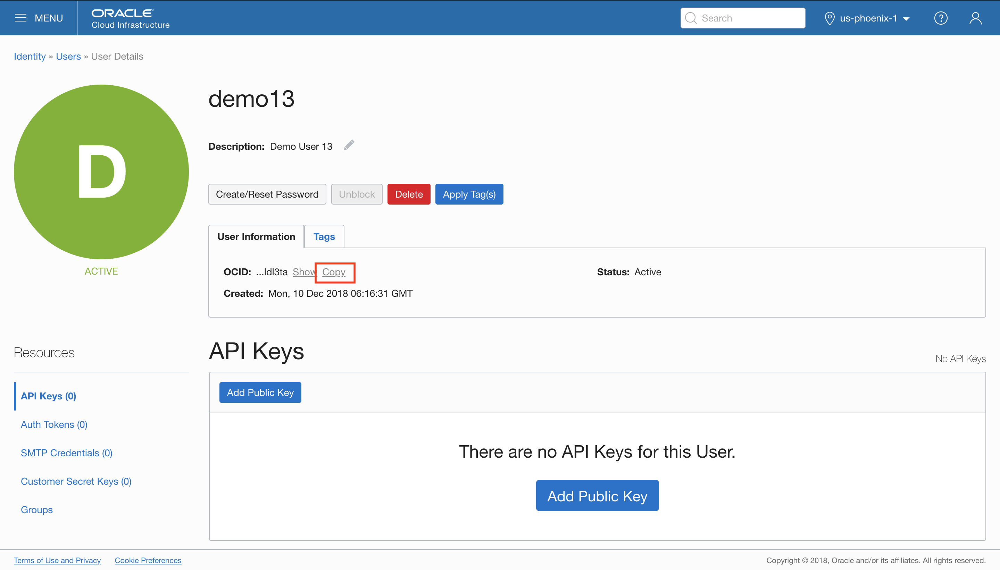

Now navigate to the **Tenancy Details** page and copy the tenancy OCID.

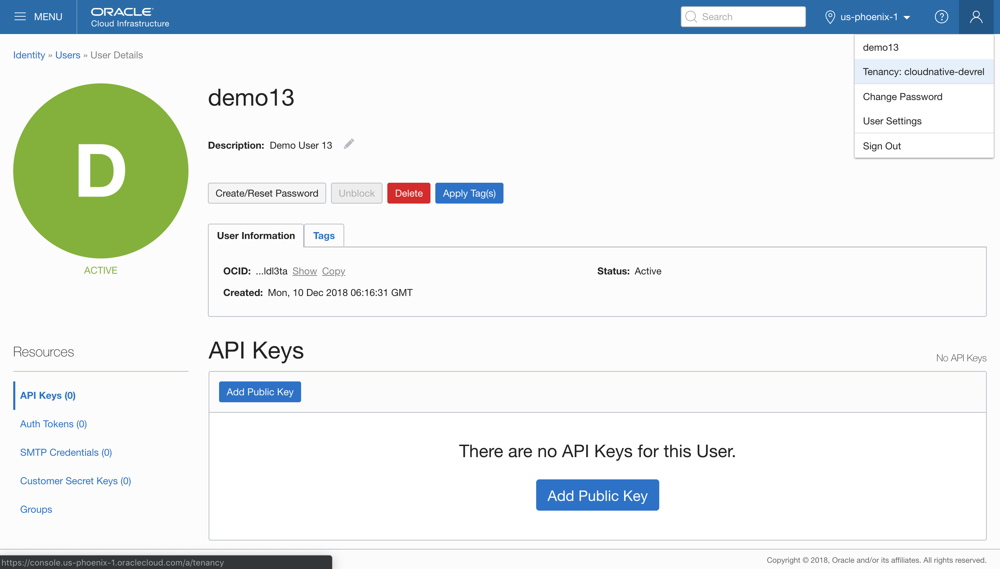
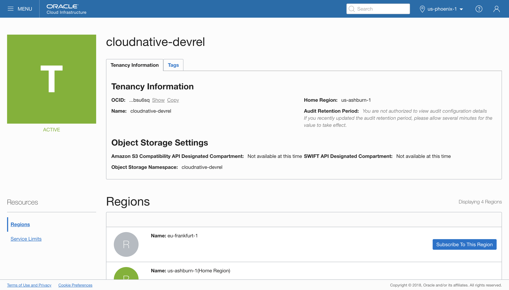

With that data in hand, we can fire off the OCI CLI setup wizard in our compute instance.
Take the defaults, and do opt to create a key.

```
[opc@demo13 ~]$ oci setup config
    This command provides a walkthrough of creating a valid CLI config file.

    The following links explain where to find the information required by this
    script:

    User OCID and Tenancy OCID:

        https://docs.us-phoenix-1.oraclecloud.com/Content/API/Concepts/apisigningkey.htm#Other

    Region:

        https://docs.us-phoenix-1.oraclecloud.com/Content/General/Concepts/regions.htm

    General config documentation:

        https://docs.us-phoenix-1.oraclecloud.com/Content/API/Concepts/sdkconfig.htm


Enter a location for your config [/home/opc/.oci/config]:
Enter a user OCID: ocid1.user.oc1..aaaaaaaa5zpl2rvbeixsyho2gmtpbctf7efl2qlgeur676qhyrp7zt54nytq
Enter a tenancy OCID: ocid1.tenancy.oc1..aaaaaaaaud4g4e5ovjawn5cij7kec3bsl2lstk45znprd7uxtyqom5bsu6sq
Enter a region (e.g. eu-frankfurt-1, uk-london-1, us-ashburn-1, us-phoenix-1): us-phoenix-1
Do you want to generate a new RSA key pair? (If you decline you will be asked to supply the path to an existing key.) [Y/n]: Y
Enter a directory for your keys to be created [/home/opc/.oci]:
Enter a name for your key [oci_api_key]:
Public key written to: /home/opc/.oci/oci_api_key_public.pem
Enter a passphrase for your private key (empty for no passphrase):
Private key written to: /home/opc/.oci/oci_api_key.pem
Fingerprint: 21:ae:bd:d1:a3:88:5a:a9:ff:6c:f5:50:c5:2a:0f:b6
Config written to /home/opc/.oci/config
```

Now head back to the **User Detail** page one more time, and click the `Add Public Key`. 

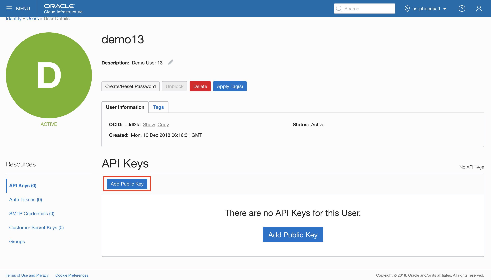

Paste the contents of the PEM public key in the dialog box and click add.

The key's fingerprint is displayed (for example, 12:34:56:78:90:ab:cd:ef:12:34:56:78:90:ab:cd:ef).

And we're all set. Let's test things by listing the instances in your demo compartment.

You can grab your demo compartment OCID by navigating over to the compartments, clicking into the demo compartment (compartments can nest, demo is the parent of all of lab environments) and then find your lab environment compartment. It'll be called something like dc13.

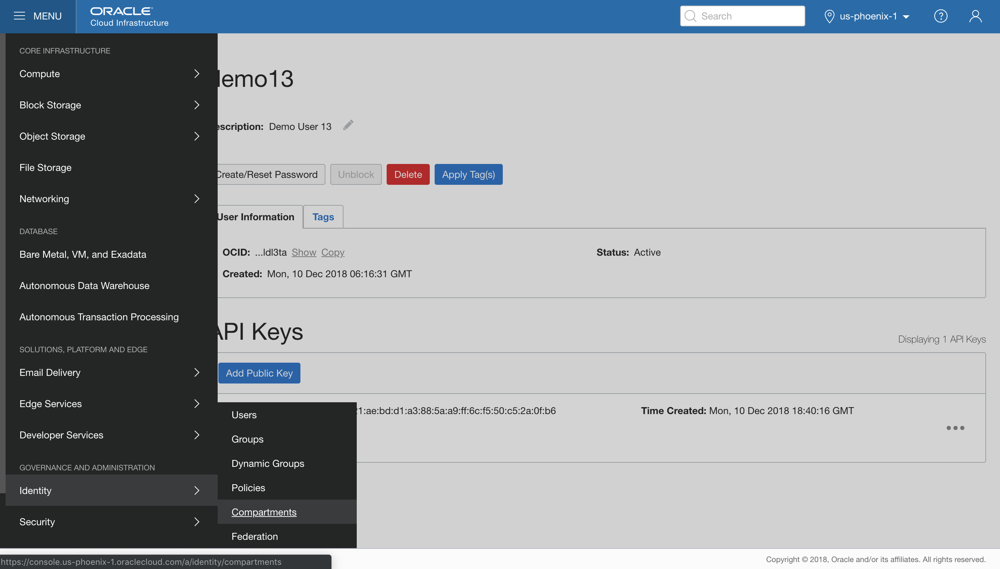

Copy its ocid, and then give the OCI CLI for a spin.

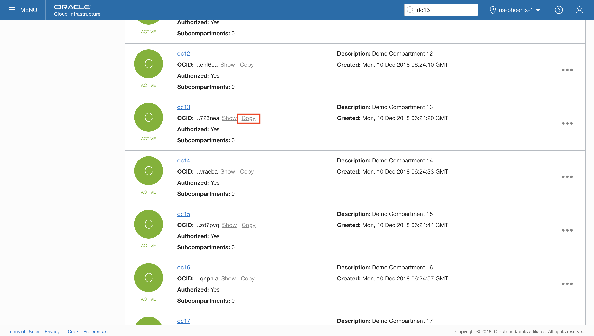

We'll make this simpler below, but let's test quickly.

```
[opc@demo-test ~]$ oci compute instance list --compartment-id=ocid1.compartment.oc1..aaaaaaaate3n7stcvy3jugktgirx2hmau7ufl7p6kl7mn2qg77xnq3723nea
{
  "data": [
    {
      "availability-domain": "nFuS:PHX-AD-1",
      "compartment-id": "ocid1.compartment.oc1..aaaaaaaate3n7stcvy3jugktgirx2hmau7ufl7p6kl7mn2qg77xnq3723nea",
      "defined-tags": {},
    ...
```

One more nice feature of the OCI CLI is that you can set up a runtime config file that will fill in things like your compartment id or object store bucket name, so you don't need to specify the same things every time. 

```
[opc@demo-test ~]$ oci setup oci-cli-rc
Predefined queries written under section OCI_CLI_CANNED_QUERIES
Command aliases written under section OCI_CLI_COMMAND_ALIASES
Parameter aliases written under section OCI_CLI_PARAM_ALIASES
```

That will create by default a file named ~/.oci/oci_cli_rc. Edit that file and add these two lines:

```
[DEFAULT]
compartment-id = <your demo compartment's ocid>
```
Now, we don't need to specify the compartment ocid with the CLI. You can set a number of other defaults this way, as well.

### Configure Kubernetes CLI ###

Let's do one more thing before we wrap up. We can use the OCI CLI to set up our kubectl configuration. 

First, navigate over to the demo cluster that's already deployed in your demo lab environment. We preallocate clusters in order to save a few minutes later, so don't hit the read delete button...

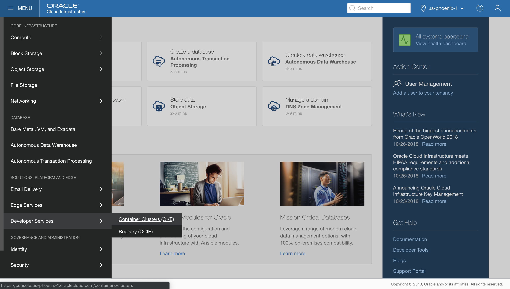

Click the cluster name to access its details, and copy its ocid.


Now fire off this one-liner to pull the kubeconfig and drop it into our local config.

```
[opc@demo-test ~]$ oci ce cluster create-kubeconfig --cluster-id=ocid1.cluster.oc1.phx.aaaaaaaaafsgkylemvrtqmjugjqtqnrqmu2wmnrwgvqtmn3ghctdczbrgnsd --file=/home/opc/.kube/config
```

Give it a spin to verify that you can get to your demo cluster.

```
[opc@demo-test ~]$ kubectl get nodes
NAME              STATUS    ROLES     AGE       VERSION
129.146.109.52    Ready     node      12h       v1.11.5
129.146.133.207   Ready     node      12h       v1.11.5
129.146.7.236     Ready     node      12h       v1.11.5
[opc@demo-test ~]$
```

All set!