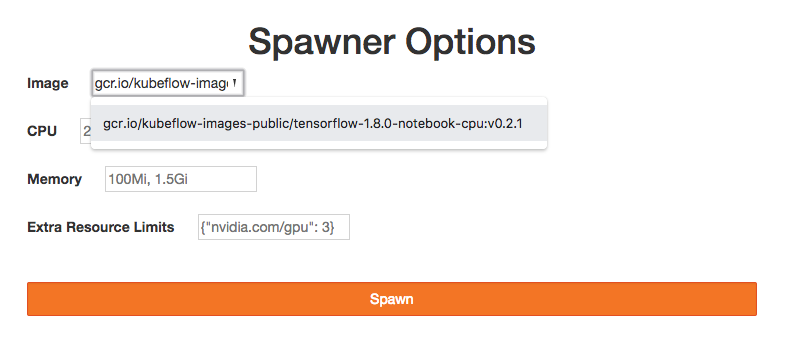
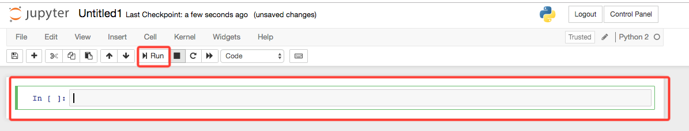
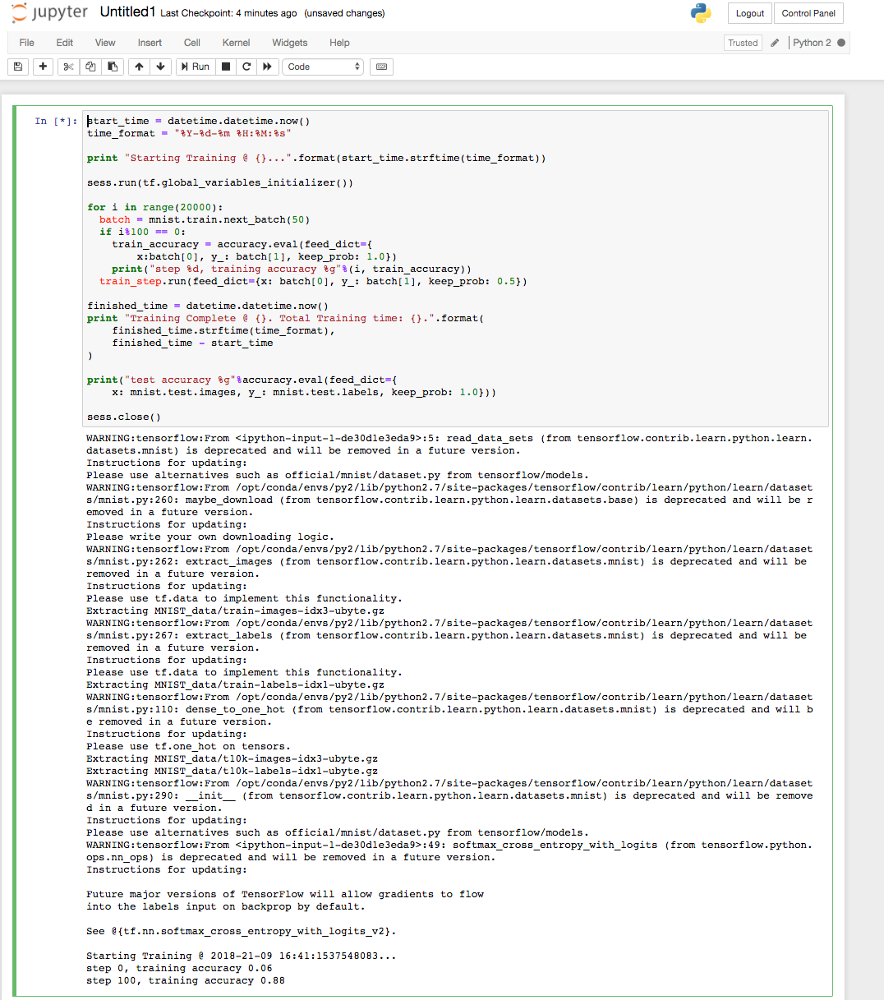

# A Kubeflow Quickstart

As discussed in the [Overview](Readme.md) the goal of this quickstart is to take an existing OKE cluster, configure and install Kubeflow on it, launch a Jupyter notebook via Kubeflow, and run a demo TensorFlow project that will train a very simple model based on the MNSIT image dataset.

You can find the prerequisites for this quickstart in the Overview as mentioned above. 

## Step One: Installing Kubeflow

Starting from your development environment with the conditions in the above section met, let's get straight into installing Kubeflow!

```
export KUBEFLOW_VERSION=0.2.2
wget https://raw.githubusercontent.com/kubeflow/kubeflow/v${KUBEFLOW_VERSION}/scripts/deploy.sh
chmod +x deploy.sh
./deploy.sh
```

This will download the Kubeflow quickstart deploy script to your development machine and begin running it. The script will create a ksonnet project and begin running it. 

The ksonnet project will likely break during running due to OKE clusters using RBAC authorization. Fret not, the fix is simply to create a cluster role binding for the Kubernetes user that ksonnet is using. This can be seen from the error message and will look something like:

```
ocid1.user.oc1..aaaaaaaajxscsvyafzdtj3zsgylm4b2rzl6nfg2fkxbvkuizadyzjo4lghla
```

The cluster role binding can be created via the following command:

```
kubectl create clusterrolebinding default-admin --clusterrole=cluster-admin --user=<USER FROM ERROR MESSAGE>
```

Next, delete the directory `kubeflow_ks_app` then re-run the deploy script with `./deploy.sh` this will likely take several minutes to complete, but once it has you can check that everything came up properly via `kubectl get pods` this should result in something like:

```
NAME                       DESIRED   CURRENT   UP-TO-DATE   AVAILABLE   AGE
ambassador                 3         3         3            3           1m
centraldashboard           1         1         1            1           1m
spartakus-volunteer        1         1         1            1           1m
tf-job-dashboard           1         1         1            1           1m
tf-job-operator-v1alpha2   1         1         1            1           1m
```


## Step Two: Fire up a Jupyter Notebook

Jupyter is an open-source service that allows you to (among other things) write code in a notepad-like format in your browser. It's incredibly useful for hacking and executing scripts together, and is generally the industry standard for ML and Data Science projects.

Kubeflow includes the capability to launch a Jupyter notepad directly on your Kubernetes cluster.

To keep things simple, you can create a proxy from your development machine to the Kubeflow Hub, which will allow you to access Jupyter as if it were on your computer.

```
PODNAME=`kubectl get pods --selector="app=tf-hub" --output=template --template="{{with index .items 0}}{{.metadata.name}}{{end}}"`
kubectl port-forward  $PODNAME 8000:8000
```

You should then be able to hit `http://127.0.0.1:8000` in your browser, and log in with any credentials. I use username/password "test".

### Spawn a New Jupyter Notebook Instance

Next, you need to launch a new Jupyter notebook instance with TensorFlow available to it. This is a simple process of selecting a TensorFlow/Jupyter notebook image from the "Image" dropdown. I used version 1.8.0, geared for CPUs. You may want to use the GPU version if your underlying hardware supports it.



The process of launching the new instance can take some time as a new Kubernetes pod is being launched in the background. This will vary depending on your underlying hardware, but approximately 10-30 minutes is normal. 

You don't need to do anything but wait. However, if interested you can use `kubectl get events -w` from your development machine to see the status of the provisioning. Running this command can also give you the pod name that can, in turn, be used with `kubectl logs <pod name>` which will give you a more in-depth view of what the new pod is actually doing. These two commands will be invaluable for debugging any issues during launch.

### Create Your Notebook!

Once the Jupyter notebook application instance has started, you will see a webpage that has a file browser. This is where you will need to create your notebook, which can be done by selecting the "new" dropdown, and selecting Python 7.


Once launched, the most important things to pay attention to inside your notebook are:

1. The notebook code areas. This is where you write/paste the Python code you want to run. You can have one or many blocks of code.
2. The "Run" button. This will execute the selected code area. Any output generated will be displayed directly beneath the code area.



## Step Three: Demo Script

The demo TensorFlow script we'll run is adapted from the [TensorFlow MNIST tutorial](https://www.tensorflow.org/versions/r1.1/get_started/mnist/pros). This script is a deep convolutional MNIST classifier that will run 20,000 training iterations. Its intention is to benchmark different OKE instance shapes running a ML workload.

Running it is a simple case of pasting it into a Jupyter notebook code area:

```
from tensorflow.examples.tutorials.mnist import input_data
import tensorflow as tf
import datetime

mnist = input_data.read_data_sets("MNIST_data/", one_hot=True)

def weight_variable(shape):
  initial = tf.truncated_normal(shape, stddev=0.1)
  return tf.Variable(initial)

def bias_variable(shape):
  initial = tf.constant(0.1, shape=shape)
  return tf.Variable(initial)

def conv2d(x, W):
  return tf.nn.conv2d(x, W, strides=[1, 1, 1, 1], padding='SAME')

def max_pool_2x2(x):
  return tf.nn.max_pool(x, ksize=[1, 2, 2, 1],
                        strides=[1, 2, 2, 1], padding='SAME')
x = tf.placeholder(tf.float32, shape=[None, 784])
y_ = tf.placeholder(tf.float32, shape=[None, 10])
W_conv1 = weight_variable([5, 5, 1, 32])
b_conv1 = bias_variable([32])
x_image = tf.reshape(x, [-1,28,28,1])
h_conv1 = tf.nn.relu(conv2d(x_image, W_conv1) + b_conv1)
h_pool1 = max_pool_2x2(h_conv1)
W_conv2 = weight_variable([5, 5, 32, 64])
b_conv2 = bias_variable([64])

h_conv2 = tf.nn.relu(conv2d(h_pool1, W_conv2) + b_conv2)
h_pool2 = max_pool_2x2(h_conv2)
W_fc1 = weight_variable([7 * 7 * 64, 1024])
b_fc1 = bias_variable([1024])

h_pool2_flat = tf.reshape(h_pool2, [-1, 7*7*64])
h_fc1 = tf.nn.relu(tf.matmul(h_pool2_flat, W_fc1) + b_fc1)
keep_prob = tf.placeholder(tf.float32)
h_fc1_drop = tf.nn.dropout(h_fc1, keep_prob)
W_fc2 = weight_variable([1024, 10])
b_fc2 = bias_variable([10])

y_conv = tf.matmul(h_fc1_drop, W_fc2) + b_fc2

sess = tf.InteractiveSession()
tf.global_variables_initializer().run()

cross_entropy = tf.reduce_mean(
    tf.nn.softmax_cross_entropy_with_logits(labels=y_, logits=y_conv))
train_step = tf.train.AdamOptimizer(1e-4).minimize(cross_entropy)
correct_prediction = tf.equal(tf.argmax(y_conv,1), tf.argmax(y_,1))
accuracy = tf.reduce_mean(tf.cast(correct_prediction, tf.float32))

start_time = datetime.datetime.now()
time_format = "%Y-%d-%m %H:%M:%s"

print "Starting Training @ {}...".format(start_time.strftime(time_format))

sess.run(tf.global_variables_initializer())

for i in range(20000):
  batch = mnist.train.next_batch(50)
  if i%100 == 0:
    train_accuracy = accuracy.eval(feed_dict={
        x:batch[0], y_: batch[1], keep_prob: 1.0})
    print("step %d, training accuracy %g"%(i, train_accuracy))
  train_step.run(feed_dict={x: batch[0], y_: batch[1], keep_prob: 0.5})

finished_time = datetime.datetime.now()
print "Training Complete @ {}. Total Training time: {}.".format(
    finished_time.strftime(time_format),
    finished_time - start_time
)

print("test accuracy %g"%accuracy.eval(feed_dict={
    x: mnist.test.images, y_: mnist.test.labels, keep_prob: 1.0}))

sess.close()
```

The training can take some time to complete, depending on the OKE node pool instances used, but expect an output like the following:

```
Extracting MNIST_data/train-images-idx3-ubyte.gz
Extracting MNIST_data/train-labels-idx1-ubyte.gz
Extracting MNIST_data/t10k-images-idx3-ubyte.gz
Extracting MNIST_data/t10k-labels-idx1-ubyte.gz
Starting Training @ 2018-30-07 15:03:1532963001...
step 0, training accuracy 0.18
step 100, training accuracy 0.8
step 200, training accuracy 0.84
step 300, training accuracy 0.92
step 400, training accuracy 0.9
step 500, training accuracy 0.9
step 600, training accuracy 0.9
step 700, training accuracy 0.96
step 800, training accuracy 0.9
...
step 18500, training accuracy 1
step 18600, training accuracy 1
step 18700, training accuracy 1
step 18800, training accuracy 1
step 18900, training accuracy 1
step 19000, training accuracy 1
step 19100, training accuracy 1
step 19200, training accuracy 1
step 19300, training accuracy 1
step 19400, training accuracy 1
step 19500, training accuracy 1
step 19600, training accuracy 1
step 19700, training accuracy 1
step 19800, training accuracy 1
step 19900, training accuracy 1
Training Complete @ 2018-30-07 15:40:1532965241. Total Training time: 0:37:19.952672.
test accuracy 0.9926
```


## Clean Up

To remove everything from your cluster that we've configured in this quickstart, simply run the following from the directory in which you ran the code in step one:

1. `cd kubeflow_ks_app` - the directory created by the deploy.sh script. This contains the ksonnet package that created your Kubeflow environment.
2. `ks delete default` - deletes everything that was configured by ksonnet!

The second command should give you an output similar to:

```
INFO Deleting deployments default.tf-job-dashboard
INFO Deleting deployments default.centraldashboard
INFO Deleting deployments default.spartakus-volunteer
INFO Deleting statefulsets default.tf-hub
INFO Deleting deployments default.ambassador
INFO Deleting deployments default.tf-job-operator-v1alpha2
INFO Deleting configmaps default.jupyterhub-config
INFO Deleting configmaps default.tf-job-operator-config
INFO Deleting serviceaccounts default.tf-job-operator
INFO Deleting clusterroles tf-job-operator
INFO Deleting clusterrolebindings tf-job-operator
INFO Deleting clusterroles tf-job-dashboard
INFO Deleting clusterrolebindings tf-job-dashboard
INFO Deleting services default.tf-job-dashboard
INFO Deleting serviceaccounts default.tf-job-dashboard
INFO Deleting rolebindings default.jupyter-role
INFO Deleting customresourcedefinitions tfjobs.kubeflow.org
INFO Deleting serviceaccounts default.jupyter-hub
INFO Deleting services default.ambassador
INFO Deleting services default.ambassador-admin
INFO Deleting roles default.ambassador
INFO Deleting serviceaccounts default.ambassador
INFO Deleting rolebindings default.ambassador
INFO Deleting roles default.jupyter-role
INFO Deleting services default.k8s-dashboard
INFO Deleting clusterroles spartakus
INFO Deleting clusterrolebindings spartakus
INFO Deleting serviceaccounts default.spartakus
INFO Deleting services default.tf-hub-lb
INFO Deleting services default.tf-hub-0
INFO Deleting services default.centraldashboard
INFO Deleting serviceaccounts default.centraldashboard
INFO Deleting clusterroles default.centraldashboard
INFO Deleting clusterrolebindings default.centraldashboard
INFO Deleting configmaps default.kubeflow-version
```

Gone!

## Conclusion

At this point (assuming you didn't also run the clean up section!) you should have a platform for Machine Learning on Kubernetes using TensorFlow with a script that can benchmark different node pool instance shapes against a common workload. 