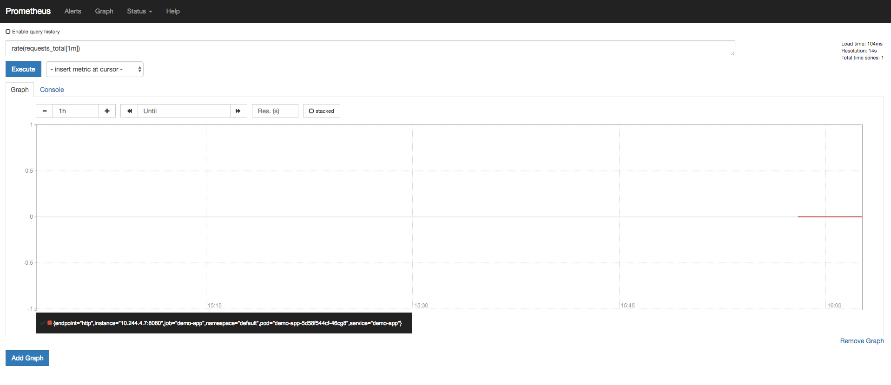
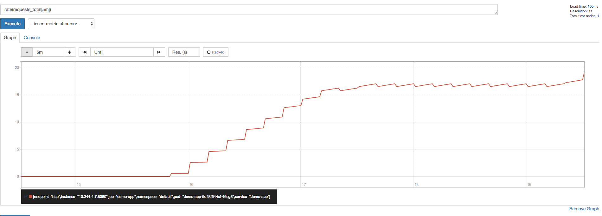

# Prometheus: How to Monitor Your Applications

So, you have followed the [Prometheus 101 Tutorial](https://gitlab-odx.oracledx.com/cloudnative/devcenter/tree/master/content/prometheus), your OCI Kubernetes cluster is running Prometheus, with the operator installed, and even has Grafana configured. What now?

Well, now that you have your monitoring infrastructure in place, it's time to utilize it to actually get some visibility into your applications!

In this post, we will:

- Use an existing OKE Kubernetes cluster with Helm's Tiller, Prometheus, and Grafana installed 
- Modify a Go demo application to send metrics to Prometheus
- Deploy that application to our cluster
- Create a pretty Grafana dashboard to view the metrics in Prometheus

## Requirements

As above, you'll need an OKE cluster configured (watch those network rules!) with Prometheus. If you don't already have this, I recommend following the comprehensive [OKE quick start documentation](https://www.oracle.com/webfolder/technetwork/tutorials/obe/oci/oke-full/index.html) to launch an OKE cluster, followed by the [first part of this tutorial series](https://gitlab-odx.oracledx.com/cloudnative/devcenter/tree/master/content/prometheus.html) to get your Prometheus infrastructure in place.

## Application Metrics?

Before we get into the process for deploying an application integrated with Prometheus, let's take a look at what application metrics are, and why we are interested in them.

Let's assume we have a simple HTTP API server application deployed on our cluster. Out of the box with Kubernetes, we get some visibility on how much resource its pod is consuming, and we can quickly access the stdout/stderr logs from the container with `kubectl logs -f <pod name>`. 

If we wanted to access these logs more easily, We could set up an EFK or ELK logging stack to pull those logs in to a central place. We could also configure this logging stack to aggregate some metrics around those log files, e.g. "Requests per minute."

We might also want to find out just how much resource the pod's underlying node is using, which we could do with Prometheus.

But what if we want to gather metrics _inside_ our application? How many times have we raised a certain exception? What was the response time of a specific external microservice call? How long is it taking to resolve DNS internally?

Sure, we could answer some of these questions by adding some kind of [Service Mesh](https://istio.io/docs/concepts/what-is-istio/) between our microservices, but to achieve this without adding extra complexity to your infrastructure, and to keep the freedom to decide exactly what information inside your application is useful, we can modify our application to include a metrics endpoint that Prometheus can call.

## Don't Call Us, We'll Call You.

Note that I said Prometheus would call us. Our application will expose a /metrics HTTP endpoint that Prometheus will hit to gather data. This means that we don't need to include information on a Prometheus server to send data to from our application, nor worry about disabling it in environments that aren't using Prometheus. 

The endpoint is there to be consumed by whatever wants to consume it. 

## Lets get GOing
[ಠ_ಠ]

In this tutorial, we're going to take a very simple Go application that serves a message over HTTP, and learn how to expose a metrics endpoint to track the number of times our user-facing endpoint was called, which we'll do by implementing a few Go libraries.

We're using Go for this tutorial, but you don't have to! There are [Prometheus libraries for many languages](https://prometheus.io/docs/instrumenting/clientlibs/) that can be used to achieve application metrics.

Our application looks like:

`main-no-monitor.go`

```
package main

import (
    "fmt"
    "log"
    "net/http"
)

func handler(w http.ResponseWriter, r *http.Request) {
    w.Write([]byte("This service is _so_ micro."))
}

func main() {
    fmt.Printf("HTTP server is running on port 8080!\n")
    http.HandleFunc("/", handler)
    log.Fatal(http.ListenAndServe(":8080", nil))
}

```

When running, it will listen on port 8080 and send the message in handler() on request.

For the sake of simplicity, I've packed this application into a Docker image for you. You can pull it from `iad.ocir.io/oracle-cloudnative/prometheus-app-monitor:no-monitoring`.

If you want to build it yourself and push to your own image registry, the `Dockerfile` is a simple one:

`Dockerfile`

```
FROM golang:latest

COPY main-no-monitor.go main.go
RUN go build main.go
```

You can launch this application image on your Kubernetes cluster with the following Service and Deployment configuration:

`kubernetes.yml`

```
apiVersion: extensions/v1beta1
kind: Deployment
metadata:
  name: demo-app
spec:
  replicas: 1
  selector:
    matchLabels:
      app: demo-app
  template:
    metadata:
      labels:
        app: demo-app
    spec:
      containers:
      - name: demo-app-server
        image: iad.ocir.io/oracle-cloudnative/prometheus-app-monitor:no-monitoring
        imagePullPolicy: Always
        command: ["./main"]
        ports:
        - name: demo-app-server
          containerPort: 8080
          protocol: TCP
---
# Service Definition
apiVersion: v1
kind: Service
metadata:
  name: demo-app
  labels:
    app: demo-app
spec:
  type: NodePort
  ports:
  - port: 8080
    targetPort: 8080
    protocol: TCP
    name: http
    nodePort: 30001
  selector:
    app: demo-app

```

```
> kubectl apply -f kubernetes.yml
```

The service will now be accessible as a NodePort on your cluster - i.e. it's accessible on port `30001` of any of your nodes, which can be found via a handy `kubectl get nodes` command.

```
>  kubectl get nodes
NAME              STATUS   ROLES   AGE   VERSION
192.168.0.1   Ready    node    26d   v1.11.1
192.168.0.2    Ready    node    26d   v1.11.1
192.168.0.3     Ready    node    26d   v1.11.1

>  curl 192.168.0.3:30001
This service is _so_ micro.%
```

Hint: If you can't access the service on port 30001 on your nodes - and you're sure the service is running - check your OCI Security Lists to ensure access to that port is permissive on your OKE nodes.


## Application Metrics! 

At this point, you should have the demo application running on your cluster. However, the application doesn't expose any metrics.

Let's fix that!

First, we need to import the Prometheus Go packages. 

Note: `go get` can be used to pull these dependencies, but if you use the Dockerfile repo I link a little bit further down this post, you won't need to worry about pulling Go dependencies.


```
package main

import (
    "fmt"
    "log"
    "net/http"

    "github.com/prometheus/client_golang/prometheus"
    "github.com/prometheus/client_golang/prometheus/promauto"
    "github.com/prometheus/client_golang/prometheus/promhttp"
)
```

Next, we need to define a custom metrics counter that we'll increment manually when a new web request is handled:

```
var (
    requests = promauto.NewCounter(
        prometheus.CounterOpts{
            Name: "requests_total",
            Help: "Requests to the demo endpoint",
        })
)
```
Like so:

```
func handler(w http.ResponseWriter, r *http.Request) {
    // The following line will increment the Metrics counter!
    requests.Inc()
    w.Write([]byte("This service is _so_ micro."))
}
```

Finally, we expose the /metrics endpoint and point it at the Prometheus HTTP handler:


```
func main() {
    fmt.Printf("HTTP server is running on port 8080!\n")
    http.HandleFunc("/", handler)
    // Like So!
    http.Handle("/metrics", promhttp.Handler())
    log.Fatal(http.ListenAndServe(":8080", nil))
}

```
This should leave your application Go file looking like:

```
package main

import (
    "fmt"
    "log"
    "net/http"

    "github.com/prometheus/client_golang/prometheus"
    "github.com/prometheus/client_golang/prometheus/promauto"
    "github.com/prometheus/client_golang/prometheus/promhttp"
)

var (
    requests = promauto.NewCounter(
        prometheus.CounterOpts{
            Name: "requests_total",
            Help: "Requests to the demo endpoint",
        })
)

func handler(w http.ResponseWriter, r *http.Request) {
    requests.Inc()
    w.Write([]byte("This service is _so_ micro."))
}

func main() {
    fmt.Printf("HTTP server is running on port 8080!\n")
    http.HandleFunc("/", handler)
    http.Handle("/metrics", promhttp.Handler())
    log.Fatal(http.ListenAndServe(":8080", nil))
}
```
### /metrics, You Say?

Before we package up this application in Docker image, let's take a look at the /metrics endpoint. You can do this by running the Go application on your local machine with:

```
>  go run main.go
HTTP server is running on port 8080!
```

The application should still serve the friendly message on the `/` endpoint:

```
>  curl localhost:8080
This service is _so_ micro.%
```

However, we now have a new endpoint to play with:

```
>  curl localhost:8080/metrics
# HELP go_gc_duration_seconds A summary of the GC invocation durations.
# TYPE go_gc_duration_seconds summary
go_gc_duration_seconds{quantile="0"} 0
go_gc_duration_seconds{quantile="0.25"} 0
go_gc_duration_seconds{quantile="0.5"} 0
go_gc_duration_seconds{quantile="0.75"} 0
go_gc_duration_seconds{quantile="1"} 0
go_gc_duration_seconds_sum 0
...
# HELP requests_total Requests to the demo endpoint
# TYPE requests_total counter
requests_total 1
```

This should spit out all sorts of application metrics now exposed on /metrics, along with our manually defined `requests_total` counter, which should be sitting at `1`. 

If we were to re-hit the `/` endpoint, then check the metrics again, it should have incremented!

```
>  curl localhost:8080/
This service is _so_ micro.%       
                                                                                                  
>  curl localhost:8080/metrics | grep requests_total

# HELP promhttp_metric_handler_requests_total Total number of scrapes by HTTP status code.
# TYPE promhttp_metric_handler_requests_total counter
promhttp_metric_handler_requests_total{code="200"} 1
promhttp_metric_handler_requests_total{code="500"} 0
promhttp_metric_handler_requests_total{code="503"} 0
# HELP requests_total Requests to the demo endpoint
# TYPE requests_total counter
requests_total 2
```

### Deploying the metrics-spouting app

Again, I've packaged up this image and pushed to a public OCIR repo for ease of use. This one can be found at `iad.ocir.io/oracle-cloudnative/prometheus-app-monitor:metrics`.

If you're happy to use this image, all you need to do is modify your `kubernetes.yml` file from above to point at the new image...

`kubernetes.yml`

```
apiVersion: extensions/v1beta1
kind: Deployment
metadata:
  name: demo-app
spec:
  replicas: 1
  selector:
    matchLabels:
      app: demo-app
  template:
    metadata:
      labels:
        app: demo-app
    spec:
      containers:
      - name: demo-app-server
        image: iad.ocir.io/oracle-cloudnative/prometheus-app-monitor:metrics
        imagePullPolicy: Always
        command: ["./main"]
        ports:
        - name: demo-app-server
          containerPort: 8080
          protocol: TCP
---
# Service Definition
apiVersion: v1
kind: Service
metadata:
  name: demo-app
  labels:
    app: demo-app
spec:
  type: NodePort
  ports:
  - port: 8080
    targetPort: 8080
    protocol: TCP
    name: http
    nodePort: 30001
  selector:
    app: demo-app

```

Then, redeploy:

```
>  kubectl apply -f kubernetes.yml
deployment.extensions/demo-app configured
service/demo-app unchanged
```

Once that's done, you can hit the NodePort on any one of your nodes to see if the new version of the application is deployed. We'll do this by hitting the `/metrics` endpoint:

```
>  kubectl get nodes
NAME              STATUS   ROLES   AGE   VERSION
192.168.0.1   Ready    node    26d   v1.11.1
192.168.0.2    Ready    node    26d   v1.11.1
192.168.0.3     Ready    node    26d   v1.11.1

>  curl 192.168.0.3:30001/metrics
# HELP go_gc_duration_seconds A summary of the GC invocation durations.
# TYPE go_gc_duration_seconds summary
```

W00t!

_Again, you can use a Dockerfile if you want to build this version of the application yourself. However, this time there are some Go dependencies you need to pull in. Running `docker build .` from this repository will make it easy for you: https://github.com/riceo/oracle-demo-prometheus-metrics_

## Observing Your Observables

You should now have your application running on your Kubernetes cluster, with a Prometheus metrics endpoint exposed. Now it's time to configure Prometheus to poll and display those metrics!

At this point, you may want to reference the [first part of this post series](https://gitlab-odx.oracledx.com/cloudnative/devcenter/tree/master/content/prometheus.html) to ensure you have access to the Prometheus web interface on your cluster. 

To do this, we will need to modify our Kubernetes Service for the application, and add a new [Prometheus Operator](https://coreos.com/blog/the-prometheus-operator.html) definition to tell Prometheus that the demo application exposes a metrics endpoint and that we want to pull metrics from it.

We need to up our `kubernetes.yml` file, and add some Prometheus Operator annotations, so that it looks like this:

```
---
# Service Definition
apiVersion: v1
kind: Service
metadata:
  name: demo-app
  labels:
    app: demo-app
  annotations:
    # Scrape this Service's /metrics endpoint.
    prometheus.io/scrape: "true"
    prometheus.io/port: "8080" 
spec:
  type: NodePort
  ports:
  - port: 8080
    targetPort: 8080
    protocol: TCP
    name: http
    nodePort: 30001
  selector:
    app: demo-app
```

We also need to add a new Prometheus Operator definition to the end of the file:

```
apiVersion: monitoring.coreos.com/v1
kind: ServiceMonitor
metadata:
  name: demo-app
  namespace: monitoring
  labels:
    prometheus: kube-prometheus
spec:
  endpoints:
  - interval: 10s
    port: http
  jobLabel: demo-app
  namespaceSelector:
    matchNames:
    - default
  selector:
    matchLabels:
      app: demo-app
```

This should leave our kubernetes.yml file looking just like this:

`kubernetes.yml`

```
apiVersion: extensions/v1beta1
kind: Deployment
metadata:
  name: demo-app
spec:
  replicas: 1
  selector:
    matchLabels:
      app: demo-app
  template:
    metadata:
      labels:
        app: demo-app
    spec:
      containers:
      - name: demo-app-server
        image: iad.ocir.io/oracle-cloudnative/prometheus-app-monitor:metrics
        imagePullPolicy: Always
        command: ["./main"]
        ports:
        - name: demo-app-server
          containerPort: 8080
          protocol: TCP
---
# Service Definition
apiVersion: v1
kind: Service
metadata:
  name: demo-app
  labels:
    app: demo-app
  annotations:
    prometheus.io/scrape: "true"
    prometheus.io/port: "8080" 
spec:
  type: NodePort
  ports:
  - port: 8080
    targetPort: 8080
    protocol: TCP
    name: http
    nodePort: 30001
  selector:
    app: demo-app
---
apiVersion: monitoring.coreos.com/v1
kind: ServiceMonitor
metadata:
  name: demo-app
  namespace: monitoring
  labels:
    prometheus: kube-prometheus
spec:
  endpoints:
  - interval: 10s
    port: http
  jobLabel: demo-app
  namespaceSelector:
    matchNames:
    - default
  selector:
    matchLabels:
      app: demo-app

```

## Uh, Does It Work?

We've done everything needed to get our application exposing a /metrics endpoint, with Prometheus configured to poll for metrics from it. How do we test this?

Hit the Prometheus Web interface on your cluster ([reference the first part of this post series](https://gitlab-odx.oracledx.com/cloudnative/devcenter/tree/master/content/prometheus.html) if you are unsure how), and add "rate(requests_total[1m])"into the query box, then select "Graph". 

It should look a little like this:



If it does, your metrics are coming through!

... although, it's not that exciting.

### Let's Make It Exciting

Enter our good friend [Siege](https://github.com/JoeDog/siege), a tool for load testing web servers. We'll quickly use this to fire a whole bunch of requests to our demo application, which should make this graph _more exciting_.

If you don't already have it installed, you can get it via `brew install siege` on MacOS, or from the [Github repo](https://github.com/JoeDog/siege) otherwise.

Once installed, run a test against your demo application with:

```
>  siege -r 10000 http://192.168.0.1:30001/
** SIEGE 4.0.4
** Preparing 25 concurrent users for battle.
The server is now under siege...
HTTP/1.1 200     0.16 secs:      27 bytes ==> GET  /
HTTP/1.1 200     0.16 secs:      27 bytes ==> GET  /
HTTP/1.1 200     0.17 secs:      27 bytes ==> GET  /
...
```

This will send 10,000 requests to your application with a concurrency of 10 workers, which should make our graph look a little bit more like:



We have real-time application metrics!

### Clean up and Conclusion

That's all for today! You should now have a better understanding of setting up an application metrics endpoint for Prometheus, and how to use the Prometheus Operator in Kubernetes to have it pull metrics from applications! 

Also, now you know about `Siege`... With great power comes great responsibility.

If you would like to remove the configuration we've added to your cluster, you can do so with:

```
kubectl delete svc/demo-app deploy/demo-app
```
