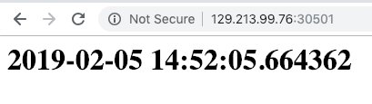
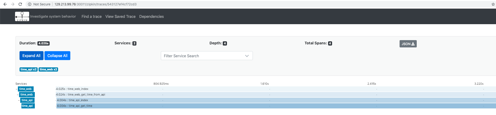

# Instrumenting a Microservice-Based Application With Zipkin

In our previous [tutorial](https://cloudnative.oracle.com/template.html#observability-and-analysis/telemetry/zipkin/zipkin-an-introduction.md), we discussed the benefits of using Zipkin and covered the steps required to install it to a Kubernetes cluster.

In this continuation tutorial, we'll discuss how to instrument an application comprised of microservices.

## Prerequisites

You should have a Kubernetes cluster (I'll be using Oracle Container Engine) with Zipkin installed, as per the first part of this series.

You should also have a development environment configured with `kubectl` configured to access your cluster.

Some knowledge of Python will also be handy, as it is the language the demo application is written with.

## What Are We Doing?

This tutorial will:

1. Show you how to deploy two demo Microservices to your Kubernetes cluster. These microservices will communicate with each other over HTTP, to imitate a microservice-based application.
2. Demonstrate parts of the microservice code that will send metrics to Zipkin.
3. Explain how to configure your deployed microservices to point at your Zipkin instance.

## Demo Applications

We will use two simple demo applications written in Python for this project. They are both written in Flask and take advantage of the [Zipkin Python Extension](https://github.com/Yelp/py_zipkin) to instrument the application.

### Time API

This is a simple application that gets the current time, and serves it over HTTP, wrapped in JSON. It takes an environment variable to configure the Zipkin server address.

The source can be found at [https://github.com/riceo/oracle-demo-zipkin-python/blob/master/api.py](). Let's step through this simple application line-by-line, starting just after the imports/setting up of our simple Flask application. The variable `zipkin_svc_name` is used a few times in the application for telling Zipkin our application name:

```
# We need to reference this a few times in calls to Zipkin
zipkin_svc_name="time_web"
```

Next up, we define a function that py_zipkin uses to send spans over to Zipkin. It handles the encoding of data (in this case, it's using [Apache Thrift](https://thrift.apache.org/)) before sending it to the Zipkin server we define (and pass in via an environment variable), using the Python `requests` package. 

```
"""
Define a transport to send data to Zipkin over HTTP. It uses the
Zipkin URL defined as an environment variable.
"""
def http_transport(encoded_span):
    return requests.post(
        os.environ['ZIPKIN_DSN'],
        data=encoded_span,
        headers={'Content-Type': 'application/x-thrift'},
)
```

Remember that `zipkin_svc_name` variable at the top of the application? Well, we use it in a helper function for passing some explicit naming of the part of our code we're instrumenting here: 

```
"""
A simple helper to return a Zipkin span name that has the service name prepended. This namespacing helps keep the instrumented service/method 
clear on the Zipkin UI.
"""
def get_zipkin_span_name(name):
    return "_".join([zipkin_svc_name, name])
```

Now we're on to the meat of the application! The `get_time` function carries out the primary job of the application - to serve the current date and time. I've also added in a random delay via a `sleep()` call for demonstration purposes.

Note here that the application's logic is wrapped in a call to `zipkin_span()`. `zipkin_span` comes from the `py_zipkin` package. It takes the `zipkin_svc_name` variable that we defined at the start of the application, and a span name that we generate from the name of the application + name of the calling function. 

```
"""
Get the current time after random for a random number of
seconds between 1 and 5. Return it as a string.
"""
def get_time():
    with zipkin_span(service_name=zipkin_svc_name, span_name=get_zipkin_span_name("get_time")):
        sleep(randint(1,5))
        return str(datetime.datetime.now())
```

This leads us on to the last part of this microservice - the part that makes it a microservice! Since this is a Flask application, a HTTP server will be created upon execution, and all routed endpoints will be served over that server. In this case, the `index()` function is tied to our only route of `/`, so it will be called whenever a user - or upstream microservice - hits this server on /.

```
"""
The meat of the service: Listens for a HTTP call to "/", serves the return value
from get_time()
"""
@app.route('/')
def index():
    # The X-* headers come from the upstream, calling service. Since this is a backend
    # microservice that will be called by another service and not a human, we can expect
    # the request to come with Zipkin span headers attached. Those headers will then be included
    # in this service's call to Zipkin to ensure the request is tracked end-to-end, across both
    # services.
    with zipkin_span(
        service_name=zipkin_svc_name,
        span_name=get_zipkin_span_name("index"),
        transport_handler=http_transport,
        zipkin_attrs=ZipkinAttrs(
            trace_id=request.headers['X-B3-TraceID'],
            span_id=request.headers['X-B3-SpanID'],
            parent_span_id=request.headers['X-B3-ParentSpanID'],
            flags=request.headers['X-B3-Flags'],
            is_sampled=request.headers['X-B3-Sampled'],
        ),
        port=5000,
        sample_rate=100
    ):
        got_time = get_time()
        return json.dumps(got_time)
```
As you can see, this function gets the output of the get_time() function above, then returns it wrapped in JSON. The return value of this function is served over HTTP automagically by Flask.

Did you notice that there's another zipkin_span() call wrapping the logic of this function - and that this time it's full of new information!? Well, since this function is going to be the entry point to the application from the Time Web microservice which is also being instrumented by Zipkin, we can assume it will have Zipkin attributes baked into the request as headers. We'll take these headers and add them to this application's Zipkin spans, which makes Zipkin understand that these microservices are tied together. 

The headers that will be passed to this microservice from the Time API service are:

* X-B3-TraceID 
* X-B3-SpanID
* X-B3-ParentSpanID
* X-B3-Flags
* X-B3-Sampled

More information about these headers can be found in the [Zipkin documentation](https://github.com/openzipkin/b3-propagation).

### Time Web

That's all there is to the backend Time API microservice. Next, we'll talk about the Time Web microservice, which acts as the front-end of the microservice-built application. Making a HTTP request to a running instance of this application will call the upstream time API, then serve its response as a human-readable HTML page. It takes an environment variable to configure Zipkin server just like the Time API service but also takes another for the time API URI. 

The source for this application can also be found in the same Git repository but in a different file: [https://github.com/riceo/oracle-demo-zipkin-python/blob/master/web.py]().

Most of the code is the same in the Web service as the API service, so we'll skip straight to the bits that are different:

```
"""
Call the Time API microservice, which should return the time in JSON. Unserialise the response and return it as a plaintext string.

If the API is unavailable return False.
"""
def get_time_from_api():
    with zipkin_span(service_name=zipkin_svc_name, span_name=get_zipkin_span_name("get_time_from_api")):

        time_api = os.environ["TIME_API_URL"]

        # Generate a new set of Zipkin span headers and include them in the call to the
        # downstream microservice. This will cause Zipkin to join both services and surface
        # them as a single Span.
        headers = {}
        headers.update(create_http_headers_for_new_span())

        r = requests.get(time_api, headers=headers)

        return r.json()
```

The above function should look very similar to the get_time() function from the API service, with two key differences:

1. The function generates and passes the Zipkin HTTP headers mentioned in the last paragraph of the Time API section of this tutorial. 
2. Once generated, it sends those headers in a request to the upstream Time API service to get the time in JSON, which will be displayed as HTML by the Web service.

Again, in a similar fashion to the Time API service, this service's entry point is via a Flask application on route /:

```
"""
The meat of the service: Listens for a HTTP call to "/", serves the return value
from get_time_from_api()
"""
@app.route("/")
def index():
    with zipkin_span(
        service_name=zipkin_svc_name,
        span_name=get_zipkin_span_name("index"),
        transport_handler=http_transport,
        port=5001,
        sample_rate=100,
    ):
        time = get_time_from_api()
        return "<html><h1>{}</h1></html>".format(time)
```

## Running on Kubernetes

In the first part of this series, I showed you how to install Zipkin on a Kubernetes cluster. Next, we'll launch this application's two microservices on the Kubernetes cluster using the Kubernetes config files in the application repository, named `kubernetes_web.yml` and `kubernetes_api.yml`. Both files are the same, minus changes to the application name, so we'll only look at the contents of `web` here. Similarly, while each Kubernetes configuration file is split into both a Deployment and Service definition, we'll only be looking at the Deployment definition here as the Service is purely to allow us to access the microservices for testing.

`kubernetes_web.yml`:

```
apiVersion: extensions/v1beta1
kind: Deployment
metadata:
  name: time-web
spec:
  replicas: 1
  selector:
    matchLabels:
      app: time-web
  template:
    metadata:
      labels:
        app: time-web
    spec:
      containers:
      - name: time-web-server
        image: riceo/oracle-demo-zipkin-python:master
        command: ["flask"]
        args: ["run", "--host=0.0.0.0"]
        env:
            - name: FLASK_DEBUG
              value: "1"
            - name: FLASK_RUN_PORT
              value: "5001"
            - name: ZIPKIN_DSN
              value: "http://zipkin-api:9411/api/v1/spans"
            - name: FLASK_APP
              value: "web.py"
            - name: FLASK_APP
              value: "web.py"
            - name: TIME_API_URL
              value: "http://time-api:5000"
        imagePullPolicy: Always
        ports:
        - name: time-web-server
          containerPort: 5001
          protocol: TCP
...
```

In the above excerpt from the `kubernetes_web.yml` file, you'll notice a few things:

* We will pull the Docker image for this deployment from Dockerhub's `riceo/oracle-demo-zipkin-python:master`. The application repository does include a working Dockerfile if you wish to build and push the image to your own image registry, but for the sake of simplicity, you are welcome to use the image I have pushed too.
* The application environment variables required to launch the application reference are `http://zipkin-api` and `http://time-api`. These are the names of services running in our Kubernetes cluster. The former was launched in part one of our series, and the latter will be launched by `kubernetes_api.yml`. If you have customised your Zipkin installation or any of the services defined in the listed demo repository, ensure you update the environment variable values accordingly.

Applying the four definitions (two services, two deployments) to your Kubernetes cluster is a simple case of running:

```
kubectl apply -f kubernetes_api.yml -f kubernetes_web.yml
```

## Testing

Once the Kubernetes configuration has been applied to your cluster, run `kubectl get svc` to see the ports that your services will be available on:

```
>  kubectl get svc
NAME                                TYPE           CLUSTER-IP      EXTERNAL-IP      PORT(S)                      AGE
time-api                            NodePort       10.96.22.133    <none>           5000:30500/TCP               22h
time-web                            NodePort       10.96.236.15    <none>           5001:30501/TCP               37m
```
Since the services we have defined are nodeports, hitting any Kubernetes node's public IP address (hint: `kubectl get nodes`) on port 30501 (extra hint: ensure your firewalling is configured to allow you remote access to that (port!) should serve the application to you!)



... and since we know that our application is configured to send telemetry across both microservices to Zipkin, you should see a new Span in Zipkin for your test request! 



## Conclusion

Using the demo repository linked to this tutorial, you can now see how to link multiple applications together in Zipkin, along with how to get your services to discover each other using Kubernetes DNS. Check out the other guides on this site to learn about both competing and complimentary telemetry tooling!

### Clean Up

You can remove everything you applied to your Kubernetes cluster in this demo by running:

```
kubectl delete {svc/time-api,svc/time-web,deploy/time-api,deploy/time-web}
```